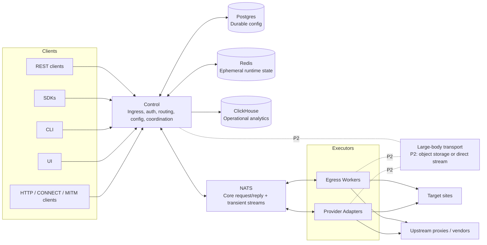

# Straw Proxy Plan

## 1. Purpose

Straw is a distributed HTTP/HTTPS proxy system for high-scale scraping and controlled outbound HTTP transport. It
centralizes ingress, authentication, authorization, tenant isolation, routing policy, and observability in a Control
service, while outbound execution happens through registered executors.

Straw lets operators combine:

- operator-owned Egress Workers,
- operator-configured upstream proxies,
- optional Provider Adapters for direct provider/vendor execution,
- policy-based route selection,
- stable transport error semantics,
- browser-like outbound TLS behavior where supported by the executor.

Straw is not an anonymity network, scraping orchestrator, browser automation system, CAPTCHA solver, compliance engine,
or unmanaged public proxy. It transports requests through configured routes and exposes predictable operational control
over that transport.

## 2. Phase Boundaries

The original plan mixed MVP, Phase 1, Phase 2, and mature platform features. This rewrite separates them. A feature is
not considered in-scope for a phase unless it is listed in that phase and has a corresponding contract, schema, or test
row.

### P0 — Vertical Slice

P0 is the first buildable implementation slice.

P0 includes:

- one Control service,
- one official Go Egress Worker,
- externally synchronous REST request transport only,
- API-key authentication,
- tenant-scoped API keys and worker credentials,
- tenant-scoped routing rules,
- exact-session Core NATS assignment,
- protobuf Envelope and StreamFrame contracts,
- internal NATS body/response streaming up to configured frame/body limits,
- Control-buffered JSON response envelopes for REST,
- basic worker registration, heartbeat, health, capacity, draining, disable state, duplicate-session handling, and
  cooldown,
- basic rate limits,
- operational/admission-control quotas with explicit non-billing-grade accuracy limits,
- destination deny rules with Control-side URL/host validation and Egress-side resolved-IP validation,
- Control-resolved destination policy bundles sent to Egress per request,
- explicit header injection operations resolved by Control; no arbitrary live traffic mutation,
- fingerprint profile selection with P0 profiles limited to the worker-supported set,
- canonical ErrorResponse envelope,
- request metadata written asynchronously to ClickHouse with P0 metadata redaction rules,
- local docker-compose environment,
- table-driven unit tests and E2E tests for the P0 flow.

P0 excludes:

- HTTP forward proxy,
- raw CONNECT,
- MITM,
- Provider Adapters,
- object-storage large-body transport,
- direct streaming large-body transport,
- external REST response streaming,
- payload capture,
- capture hints other than `none`,
- redirect following,
- SDKs beyond a minimal generated/prototype client,
- CLI/UI beyond basic admin smoke tooling,
- Kubernetes/Swarm production manifests,
- HTTP/2 semantics,
- upstream keep-alive pooling and advanced/shared upstream connection-pool management.

P0 Egress disables upstream HTTP keep-alives and outbound HTTP/2 by default. Those may be re-enabled only behind an
explicit tested feature flag in a later phase.

### P1 — Proxy Transport and Operational Hardening

P1 adds:

- HTTP forward proxy,
- raw CONNECT tunnel mode,
- worker-loss and NATS-outage hardening beyond the P0 baseline,
- richer config-management APIs,
- SDK, CLI, and minimal UI surfaces,
- telemetry read APIs and dashboards,
- optional direct worker Prometheus scraping if explicitly chosen,
- optional upstream connection pooling if explicitly specified and tested,
- improved observability dashboards,
- load and backpressure testing,
- operational deployment templates.

### P2 — MITM, Large Bodies, Payload Capture, Provider Adapters

P2 adds:

- MITM HTTPS decoded mode,
- generated leaf certificate cache/storage,
- object-storage BodyRef transport,
- direct streaming BodyRef transport,
- payload capture with storage-only redaction,
- Provider Adapter protocol and at least one static adapter implementation,
- HTTP/2 support where explicitly specified and tested,
- quota reconciliation suitable for billing-grade or near-billing-grade reporting if required.

### Future Work

Future work includes:

- WebSockets,
- SOCKS5,
- generic TCP/UDP/QUIC,
- scraping orchestration,
- persistent request queues,
- automatic retries/replay workflows,
- public marketplace workflows,
- billing/payment workflows,
- active egress verification,
- plugin runtime inside workers,
- managed disaster recovery.

## 3. Non-Goals

Straw does not provide:

- crawler scheduling,
- browser orchestration,
- content extraction/parsing,
- automated login/session workflows,
- CAPTCHA solving,
- automatic content-aware scraping decisions,
- traffic surveillance,
- credential harvesting,
- unauthenticated public proxying,
- legal/compliance enforcement,
- undetectability guarantees,
- anonymity guarantees,
- exactly-once request execution.

Payload capture, MITM, and live traffic mutation are not P0 features. If later enabled, payload capture is explicit,
tenant-admin-controlled, and off by default.

## 4. Canonical Architecture

Control is the only public-facing runtime service. All clients enter through Control. Control owns:

- ingress protocols,
- authentication,
- authorization,
- tenant resolution,
- routing decisions,
- quota/rate-limit admission,
- destination policy checks,
- worker selection,
- request IDs and trace propagation,
- NATS dispatch,
- config APIs,
- durable config access,
- observability aggregation.

Executors own outbound execution. Executors are not allowed to query Postgres, Redis, or ClickHouse. They receive
resolved per-request instructions from Control and report constrained results/failures back to Control.



## 5. Component Boundaries

### Control

Control is stateful at the policy boundary and mostly stateless at the process boundary. It caches durable config
snapshots but treats Postgres as the source of truth. It uses Redis only for ephemeral runtime state. It writes
operational records to ClickHouse asynchronously.

Control performs:

- API-key authentication,
- RBAC authorization,
- tenant resolution,
- route evaluation,
- worker selection,
- NATS request/reply,
- stream coordination,
- cancellation,
- request deadlines,
- final client-facing error mapping,
- request metadata persistence.

Control does not perform outbound HTTP execution except for later MITM inbound TLS termination and local health/config
endpoints.

### Egress Worker

The official Egress Worker is written in Go. It performs outbound HTTP/HTTPS requests, applies Control-resolved
header/cookie injection, applies supported outbound TLS fingerprint behavior, enforces the request deadline, and reports
constrained execution facts back to Control.

The worker is stateless with respect to Straw control-plane state. Local static config may include upstream proxy
credentials, network-interface binding, DNS configuration, and local health endpoints.

### Provider Adapter

Provider Adapters are P2 executors. They participate in the same NATS registration, heartbeat, assignment, stream, and
error protocol as Egress Workers. They differ only in execution behavior: a Provider Adapter may select provider
accounts, upstream endpoints, or vendor-specific request mechanics internally.

Provider Adapters are operator-configured only. Phase 2 does not include marketplace discovery, provider billing
reconciliation, automatic provider account provisioning, or provider economics.

### NATS

P0/P1 use Core NATS only. NATS is a transient service transport, not a durable queue, replay log, tenant authorization
system, or hidden backlog.

NATS queue groups are used only so multiple Control instances can share registration and heartbeat service handling.
Queue groups are not used for executor dispatch. Control chooses the exact executor session.

### Postgres

Postgres is the durable source of truth for tenant and control-plane configuration.

### Redis

Redis stores ephemeral runtime state only. Every Redis key must have a TTL. Redis data loss must not corrupt durable
config. Redis loss may degrade availability decisions, sticky sessions, rate limits, quotas, or certificate caches
depending on explicit fail policy.

### ClickHouse

ClickHouse stores operational analytics, request metadata, worker events, audit records, and P2 payload-capture records.
ClickHouse write failure must not fail request transport.

## 6. Identity, Roles, and Tenant Isolation

### Tenant Resolution

Control derives `tenant_id` exclusively from the validated API key or worker credential. Clients and workers cannot
provide or override tenant identity through headers, request metadata, request body fields, or NATS subject tokens.

### Role Scopes

Straw has two role scopes:

- platform scope, for operations that create or delete tenant boundaries;
- tenant scope, for operations inside a tenant boundary.

P0 must not rely on a tenant-scoped role to create that same tenant. Local development may bootstrap a default platform
administrator and default tenant through seed data or migration fixtures.

### Platform Role

| Role           | Scope    | Purpose                                                              |
|----------------|----------|----------------------------------------------------------------------|
| `system_admin` | Platform | Create, soft-delete, and administer tenants; bootstrap tenant admins |

### Tenant Roles

Tenant roles apply only inside one tenant.

| Role           |      Data-plane execution |                      Config mutation | Credential management |            Telemetry read | Payload capture control |
|----------------|--------------------------:|-------------------------------------:|----------------------:|--------------------------:|------------------------:|
| `requester`    |                       Yes |                                   No |                    No | Own request metadata only |                      No |
| `viewer`       |                        No |                                   No |                    No |                       Yes |                      No |
| `operator`     | Optional by tenant policy | Routing/fingerprint/injection config |                    No |                       Yes |                      No |
| `tenant_admin` |                       Yes |                                  Yes |                   Yes |                       Yes |                     Yes |

Where earlier text says `admin` for tenant-local actions, it means `tenant_admin`. Where tenant creation or deletion is
required, the role is `system_admin`.

API keys inherit the role and tenant of the user/key record. P0 supports tenant-scoped API keys. Cross-tenant users use
separate keys per tenant. Platform administration uses a separate platform-scoped credential and is not accepted for
data-plane request execution unless it also maps to a tenant role.

### Worker Credential Scope

Worker credentials bind to:

- credential ID,
- tenant scope or explicit multi-tenant scope,
- allowed pool IDs,
- executor type,
- signing public key,
- status.

A worker cannot register pools, countries, regions, tags, ingress modes, IP types, or other capabilities outside its
credential scope.

### Tenant Isolation Rules

Tenant isolation applies to:

- route snapshots,
- routing rules,
- API keys,
- worker credentials,
- worker pool membership,
- sticky sessions,
- rate-limit counters,
- quota counters,
- ClickHouse records,
- object-storage BodyRefs,
- request IDs and trace correlation.

A request for tenant A must never route to an executor credentialed only for tenant B. A multi-tenant worker may execute
for multiple tenants only when its credential explicitly grants that scope and the selected pool is eligible for the
requesting tenant.

## 7. Public API Surface

The canonical public base path is `/api/v1`.

P0 exposes:

- `POST /api/v1/requests` for synchronous REST request transport,
- `/api/v1/config/*` for durable configuration resources,
- `/api/v1/admin/*` for runtime operational actions,
- `/metrics` for Prometheus metrics.

P1 may add telemetry read APIs and proxy ingress endpoints. P2 may add MITM CA distribution and BodyRef-related APIs.

### REST Request Transport — P0

P0 implements externally synchronous REST transport:

```http
POST /api/v1/requests
Authorization: Bearer <api_key>
Content-Type: application/json
```

The external P0 REST contract is non-streaming:

1. The client sends a JSON request envelope.
2. The request body, if present, uses `inline_base64` and must not exceed `request.max_inline_request_body_bytes`.
3. Control may internally split the body into NATS `DataFrame`s.
4. Egress may internally stream response frames back to Control.
5. Control buffers the upstream response until complete or until `request.max_inline_response_body_bytes` is exceeded.
6. Control returns either a JSON success envelope or a public ErrorResponse.

P0 does not expose HTTP chunked response streaming, BodyRef downloads, CONNECT, MITM, or raw upstream response
passthrough.

#### Request Schema

```json
{
  "method": "GET",
  "url": "https://example.com/path?x=1",
  "headers": [
    {
      "name": "User-Agent",
      "value_base64": "..."
    }
  ],
  "body": {
    "mode": "inline_base64",
    "data_base64": ""
  },
  "routing": {
    "tags": [
      "datacenter"
    ],
    "country": "US",
    "region": "us-west-1",
    "ip_type": "datacenter",
    "sticky_session_id": "optional-session"
  },
  "fingerprint_profile": "chrome_120",
  "timeout_ms": 60000,
  "replayable": false,
  "capture_hint": "none"
}
```

Field rules:

- `method` is required.
- `method` must not be `CONNECT` in P0 REST transport.
- `url` is required and must be absolute HTTP or HTTPS.
- URL userinfo is rejected.
- `headers` preserves order and duplicates.
- Header values are bytes and use Base64 in JSON.
- `body.mode` must be `inline_base64` or omitted in P0.
- `routing` fields are hints and hard constraints when supplied.
- `fingerprint_profile` is optional; tenant default applies when absent.
- `timeout_ms` is capped by tenant and deployment limits.
- `replayable` defaults to `false` except prototype/generated clients may default `GET`, `HEAD`, and `OPTIONS` to
  `true` before submission.
- `capture_hint` must be absent or `none` in P0. Any other value returns `invalid_request`.
- Redirect following is not available in P0. Redirect responses pass through as upstream responses.

#### Successful Response Schema

For REST transport, successful upstream responses are represented in a JSON envelope because the REST request itself is
JSON. HTTP proxy/MITM decoded modes later stream raw upstream responses directly.

```json
{
  "request_id": "req_...",
  "status": 200,
  "headers": [
    {
      "name": "Content-Type",
      "value_base64": "..."
    }
  ],
  "body": {
    "mode": "inline_base64",
    "data_base64": "...",
    "truncated": false
  },
  "timing": {
    "routing_ms": 3,
    "assignment_ms": 4,
    "egress_ms": 123,
    "total_ms": 140
  }
}
```

If Straw successfully transports the request and receives upstream status/headers, `POST /api/v1/requests` returns HTTP
`200` from the Straw API even when the upstream status is `301`, `404`, `429`, or `500`. The upstream status is carried
in the JSON envelope as `status`.

If Straw fails to authenticate, authorize, validate, route, assign, stream, execute, or complete the transport, Control
returns the public ErrorResponse with the HTTP status from the canonical error registry.

If the upstream response body exceeds `request.max_inline_response_body_bytes` before P2 large-body transport or a P1
streaming endpoint exists, Control returns `body_too_large` with `details.direction = "response"`.

### REST Streaming Variant — P1

P1 may add:

```http
POST /api/v1/requests:stream
```

This endpoint streams response bytes and metadata using HTTP chunking or server-selected framing. The exact framing must
be specified before implementation.

### Config and Admin APIs

Durable configuration endpoints live under:

```text
/api/v1/config/*
```

Runtime operational actions live under:

```text
/api/v1/admin/*
```

Config and admin endpoints require `operator`, `tenant_admin`, or `system_admin` according to the endpoint-specific
table in Section 26.

### Telemetry Read APIs — P1

The role model reserves telemetry read permissions, but P0 does not implement a general telemetry query API. P0 may
return the current request's metadata in the request response envelope and may expose local health/metrics endpoints.

P1 adds explicit APIs such as:

```text
GET /api/v1/telemetry/requests
GET /api/v1/telemetry/requests/{request_id}
GET /api/v1/telemetry/workers
GET /api/v1/telemetry/audit
```

These are placeholders until P1 schemas and ClickHouse query limits are specified.

### MITM CA Distribution Endpoint — P2

P2 adds:

```http
GET /api/v1/mitm/ca.pem
Authorization: Bearer <api_key>
```

Any authenticated key whose tenant is allowed to use MITM may download the public CA certificate. Tenant admin rights
are required to rotate or configure the CA, but not to download the public certificate needed by clients.

## 8. Request ID and Trace Lifecycle

Control generates `request_id` as soon as a request reaches any ingress path. Clients may supply `X-Straw-Request-Id`
only as an idempotency/correlation hint in a future phase; P0 ignores client-supplied request IDs and always generates
its own.

`request_id` is propagated through:

- REST response envelopes,
- ErrorResponse envelopes,
- NATS Envelope,
- ClickHouse records,
- logs,
- metrics exemplars where supported,
- traces.

Trace behavior:

- If inbound HTTP includes valid W3C `traceparent`, Control extracts trace context and starts a child span.
- If no valid trace context exists, Control starts a new trace.
- NATS Envelope carries `trace_id` and optionally serialized trace context.
- Egress spans use the received trace context.
- Outbound target requests do not receive tracing headers unless an explicit injection policy allows it.

## 9. Canonical Request Lifecycle

### P0 REST Decoded Flow

1. Control receives REST request.
2. Control generates `request_id`.
3. Control authenticates the API key and derives `tenant_id`.
4. Control authorizes data-plane execution.
5. Control validates method, URL, headers, body mode, routing hints, timeout, replayability, and P0 feature flags.
6. Control rejects URL userinfo and applies metadata/logging redaction decisions.
7. Control applies rate-limit and quota admission checks according to configured Redis fail policy.
8. Control applies destination deny rules at the URL/host level.
9. Control captures an immutable tenant route/config snapshot.
10. Control selects a route and exact executor session.
11. Control sends `AssignRequest` to the exact executor assignment subject.
12. Executor replies with `AssignAck`.
13. After accept, Control and Executor subscribe to request-scoped `c2e` and `e2c` subjects.
14. Control sends `RequestStart` over the request-scoped `c2e` subject.
15. Control streams request body frames or sends `BodyRef` according to transport mode. P0 supports only NATS
    `DataFrame` bodies derived from inline REST bodies.
16. Executor validates destination policy after DNS resolution and immediately before connect.
17. Executor sends `OutboundStartFrame` before DNS/connect or before delegating to an upstream proxy.
18. Executor performs outbound request.
19. Executor sends `ResponseStart`, response `DataFrame`s, optional `TrailersFrame`, and `EndFrame`, or sends
    `ErrorFrame`.
20. Control maps executor facts/errors into a public response or public ErrorResponse.
21. Control writes final metadata asynchronously to ClickHouse using P0 metadata redaction rules.

### Cancellation

Control sends `CancelFrame` when:

- client disconnects,
- request deadline expires,
- admin cancellation occurs,
- Control shutdown abandons the request,
- fallback makes an accepted attempt obsolete before the attempt reaches its no-replay boundary.

Cancellation is best effort. The deadline is authoritative even if cancel is missed.

### Terminal Rule

Every protocol-compliant accepted assignment that remains connected until completion must end with exactly one terminal
frame:

- `EndFrame`,
- `ErrorFrame`, or
- `CancelledFrame`.

If the worker process dies, Control loses the request-scoped NATS path, NATS becomes unavailable, or the deadline
expires
before a terminal frame arrives, Control synthesizes the terminal request outcome as one of:

- `worker_disconnected`,
- `transport_unavailable`,
- `assignment_timeout`,
- `timeout_exceeded`,
- `stream_upload_aborted`,
- `stream_download_aborted`.

After a terminal frame, synthesized terminal outcome, or deadline, both sides close request-scoped subscriptions and
ignore late frames. Repeated late/protocol-invalid frames contribute to worker cooldown.

### Replay and Fallback Boundary

For P0, Control uses the conservative replay boundary:

- fallback is allowed after assignment reject before `RequestStart`,
- fallback is allowed after assignment timeout before `RequestStart`,
- fallback is allowed after executor loss before `RequestStart`,
- after `RequestStart`, fallback is forbidden unless `replayable=true`.

Egress sends `OutboundStartFrame` before DNS/connect. In P1/P2, Control may use that finer-grained signal to allow some
pre-connect fallback after `RequestStart`, but P0 does not depend on that optimization.

If `replayable=true`, fallback after `RequestStart` is still forbidden once Control has sent a client-visible successful
response envelope or begun a streaming response in a future ingress mode.

## 10. Routing Model

Routes are tenant-scoped and evaluated from an immutable snapshot captured at request start.

### Rule Shape

Each rule has:

- `id`,
- `tenant_id`,
- `priority`,
- `enabled`,
- `match_conditions`,
- `target_pool_id`,
- `sticky_session_ttl_seconds`,
- `allow_sticky_fallback`,
- `config_version`.

P0 does not support nested `fallback_pool_ids`. Fallback is modeled by lower-priority rules and by Control selecting
another eligible executor only when replay/fallback rules allow it.

### Match Conditions

```json
{
  "tags": [
    "string"
  ],
  "country": "ISO-3166-alpha-2",
  "region": "string",
  "ip_type": "datacenter | residential | mobile | isp | unknown",
  "ingress_type": "rest | http_proxy | connect | mitm",
  "target_host": "example.com or *.example.com"
}
```

Rules are evaluated in ascending priority order. Any client-supplied hint is a hard constraint. Missing hints mean no
preference.

### Executor Selection

After a rule selects a pool, Control chooses the least-loaded healthy eligible executor in that pool. Round-robin is the
tie breaker.

An executor is eligible only if:

- tenant scope matches,
- pool scope matches,
- version is compatible,
- health is `ready` or eligible `degraded`,
- it is not administratively disabled,
- it is not draining,
- it has available capacity,
- heartbeat freshness is within the availability threshold,
- it is not in cooldown,
- capabilities satisfy all request constraints.

Eligibility precedence is:

```text
disabled > dead > duplicate_replaced > draining > cooldown > heartbeat_stale > health > capacity > capability
```

A higher-precedence exclusion reason should be reported in internal diagnostics. Public errors remain canonical public
codes.

### Sticky Sessions

Sticky sessions pin to a stable egress identity when available. If no stable identity exists, they may pin to executor
session. Sticky state is stored in Redis with tenant/rule TTL.

If the sticky target is unavailable:

- default: fail with `sticky_session_unavailable`,
- if `allow_sticky_fallback=true`: choose another eligible executor and update affinity.

Sticky fallback follows the same replay/fallback boundary as non-sticky fallback.

### Fallback and Replay

Control fallback is internal recovery before a final client-visible result. It is not SDK/client retry.

P0 fallback is allowed:

- after assignment reject before `RequestStart`,
- after assignment timeout before `RequestStart`,
- after executor loss before `RequestStart`,
- after `RequestStart` only if `replayable=true` and Control has not sent any client-visible success response.

Automatic replay defaults:

- `GET`, `HEAD`, `OPTIONS`: SDKs may default `replayable=true` before sending the request.
- `PUT`, `DELETE`, `POST`, `PATCH`: default `replayable=false`.

Control never silently changes `replayable=false` to `true`.

If no rule matches, return `route_no_match` with HTTP 421 for decoded proxy modes and HTTP 404 for REST transport. The
ErrorCode remains `route_no_match` in both cases.

If a rule matches but no eligible executor exists after permitted fallback, return `route_unavailable` with HTTP 503.

If all otherwise-eligible executors reject for capacity, return `executor_capacity_exhausted` with HTTP 503.

## 11. Worker Discovery and Health

Egress Workers and Provider Adapters use the same registration and heartbeat protocol. Provider Adapters are P2, but the
protocol shape is common.

### Worker Session State Machine

Runtime worker session state is derived from registration, heartbeat, admin state, duplicate-session handling, and
cooldown. P0 uses this state machine:

```text
unregistered
  -> registering
  -> registered
  -> ready
  -> degraded
  -> unavailable
  -> dead

ready/degraded
  -> draining
  -> stopped | dead

ready/degraded/unavailable
  -> cooldown
  -> ready | degraded | unavailable

ready/degraded/unavailable/draining
  -> duplicate_replaced
  -> dead
```

State meanings:

| State                | Routable | Meaning                                                        |
|----------------------|----------|----------------------------------------------------------------|
| `unregistered`       | No       | No active runtime session                                      |
| `registering`        | No       | Registration being validated                                   |
| `registered`         | No       | Registered but not yet heartbeat-ready                         |
| `ready`              | Yes      | Healthy and eligible if capacity/capabilities match            |
| `degraded`           | Optional | Eligible only if tenant/deployment policy permits degraded use |
| `unavailable`        | No       | Heartbeat stale beyond availability timeout                    |
| `dead`               | No       | Removed after dead timeout                                     |
| `draining`           | No new   | Finishes in-flight requests only                               |
| `disabled`           | No       | Durable admin exclusion                                        |
| `cooldown`           | No       | Temporary exclusion after repeated failures                    |
| `duplicate_replaced` | No       | Superseded by a newer valid session                            |

Eligibility exclusion precedence is defined in Section 10. Disable is durable admin state and overrides all runtime
health. Draining excludes new assignments even when the worker is otherwise healthy.

### Registration

Workers register over NATS request/reply on:

```text
straw.v1.control.register
```

Control instances subscribe using the `control` queue group.

Registration includes:

- `worker_id`,
- `executor_type`,
- `credential_id`,
- signed registration token,
- protocol major/minor,
- software version,
- pool IDs,
- tags,
- countries,
- regions,
- IP types,
- supported ingress modes,
- stable egress identity when known,
- max concurrency,
- initial draining state.

Control validates:

- signature,
- credential status,
- tenant scope,
- pool scope,
- capability scope,
- protocol compatibility,
- safe subject-token format for `worker_id`.

A successful registration returns a runtime `session_id`. The worker subscribes to its exact assignment subject only
after receiving `OK`.

### Heartbeats

Workers heartbeat over NATS request/reply on:

```text
straw.v1.control.heartbeat
```

Heartbeats include:

- `worker_id`,
- `session_id`,
- health,
- reason,
- active request count,
- max concurrency,
- available capacity,
- optional queue depth,
- draining flag,
- optional worker timestamp for diagnostics.

Control uses receive time, not worker time, for liveness. Heartbeats from stale `session_id`s are ignored for routing
but
may be recorded for diagnostics.

### Health Thresholds

Defaults:

| Setting                 |          Default | Meaning                              | Config key                                                                   |
|-------------------------|-----------------:|--------------------------------------|------------------------------------------------------------------------------|
| Heartbeat interval      |               5s | Worker send cadence                  | `worker.heartbeat_interval_ms`                                               |
| Availability timeout    |              15s | Excluded from new assignments        | `control.worker_availability_timeout_ms`                                     |
| Dead timeout            |              30s | Runtime session removed              | `control.worker_dead_timeout_ms`                                             |
| Duplicate-session grace |              10s | Old session drains after replacement | `control.worker_duplicate_session_grace_ms`                                  |
| Assignment ack timeout  |               2s | Wait for `AssignAck`                 | `control.assignment_ack_timeout_ms`                                          |
| Cooldown trigger        | 3 failures / 60s | Worker excluded from new work        | `control.worker_cooldown_failure_count`, `control.worker_cooldown_window_ms` |
| Cooldown duration       |              30s | Exclusion period                     | `control.worker_cooldown_duration_ms`                                        |

### Duplicate Sessions

Only one active session per `worker_id` is routable. New valid registration creates a new `session_id` and replaces the
old session after grace. The old session receives no new assignments during grace. In-flight requests on the old session
may finish until their request deadline or duplicate-session grace deadline, whichever policy chooses; P0 uses the
request deadline unless the worker disconnects.

### Draining and Disable

Draining is runtime state. It excludes new assignments but allows in-flight work until deadline.

Disable is durable admin state. It survives restart and excludes the worker from routing while still allowing
registration/heartbeat for observability.

## 12. NATS Protocol

### Transport Decision

P0/P1 use Core NATS only. There is no JetStream, no durable message retention, and no redelivery guarantee. All request
execution is synchronous/transient from Straw's perspective.

### Envelope

All NATS messages are binary protobuf `Envelope` messages.

Envelope fields:

- `request_id`,
- `tenant_id`,
- `trace_id`,
- optional serialized trace context,
- `deadline_unix_ms`,
- `protocol_major`,
- `protocol_minor`,
- `attempt`,
- `oneof payload`.

JSON is not used inside NATS.

### Canonical Subjects

| Subject                                                  | Direction                | Payload            | Queue group | Purpose                                                         |
|----------------------------------------------------------|--------------------------|--------------------|-------------|-----------------------------------------------------------------|
| `straw.v1.control.register`                              | Executor → Control       | `RegisterRequest`  | `control`   | Registration request/reply                                      |
| `straw.v1.control.heartbeat`                             | Executor → Control       | `HeartbeatRequest` | `control`   | Heartbeat request/reply                                         |
| `straw.v1.executor.<worker_id>.<session_id>.assign`      | Control → exact executor | `AssignRequest`    | none        | Exact-session assignment request/reply                          |
| `straw.v1.req.<request_id>.<worker_id>.<session_id>.c2e` | Control → executor       | `StreamFrame`      | none        | Request body, tunnel upload, request control, response credit   |
| `straw.v1.req.<request_id>.<worker_id>.<session_id>.e2c` | Executor → Control       | `StreamFrame`      | none        | Response body, tunnel download, executor control, upload credit |

Dot-free safe tokens are required for `request_id`, `worker_id`, and `session_id`. Invalid tokens are rejected. Tenant
IDs are never placed in NATS subjects.

### Direction Rules

`c2e` carries:

- `RequestStart`,
- upload/tunnel `DataFrame`,
- `BodyRef` references for request body,
- `CancelFrame`,
- credit for executor-to-Control response/download bytes.

`e2c` carries:

- `OutboundStartFrame`,
- `ResponseStart`,
- response/tunnel `DataFrame`,
- `TrailersFrame`,
- `EndFrame`,
- `ErrorFrame`,
- `CancelledFrame`,
- credit for Control-to-executor upload bytes.

### Assignment Flow

1. Control sends `AssignRequest` to exact assignment subject.
2. Executor immediately reserves capacity or rejects.
3. Executor replies with `AssignAck`.
4. If accepted, both sides subscribe to request-scoped subjects.
5. Control sends `RequestStart`.
6. Streams proceed under sequence validation and credit-based flow control.

There are no generic NATS retries for assignment. Duplicate assignment is worse than a clean failed attempt.

### Stream Ordering and Sequencing

Each request has two independent ordered stream directions:

- `c2e` for Control-to-executor frames,
- `e2c` for executor-to-Control frames.

Every `StreamFrame` carries:

- `stream_seq`: monotonically increasing unsigned integer, starting at 1 per direction and attempt,
- `attempt`: copied from the Envelope and validated against the active attempt,
- `terminal`: implicit from terminal payload type.

Rules:

- receiver accepts exactly the next expected `stream_seq`,
- duplicate frames with sequence lower than expected are ignored and counted,
- gaps or sequence higher than expected are protocol errors,
- frames after terminal are ignored and counted,
- repeated duplicates, late frames, or invalid sequence behavior contribute to worker cooldown,
- sequence numbers are not reused across attempts.

`DataFrame` additionally carries `offset` for diagnostics and optional integrity checks. `offset` must match the
cumulative
number of data bytes previously accepted in that direction for the same logical byte stream.

### Backpressure

P0 uses byte-credit flow control.

Defaults:

| Setting                      | Default | Config key                                |
|------------------------------|--------:|-------------------------------------------|
| Max frame data bytes         |   1 MiB | `transport.max_frame_data_bytes`          |
| Initial upload credit        |   8 MiB | `transport.initial_upload_credit_bytes`   |
| Initial download credit      |   8 MiB | `transport.initial_download_credit_bytes` |
| Max in-flight upload bytes   |  16 MiB | `transport.max_inflight_upload_bytes`     |
| Max in-flight download bytes |  16 MiB | `transport.max_inflight_download_bytes`   |
| Frame idle timeout           |     15s | `transport.frame_idle_timeout_ms`         |

Credit applies to raw bytes carried in `DataFrame.data`. If bytes are compressed by the client/upstream, credit counts
compressed bytes.

When credit reaches zero, senders stop reading from their upstream source where possible. Control must stop or slow
client reads to avoid unbounded buffering.

### NATS Max Payload Validation

`transport.max_frame_data_bytes` must be less than the effective NATS maximum payload minus protobuf Envelope overhead.
Startup validation must fail if the configured maximum frame data size can produce an Envelope larger than the
configured
or discovered NATS max payload.

P0 recommended rule:

```text
transport.max_frame_data_bytes <= nats.max_payload_bytes - 65536
```

The 64 KiB overhead budget is intentionally conservative and may be replaced by measured encoded-size validation.

### NATS Subject ACLs

NATS credentials are service-level but must still be scoped.

| Principal           | Publish allowed                                                                               | Subscribe allowed                                                                   |
|---------------------|-----------------------------------------------------------------------------------------------|-------------------------------------------------------------------------------------|
| Control             | `straw.v1.executor.*.*.assign`, `straw.v1.req.*.*.*.c2e`                                      | `straw.v1.control.register`, `straw.v1.control.heartbeat`, `straw.v1.req.*.*.*.e2c` |
| Worker `worker_id`  | `straw.v1.control.register`, `straw.v1.control.heartbeat`, `straw.v1.req.*.<worker_id>.*.e2c` | `straw.v1.executor.<worker_id>.*.assign`, `straw.v1.req.*.<worker_id>.*.c2e`        |
| Adapter `worker_id` | same as worker                                                                                | same as worker                                                                      |

Tenant authorization remains in Control and worker credential validation. NATS subject credentials prevent broad
cross-subject misuse but are not the tenant authorization source of truth.

## 13. Protobuf Contract

### Package

```text
package straw.v1;
Go package: strawpb
Source: proto/straw/v1/straw.proto
```

### Compatibility

- proto3 syntax,
- no protobuf `required` fields,
- mandatory business fields validated after decode,
- unknown fields tolerated,
- unknown enum values rejected for control-plane decisions,
- removed fields reserve numbers and names,
- Buf lint and breaking checks required in CI.

### Core Messages

```protobuf
message Envelope {
  string request_id = 1;
  string tenant_id = 2;
  string trace_id = 3;
  int64 deadline_unix_ms = 4;
  uint32 protocol_major = 5;
  uint32 protocol_minor = 6;
  uint32 attempt = 7;
  bytes trace_context = 8;

  oneof payload {
    RegisterRequest register_request = 20;
    RegisterAck register_ack = 21;
    HeartbeatRequest heartbeat_request = 22;
    HeartbeatAck heartbeat_ack = 23;
    AssignRequest assign_request = 24;
    AssignAck assign_ack = 25;
    StreamFrame stream_frame = 26;
  }
}
```

### Assignment Messages

`AssignRequest` reserves capacity only. It does not carry the HTTP request.

Fields:

- mode: decoded HTTP or raw tunnel,
- deadline,
- expected upload size if known,
- selected route ID,
- selected pool ID,
- selected executor ID,
- stable egress identity if known,
- replayability flag,
- attempt number.

`AssignAck` values:

- `ACCEPTED`,
- `REJECTED_CAPACITY`,
- `REJECTED_DRAINING`,
- `REJECTED_UNSUPPORTED`,
- `REJECTED_AUTH_SCOPE`,
- `REJECTED_ERROR`.

### StreamFrame Payloads

`StreamFrame` has common sequencing fields and a payload `oneof`:

```protobuf
message StreamFrame {
  uint64 stream_seq = 1;
  uint64 attempt = 2;

  oneof payload {
    RequestStart request_start = 10;
    OutboundStartFrame outbound_start = 11;
    ResponseStart response_start = 12;
    DataFrame data = 13;
    CreditFrame credit = 14;
    BodyRefFrame body_ref = 15;
    CancelFrame cancel = 16;
    ErrorFrame error = 17;
    TrailersFrame trailers = 18;
    EndFrame end = 19;
    CancelledFrame cancelled = 20;
  }
}
```

### DataFrame

```protobuf
message DataFrame {
  uint64 offset = 1;
  bytes data = 2;
}
```

`stream_seq` orders frames. `offset` orders byte payloads within a logical byte stream and must equal the cumulative
accepted byte count for that direction and attempt.

### Headers

HTTP headers are ordered repeated pairs:

```protobuf
message Header {
  string name = 1;
  bytes value = 2;
}
```

Maps are not used for headers because order and duplicates matter.

### RequestStart

`RequestStart` carries:

- mode,
- HTTP method,
- absolute URL,
- outbound headers after Straw header stripping,
- routing metadata,
- selected route/pool/executor metadata,
- deadline,
- replayable flag,
- payload capture decision,
- resolved fingerprint instruction,
- ordered injection operations,
- redirect-following policy,
- resolved destination policy bundle,
- policy/version IDs for audit correlation.

Executors never query config and never receive raw admin policy objects. Control sends only resolved request
instructions plus policy/version IDs for audit correlation.

### DestinationPolicy

`DestinationPolicy` is included in `RequestStart` and contains the minimum policy required for Egress-side enforcement:

```protobuf
message DestinationPolicy {
  bool allow_private_ranges = 1;
  bool allow_loopback = 2;
  bool allow_link_local = 3;
  bool allow_metadata_ips = 4;
  repeated string denied_cidrs = 5;
  repeated string allowed_cidrs = 6;
  repeated string denied_host_suffixes = 7;
  repeated string denied_cname_suffixes = 8;
  SniHostMismatchPolicy sni_host_mismatch_policy = 9;
  RedirectPolicy redirect_policy = 10;
  string policy_version = 11;
}
```

P0 default policy denies private, loopback, link-local, multicast, and cloud metadata ranges unless a tenant admin
explicitly
allows them for the tenant or deployment.

### OutboundStartFrame

`OutboundStartFrame` is emitted by Egress before DNS/connect or before delegating to an upstream proxy. It carries:

- target host,
- target port,
- selected upstream proxy ID if any,
- attempt,
- timestamp from worker for diagnostics only.

Control does not use worker timestamps for deadlines or liveness.

### BodyRef

P2 adds BodyRef variants:

- `S3BodyRef`,
- `DirectStreamRef`.

P0 supports only inline NATS `DataFrame` bodies derived from REST `inline_base64` input.

### Error Facts and ErrorResponse

Internal protobuf `Error` is not identical to public REST `ErrorResponse`.

Executors emit constrained failure facts. Control maps them to public error codes.

`Error` fields:

- internal failure fact,
- retryable hint,
- operator message,
- details map,
- optional upstream status,
- optional timeout type.

Public `ErrorResponse` fields:

```protobuf
message ErrorResponse {
  ErrorCategory category = 1;
  ErrorCode code = 2;
  string message = 3;
  bool retryable = 4;
  uint64 retry_after_ms = 5;
  string request_id = 6;
  optional uint32 upstream_status = 7;
  optional TimeoutType timeout_type = 8;
  map<string, string> details = 9;
}
```

`worker_id` and `session_id` are never exposed to clients. `details` may contain bounded public-safe diagnostics such as
`direction=request|response`, `limit_bytes`, or `retry_policy`, but never internal topology identifiers or secrets.

## 14. Canonical Error Registry

Origin HTTP statuses are not Straw errors. If the origin returns 404, 403, 429, or 500 and Straw successfully
transported the request, Straw returns/reports that as an upstream response, not an ErrorResponse.

Straw errors mean the Straw system failed to authenticate, authorize, validate, route, assign, transport, stream,
execute, or complete the request.

### Categories

| Category    | Scope                 | Meaning                                                        |
|-------------|-----------------------|----------------------------------------------------------------|
| `CLIENT`    | Control-local         | Auth, permissions, validation, rate limits, quotas, deny rules |
| `ROUTING`   | Control-local         | Route or eligible executor selection failed                    |
| `TRANSPORT` | Control↔executor      | NATS, assignment, worker loss, protocol failure                |
| `EGRESS`    | Executor/upstream leg | DNS, connect, TLS, upstream transport failure                  |
| `STREAMING` | Mid-stream transfer   | Upload/download/body transport failure                         |
| `CONTROL`   | Control internal      | Unexpected Control failure                                     |

### Error Codes

| Code | Name                          | Category  |    HTTP | Retryable | Notes                                                |
|-----:|-------------------------------|-----------|--------:|----------:|------------------------------------------------------|
|    1 | `auth_failure`                | CLIENT    |     401 |        No | Invalid API key or worker token                      |
|    2 | `tenant_not_found`            | CLIENT    |     401 |        No | Key references missing/deleted tenant                |
|    3 | `insufficient_permissions`    | CLIENT    |     403 |        No | RBAC failure                                         |
|    4 | `rate_limit_exceeded`         | CLIENT    |     429 |     Later | Uses `retry_after_ms`                                |
|    5 | `quota_exhausted`             | CLIENT    |     429 |     Later | Uses `retry_after_ms` when known                     |
|    6 | `invalid_request`             | CLIENT    |     400 |        No | Malformed request or missing business fields         |
|    7 | `destination_denied`          | CLIENT    |     403 |        No | Deny rule matched                                    |
|    8 | `header_injection_failed`     | CLIENT    |     400 |        No | Resolved injection invalid                           |
|    9 | `conflict`                    | CLIENT    |     409 |        No | Config version conflict                              |
|   10 | `unsupported_ingress_mode`    | CLIENT    |     400 |        No | Unsupported mode for endpoint/route                  |
|  100 | `route_no_match`              | ROUTING   | 421/404 |        No | No rule matched; REST uses 404, proxy uses 421       |
|  101 | `route_unavailable`           | ROUTING   |     503 |       Yes | Rule matched but no eligible executor                |
|  102 | `sticky_session_unavailable`  | ROUTING   |     503 |        No | Sticky target unavailable and fallback not allowed   |
|  103 | `executor_capacity_exhausted` | ROUTING   |     503 |       Yes | All eligible executors at capacity                   |
|  200 | `assignment_timeout`          | TRANSPORT |     504 |       Yes | No AssignAck before timeout                          |
|  201 | `worker_disconnected`         | TRANSPORT |     502 |       Yes | Worker lost mid-request                              |
|  202 | `transport_unavailable`       | TRANSPORT |     504 |       Yes | NATS publish/request/reply unavailable               |
|  203 | `protocol_error`              | TRANSPORT |     502 |        No | Invalid frame/order/sequence                         |
|  204 | `timeout_exceeded`            | TRANSPORT |     504 |     Maybe | See TimeoutType                                      |
|  205 | `unsupported_fingerprint`     | TRANSPORT |     400 |        No | Executor cannot apply requested preset               |
|  300 | `upstream_dns_failure`        | EGRESS    |     502 |       Yes | DNS resolution failed                                |
|  301 | `upstream_tls_failure`        | EGRESS    |     502 |       Yes | TLS handshake/cert failure                           |
|  302 | `upstream_connection_refused` | EGRESS    |     502 |       Yes | Connect refused                                      |
|  303 | `upstream_connect_timeout`    | EGRESS    |     504 |       Yes | Could not connect before timeout                     |
|  304 | `upstream_reset`              | EGRESS    |     502 |       Yes | Upstream closed/reset before complete response       |
|  305 | `upstream_proxy_failure`      | EGRESS    |     502 |       Yes | Configured upstream proxy failed                     |
|  400 | `stream_upload_aborted`       | STREAMING |     502 |     Maybe | Client/control upload interrupted                    |
|  401 | `stream_download_aborted`     | STREAMING |     502 |     Maybe | Executor/upstream download interrupted               |
|  402 | `body_ref_unavailable`        | STREAMING |     502 |       Yes | P2 BodyRef object/stream unavailable                 |
|  403 | `body_too_large`              | STREAMING |     413 |        No | Request or response exceeds configured limit         |
|  500 | `control_internal_error`      | CONTROL   |     500 |        No | Unexpected Control failure                           |
|  501 | `executor_internal_error`     | EGRESS    |     502 |     Maybe | Unexpected executor failure                          |
|  502 | `cancelled`                   | CLIENT    | 499/400 |        No | Client/admin cancellation; status depends on ingress |

There is no separate `response_body_too_large` code. Use `body_too_large` with public-safe ErrorResponse details:

```json
{
  "direction": "request | response",
  "limit_bytes": "1048576"
}
```

### TimeoutType

`timeout_exceeded` uses one of:

- `ASSIGNMENT_TIMEOUT`,
- `CONNECT_TIMEOUT`,
- `REQUEST_HEADER_TIMEOUT`,
- `IDLE_TIMEOUT`,
- `UPLOAD_TIMEOUT`,
- `DOWNLOAD_TIMEOUT`,
- `TOTAL_DEADLINE_TIMEOUT`.

Timeouts are request-scoped and capped by tenant/deployment configuration.

## 15. HTTP Semantics

### Origin Status Passthrough

Origin 3xx, 4xx, and 5xx responses are normal upstream responses if Straw received upstream status/headers. They are
logged as outcome metadata but are not converted into Straw errors.

For P0 REST, Straw API HTTP status is `200` for successful transport. Upstream status is carried in the JSON response
envelope as `status`.

### Methods

P0 REST decoded transport accepts standard HTTP methods except `CONNECT`. Raw CONNECT is only accepted by the P1 CONNECT
ingress.

Automatic Control fallback after `RequestStart` is disabled unless `replayable=true`.

### Headers

Control strips internal Straw routing/control headers before dispatch. `Proxy-Authorization` is never forwarded
outbound. Header order and duplicates are preserved.

### Cookies

Cookies pass through as headers. Straw does not maintain cookie jars.

### Header Injection

P0 supports only explicit Control-resolved header operations from configured injection policy. The operation list sent
to
Egress is ordered and bounded.

Allowed P0 operations:

- set header,
- append header,
- remove header.

P0 does not support live body mutation, JavaScript mutation, cookie-jar persistence, or content-aware rewriting.

### Redirects

Egress does not follow redirects in P0. Redirect responses pass through as upstream responses. Redirect following
requires explicit request flag and tenant policy in a later phase because it changes request count, destination, and
cost. Any future redirect-following implementation must re-run Control-equivalent host policy and Egress resolved-IP
policy on every redirect target.

### Compression

Egress preserves upstream `Content-Encoding`. It does not decode or recompress in P0/P1. Payload capture of compressed
bodies in P2 stores raw compressed bytes unless an explicit decompression capture feature is added later.

### Trailers

The internal protocol supports trailers. Ingress-specific support depends on the public protocol implementation. If an
ingress cannot send trailers to the client, Control records that limitation and drops/metadata-captures trailers
according to that ingress contract.

### HTTP/2

P0 does not support HTTP/2 semantics. P0 Egress disables outbound HTTP/2 by default.

P2 may add HTTP/2 after defining:

- one `request_id` per HTTP/2 stream,
- stream cancellation mapping,
- flow-control interaction with NATS credit,
- pseudo-header normalization,
- trailer behavior,
- connection-level error fanout,
- MITM ALPN behavior,
- egress HTTP/1.1/HTTP/2 downgrade rules.

## 16. Egress Execution

### Outbound TLS

Egress uses `bogdanfinn/tls-client` or another configured outbound TLS implementation to apply browser-like outbound TLS
fingerprints. This is outbound-client behavior only.

Control never asks Egress to guess a fingerprint. Control sends a supported enum/profile. If unsupported, Egress rejects
or fails with `unsupported_fingerprint`.

### P0 Transport Defaults

P0 Egress disables outbound HTTP/2 and upstream keep-alives by default to avoid promising HTTP/2 or connection-pool
semantics before they are specified and tested.

P0 may still reuse local process objects such as DNS resolvers, TLS profile definitions, and bounded worker pools. It
must not rely on cross-request upstream connection reuse for correctness or performance claims.

### CGO Isolation

If the outbound TLS stack uses CGO/FFI, the worker isolates it from the NATS message loop using bounded worker pools and
deadline-aware execution. The NATS receiver must remain responsive under high outbound TLS load.

### DNS and Deny Enforcement

Egress validates destination policy immediately before connect using the resolved IP set and the `DestinationPolicy`
bundle included in `RequestStart`.

Egress must block unless explicitly allowed by policy:

- private RFC1918 ranges,
- loopback,
- link-local,
- multicast,
- metadata service IPs such as cloud instance metadata addresses,
- denied CIDRs,
- denied resolved CNAME targets,
- redirect destinations that violate policy,
- SNI/Host mismatch when policy forbids it.

Control performs pre-routing URL/host validation. Egress performs final resolved-IP validation because DNS resolution
occurs closest to the outbound connection. Workers do not query Postgres, Redis, or ClickHouse to obtain destination
policy.

### Redirect Handling

P0 does not follow redirects. Future redirect following must validate every redirect target at both boundaries:

- Control-equivalent URL/host policy before the next request,
- Egress resolved-IP policy immediately before connect.

### Error Reporting Boundary

Egress reports constrained low-level failure facts. Control maps facts to public ErrorCode and HTTP status.

Examples:

| Egress fact                       | Control public code                    |
|-----------------------------------|----------------------------------------|
| `dns_no_records`                  | `upstream_dns_failure`                 |
| `dns_denied_ip`                   | `destination_denied`                   |
| `tcp_refused`                     | `upstream_connection_refused`          |
| `tls_handshake_failed`            | `upstream_tls_failure`                 |
| `deadline_exceeded_connect`       | `timeout_exceeded` + `CONNECT_TIMEOUT` |
| `upstream_reset_before_headers`   | `upstream_reset`                       |
| `unsupported_fingerprint_profile` | `unsupported_fingerprint`              |

## 17. MITM Design — P2

MITM is not in P0. When implemented, it uses the same decoded internal request model as REST and HTTP proxy.

### TLS Library Boundary

Inbound TLS termination is server-side TLS. It should use Go `crypto/tls` or another server-capable TLS implementation.
Outbound `tls-client` is not assumed to support inbound server-side TLS termination.

MITM does not change the client's JA3/JA4 fingerprint. The client's fingerprint is produced by the client's TLS stack.
Control's server TLS configuration can affect compatibility, ALPN, supported versions, and certificates, but it cannot
make an inbound client appear like a different browser client.

### Certificate Terms

- Straw CA: operator-provided CA certificate/private key used to sign generated leaf certificates.
- Generated per-SNI certificate: leaf certificate.
- Intermediate CA: a signing CA below root; Straw does not generate per-SNI intermediate CAs.

### CA Handling

Operators provide CA material through static config. Straw may provide offline helper scripts to generate dev/test CA
material.

Control exposes the public CA certificate at `/api/v1/mitm/ca.pem` to authenticated users allowed to use MITM. Tenant
admins
configure and rotate the CA.

### Leaf Certificate Storage

Generated leaf cert storage policy must be explicit:

| Item                   | P2 policy                                                                     |
|------------------------|-------------------------------------------------------------------------------|
| Leaf cert public bytes | cacheable                                                                     |
| Leaf private key       | generated per SNI; stored only if encrypted at rest or disabled by config     |
| Redis cache            | encrypted serialized cert bundle or public cert only, depending on key policy |
| Disk cache             | optional local cache, encrypted when private key included                     |
| Object storage         | optional shared cache, encrypted, tenant/deployment scoped                    |
| TTL                    | no longer than configured `cert_validity_days`; default 30 days recommended   |
| Access                 | Control process only                                                          |

If private keys are not stored, Control regenerates leaf keypairs on cache miss. If private keys are stored, they must
be encrypted using a deployment key or KMS-compatible mechanism.

### Cache Miss Coalescing

Control uses:

- local singleflight per instance,
- Redis distributed lock across instances,
- bounded generation concurrency,
- CPU protection for unique-SNI floods.

A flood of unique SNIs bypasses singleflight deduplication, so Control must enforce a per-tenant and global
certificate-generation concurrency/rate limit.

## 18. Large-Body Transport — P2

P0 supports only NATS `DataFrame` streaming within configured limits.

P2 adds BodyRef modes.

### Transport Selection

| Body condition                                                 | Transport        |
|----------------------------------------------------------------|------------------|
| ≤ `large_body_threshold_bytes` and ≤ NATS frame/message limits | NATS DataFrames  |
| > threshold and object storage enabled                         | S3 BodyRef       |
| > threshold and direct streaming enabled                       | DirectStreamRef  |
| No enabled large-body transport and body exceeds limit         | `body_too_large` |

### S3 Request Body Flow

1. Control authenticates, validates, routes, and assigns executor before reading unbounded body where possible.
2. Control creates an object key scoped to tenant and request:
   `tenant/<tenant_id>/request/<request_id>/<direction>/<nonce>`.
3. Object key includes a high-entropy nonce.
4. Control uploads request body to object storage using multipart upload.
5. On upload completion, Control sends `BodyRefFrame` to executor.
6. Executor downloads using short-lived scoped credentials or a signed URL generated by Control.
7. Executor verifies expected size/checksum when available.
8. Control deletes/aborts unfinished multipart uploads on cancellation where possible.
9. Lifecycle rules clean up any orphaned objects.

### S3 Response Body Flow

Two modes are allowed, but only one should be chosen for P2 implementation:

- executor-writes-object, Control reads after completion;
- executor streams through Control while optionally teeing to object storage.

For scraping-style synchronous transport, executor-to-Control streaming remains preferred. Object storage is mainly for
bodies too large for NATS or for REST response download references.

### Object Storage Security

- Object keys are unguessable.
- Objects are tenant-scoped by prefix and credential policy.
- Server-side encryption is required where available.
- Signed URLs or temporary credentials must expire quickly.
- BodyRef is valid only for the associated `request_id`, `tenant_id`, and executor assignment.
- Executors cannot list buckets.

### Retention

Default retention: 1 day for body objects. Operators may configure up to 3 days for debugging. Longer retention requires
explicit payload-capture/audit policy.

## 19. Payload Capture — P2

Payload capture is off by default and explicitly enabled by tenant admin policy.

### Capture Boundary

Payload capture is a tee. It must not mutate forwarded request or response bytes.

Redaction applies only to stored copies.

Live payload/header redaction is not a Phase 1/P2 feature unless separately designed as traffic mutation. The only live
outbound mutation in this plan is explicit header/cookie injection.

### Capture Decisions

Capture decision enum:

- `NONE`,
- `METADATA_ONLY`,
- `HEADERS`,
- `BODY_TRUNCATED`,
- `BODY_FULL`.

Even `BODY_FULL` is bounded by configured capture limits. Unlimited full-body capture into ClickHouse is not supported.

### Compression and Parsing

If the body is compressed and Straw does not decompress it, body regex/JSONPath redaction cannot inspect the plaintext.
In that case:

- store raw compressed bytes only if allowed, or
- store metadata only, or
- defer body redaction/decompression to a future feature.

P2 supports header redaction and raw-body truncation. Body regex/JSONPath redaction requires an explicit decoding
pipeline and is not part of baseline P2.

### Storage

Captured payload records store metadata in ClickHouse and large captured bodies in object storage by reference when they
exceed ClickHouse-safe limits.

## 20. Rate Limits and Quotas

### Rate Limits

Rate limits are short-term admission controls.

Dimensions:

- tenant,
- tenant + API key,
- tenant + target host,
- tenant + IP type.

Algorithm: Redis sliding-window log using sorted sets.

Breaches return `rate_limit_exceeded` with HTTP 429 and `retry_after_ms` when computable.

### Quotas

Quotas are long-term volume controls.

Metrics:

- monthly request count,
- monthly bandwidth bytes.

P0 quota behavior is operational admission control, not billing-grade accounting. P0 uses:

- Redis fixed-window counters for fast admission,
- ClickHouse request/usage events for durable operational analytics,
- Postgres quota configuration,
- optional Postgres aggregate checkpoints if implemented during P0.

P0 must not claim exact durable billing accuracy. If Redis quota counters are lost, behavior follows the configured
quota fail policy. Reconciliation from ClickHouse events into Redis/Postgres aggregates is P2 unless explicitly added to
P0 as a tested implementation item.

### Bandwidth Accounting

P0 counts:

- accepted inline request bytes after Base64 decode,
- upstream response body bytes received by Control,
- protocol overhead excluded from tenant quota unless a deployment explicitly chooses transport-byte accounting.

If a request fails before outbound execution, request-count quota accounting is configurable:

- `count_on_admission=true`: count admitted attempts even if transport fails,
- `count_on_success=true`: count only successful upstream transport.

P0 default: `count_on_admission=true` for request count; bandwidth counted only for bytes actually transferred.

### Redis Failure Policy

Fail policy is explicit and configurable per tenant/system.

| Control             | Default                                                                    | Notes                                  |
|---------------------|----------------------------------------------------------------------------|----------------------------------------|
| Rate limits         | fail open for internal/dev, fail closed optional for production tenants    | Operator decision                      |
| Quotas              | fail closed for paid/abuse-sensitive tenants, fail open only if configured | Avoid unbounded usage                  |
| Sticky sessions     | degrade according to route policy                                          | May fail sticky requests               |
| Worker availability | use local snapshot for short TTL, then fail safe                           | Avoid routing to stale workers forever |

### Reconciliation Position

P0 tests must verify quota behavior under Redis failure according to configured policy. P0 does not need to repair lost
Redis counters unless a reconciliation job is explicitly implemented.

A billing-grade or near-billing-grade quota system requires a later reconciliation design defining:

- durable usage-event source,
- aggregation cadence,
- idempotency key,
- late-arriving event handling,
- correction policy for Redis hot counters,
- user-visible quota display semantics.

## 21. State and Storage

### Postgres

Postgres stores durable control-plane state:

- tenants,
- platform users and tenant users,
- API keys,
- worker credentials,
- executor pools,
- routing rules,
- fingerprint profiles,
- injection policies,
- quota/rate-limit config,
- deny rules,
- payload-capture policy,
- worker admin disable state,
- config versions.

Postgres is the source of truth. Control is the only service that reads/writes it.

### Canonical P0 Postgres Model

P0 does not need every production index optimized, but it does need canonical tables, uniqueness rules, and versioning.

Required P0 tables:

| Table                    | Purpose                                                                 | Required constraints / notes                                       |
|--------------------------|-------------------------------------------------------------------------|--------------------------------------------------------------------|
| `tenants`                | Tenant boundary and status                                              | unique `id`; `status`; soft delete timestamp                       |
| `platform_users`         | Platform administrators                                                 | unique `id`; role includes `system_admin`                          |
| `tenant_users`           | Tenant-local users                                                      | unique `(tenant_id, user_id)`                                      |
| `api_keys`               | Tenant-scoped API keys                                                  | hashed secret; visible prefix; role; revoked timestamp             |
| `worker_credentials`     | Worker credential public keys and scopes                                | credential status; Ed25519 public key; scope JSON or child tables  |
| `executor_pools`         | Tenant-visible pools                                                    | unique `(tenant_id, id)`; executor type                            |
| `worker_admin_state`     | Durable worker disable state                                            | unique `(tenant_id, worker_id)` or global worker scope             |
| `routing_rules`          | Route priority and match conditions                                     | unique `(tenant_id, id)`; indexed `(tenant_id, priority)`          |
| `deny_rules`             | Host/CIDR/CNAME deny and allow overrides                                | normalized host/cidr columns where possible                        |
| `fingerprint_profiles`   | Allowed profile names and worker compatibility                          | unique `(tenant_id, name)` plus built-in global profiles           |
| `injection_policies`     | Ordered header operations                                               | unique `(tenant_id, id)`; bounded operation count                  |
| `rate_limit_configs`     | Rate-limit dimensions and limits                                        | unique `(tenant_id, dimension, key)`                               |
| `quota_configs`          | Monthly request/bandwidth limits and fail policy                        | unique `(tenant_id, quota_period)`                                 |
| `config_audit_source`    | Durable source record for config changes before ClickHouse async export | append-only; not a compliance-grade immutable audit log by itself  |
| `tenant_config_versions` | Monotonic version per tenant snapshot                                   | unique `tenant_id`; incremented transactionally with config writes |

All mutable tenant-scoped config resources include:

- `tenant_id`,
- `id`,
- `created_at`,
- `updated_at`,
- `config_version`,
- `enabled` or `status` where applicable.

Config writes are transactional. A successful write increments the affected tenant's snapshot version and writes an
audit source record in the same transaction.

### Redis

Redis stores ephemeral runtime state only. Every Redis key must have a TTL unless it is a short-lived pub/sub/version
coordination key whose lifecycle is otherwise documented.

Redis stores:

- route snapshot invalidation signals,
- latest tenant config-version hints,
- sticky session state,
- rate-limit counters,
- quota hot counters,
- worker session/heartbeat/load state,
- cooldown state,
- short-lived in-flight request state,
- P2 MITM cert cache/locks.

Redis data loss must not corrupt durable config. Redis loss may degrade availability decisions, sticky sessions, rate
limits, quotas, or certificate caches depending on explicit fail policy.

Redis eviction policy should not place all runtime state in one undifferentiated `volatile-lru` pool. Use logical DBs or
key prefixes with memory policies where deployment supports it. At minimum, quota/rate counters and worker availability
must not be evicted before best-effort cache data such as MITM cert cache.

### ClickHouse

ClickHouse stores append-heavy operational data. It is not the source of truth for config.

### Metadata Redaction Boundary

P0 writes request metadata, not payload capture. Metadata can still contain secrets. P0 therefore applies these storage
rules before writing logs or ClickHouse records:

- `target_host` is stored.
- URL userinfo is rejected before dispatch and never stored.
- `target_url` storage is sanitized by default: scheme, host, port, and path may be stored; query string is dropped
  unless tenant policy explicitly allows query storage.
- If query storage is disabled, Control may store a stable hash of the query string for correlation.
- `Authorization`, `Cookie`, `Proxy-Authorization`, and `Set-Cookie` are never stored in P0 logs or ClickHouse.
- Header names may be stored only in bounded diagnostic contexts; header values are not stored in P0 metadata.
- Public ErrorResponse details must not include secrets, worker IDs, session IDs, NATS subjects, credentials, or full
  unsanitized URLs.

Payload capture in P2 may store redacted headers/bodies according to explicit capture policy, but that is separate from
P0 metadata.

### Backup and DR

Postgres requires backup/restore outside Straw. Operators must configure managed backups or documented self-managed
backups. Straw does not provide built-in disaster recovery in Phase 1.

## 22. Canonical ClickHouse Schema

This section is canonical. Observability prose must refer here rather than defining separate schemas.

Control writes asynchronously through a bounded queue. If the queue fills, oldest non-critical events are dropped and
metrics/alerts fire. Request transport does not block on ClickHouse.

### Database Layout

Use one ClickHouse database by default: `straw`. Tables are namespaced by table name, not separate databases, unless
operators intentionally split databases.

### `request_events`

```sql
CREATE TABLE straw.request_events
(
    timestamp           DateTime64(3, 'UTC'),
    request_id          String,
    trace_id            String,
    tenant_id           LowCardinality(String),
    api_key_id          String,
    ingress_type        LowCardinality(String),
    method              LowCardinality(String),
    target_host         String,
    target_url          String,
    route_id            String,
    pool_id             String,
    executor_type       LowCardinality(String),
    selected_executor   String,
    country             LowCardinality(String),
    region              LowCardinality(String),
    ip_type             LowCardinality(String),
    tags                Array(String),
    attempt             UInt8,
    upstream_status     UInt16,
    client_status       UInt16,
    error_code          LowCardinality(String),
    error_category      LowCardinality(String),
    timeout_type        LowCardinality(String),
    request_size_bytes  UInt64,
    response_size_bytes UInt64,
    routing_ms          UInt32,
    assignment_ms       UInt32,
    egress_ms           UInt32,
    total_ms            UInt32,
    capture_decision    LowCardinality(String)
) ENGINE = MergeTree
PARTITION BY toYYYYMM(timestamp)
ORDER BY (tenant_id, timestamp, request_id)
TTL timestamp + INTERVAL 90 DAY;
```

### `worker_events`

```sql
CREATE TABLE straw.worker_events
(
    timestamp          DateTime64(3, 'UTC'),
    tenant_id          LowCardinality(String),
    worker_id          String,
    session_id         String,
    executor_type      LowCardinality(String),
    event_type         LowCardinality(String),
    health             LowCardinality(String),
    active_requests    UInt32,
    max_concurrency    UInt32,
    available_capacity UInt32,
    draining           UInt8,
    reason             String
) ENGINE = MergeTree
PARTITION BY toYYYYMM(timestamp)
ORDER BY (tenant_id, worker_id, timestamp)
TTL timestamp + INTERVAL 90 DAY;
```

### `config_audit_events`

```sql
CREATE TABLE straw.config_audit_events
(
    timestamp      DateTime64(3, 'UTC'),
    tenant_id      LowCardinality(String),
    actor_user_id  String,
    config_type    LowCardinality(String),
    resource_id    String,
    action         LowCardinality(String),
    config_version UInt64,
    field_path     String,
    old_value_json String,
    new_value_json String
) ENGINE = MergeTree
PARTITION BY toYYYYMM(timestamp)
ORDER BY (tenant_id, timestamp, config_type, resource_id)
TTL timestamp + INTERVAL 180 DAY;
```

These are operational audit logs, not immutable compliance audit logs. If compliance-grade audit is required, export to
immutable object storage or another dedicated audit system.

### `log_events`

```sql
CREATE TABLE straw.log_events
(
    timestamp  DateTime64(3, 'UTC'),
    service    LowCardinality(String),
    level      LowCardinality(String),
    message    String,
    request_id String,
    tenant_id  String,
    trace_id   String,
    worker_id  String,
    error_code LowCardinality(String),
    extra      Map(String, String)
) ENGINE = MergeTree
PARTITION BY toYYYYMM(timestamp)
ORDER BY (service, timestamp)
TTL timestamp + INTERVAL 30 DAY;
```

### `payload_capture_events` — P2

```sql
CREATE TABLE straw.payload_capture_events
(
    captured_at       DateTime64(3, 'UTC'),
    request_id        String,
    tenant_id         LowCardinality(String),
    capture_scope     LowCardinality(String),
    capture_decision  LowCardinality(String),
    request_headers   String,
    response_headers  String,
    request_body_ref  String,
    response_body_ref String,
    redacted_fields   Array(String),
    truncated         UInt8
) ENGINE = MergeTree
PARTITION BY toYYYYMM(captured_at)
ORDER BY (tenant_id, captured_at, request_id)
TTL captured_at + INTERVAL 7 DAY;
```

## 23. Observability

### Metrics

Control exposes Prometheus metrics at `/metrics`.

P0 metrics:

- `straw_requests_total`,
- `straw_request_duration_seconds`,
- `straw_routing_duration_seconds`,
- `straw_assignment_duration_seconds`,
- `straw_active_requests`,
- `straw_worker_sessions`,
- `straw_workers_available`,
- `straw_worker_heartbeat_age_seconds`,
- `straw_nats_request_duration_seconds`,
- `straw_nats_errors_total`,
- `straw_clickhouse_write_queue_depth`,
- `straw_clickhouse_write_errors_total`,
- `straw_rate_limit_rejections_total`,
- `straw_quota_rejections_total`.

Label cardinality must be controlled. Do not label high-cardinality URLs directly in Prometheus. Use `target_host`,
`tenant_id`, `route_id`, and `error_code`; full URLs belong in ClickHouse/logs.

### Egress Metrics

Choose one of the following per deployment:

- Control-aggregated metrics only: Egress reports telemetry over NATS.
- Direct worker scrape: Egress exposes `/metrics` locally.

P0 should prefer direct local `/healthz` and `/readyz`, with Control-aggregated request outcomes. If direct Prometheus
scrape is shipped, document it as an explicit supported path.

### Logs

All services emit structured JSON logs with:

- `service`,
- `timestamp`,
- `level`,
- `request_id` where available,
- `tenant_id` where available,
- `trace_id` where available,
- `error_code` where available,
- `worker_id` only in internal logs.

### SLOs

Control-side routing/coordination target is:

- p50 < 100 ms,
- p99 < 500 ms.

Do not claim sub-millisecond routing as a system guarantee. Sub-millisecond route evaluation may be an internal
optimization target for cached snapshots, but the public SLO is p99 < 500 ms excluding outbound execution.

## 24. Static Configuration

All config files include top-level `config_version`.

### Control Config Example

```yaml
config_version: "v1"
control:
  server:
    host: "0.0.0.0"
    api_port: 8080
    metrics_port: 9090
    read_timeout_ms: 30000
    write_timeout_ms: 30000

  request:
    default_timeout_ms: 60000
    max_timeout_ms: 300000
    max_inline_request_body_bytes: 1048576
    max_inline_response_body_bytes: 1048576

  worker:
    availability_timeout_ms: 15000
    dead_timeout_ms: 30000
    duplicate_session_grace_ms: 10000
    assignment_ack_timeout_ms: 2000
    cooldown_failure_count: 3
    cooldown_window_ms: 60000
    cooldown_duration_ms: 30000

  transport:
    max_frame_data_bytes: 1048576
    initial_upload_credit_bytes: 8388608
    initial_download_credit_bytes: 8388608
    max_inflight_upload_bytes: 16777216
    max_inflight_download_bytes: 16777216
    frame_idle_timeout_ms: 15000

  nats:
    servers: [ "nats://nats:4222" ]
    user_credentials_file: "/etc/straw/nats/control.creds"
    reconnect_attempts: 10
    reconnect_wait_ms: 2000
    ping_interval_ms: 30000
    max_ping_failures: 3

  database:
    postgres:
      dsn_env: "STRAW_POSTGRES_DSN"
      max_open_conns: 20
      max_idle_conns: 5
      conn_max_lifetime_minutes: 30
    redis:
      url_env: "STRAW_REDIS_URL"
      max_open_conns: 10
      conn_max_lifetime_minutes: 10
    clickhouse:
      url: "http://clickhouse:8123"
      database: "straw"
      username: "straw"
      password_env: "STRAW_CLICKHOUSE_PASSWORD"
      max_conns: 10
      async_write: true
      write_batch_size: 1000
      write_flush_interval_ms: 1000
      write_queue_max_entries: 100000

  body_transport:
    large_body_threshold_bytes: 1048576
    object_storage:
      enabled: false
      endpoint: "https://s3.amazonaws.com"
      bucket: "straw-bodies"
      region: "us-east-1"
      access_key_env: "STRAW_S3_ACCESS_KEY"
      secret_key_env: "STRAW_S3_SECRET_KEY"
      body_retention_days: 1
    direct_stream:
      enabled: false
      endpoint: "http://body-stream:9090"
      stream_timeout_ms: 300000

  observability:
    logging:
      level: "info"
      format: "json"
      output: [ "stdout" ]
    metrics:
      enabled: true
      path: "/metrics"
      host: "0.0.0.0"
      port: 9090
    tracing:
      enabled: false
      exporter: "jaeger"
      endpoint: "http://jaeger:14268/api/traces"
      sampling_rate: 0.1
      propagate_trace_context: true
```

### Egress Config Example

```yaml
config_version: "v1"
egress:
  worker_id: "egress-local-001"

  nats:
    servers: [ "nats://nats:4222" ]
    user_credentials_file: "/etc/straw/nats/egress.creds"
    reconnect_attempts: 10
    reconnect_wait_ms: 2000
    ping_interval_ms: 30000
    max_ping_failures: 3

  credential:
    credential_id_env: "STRAW_WORKER_CREDENTIAL_ID"
    private_key_env: "STRAW_WORKER_PRIVATE_KEY"

  capabilities:
    pool_ids: [ "default" ]
    tags: [ "datacenter", "local" ]
    countries: [ "AU" ]
    regions: [ "wa" ]
    ip_types: [ "datacenter" ]
    supported_ingress_modes: [ "rest" ]
    max_concurrency: 100

  heartbeat:
    interval_ms: 5000

  outbound_tls:
    strict_verify: true
    ca_bundle_path: "/etc/straw/tls/ca-bundle.crt"

  upstream_proxy:
    enabled: false
    type: "http"
    host: "proxy.example.com"
    port: 8080
    username_env: "STRAW_UPSTREAM_PROXY_USERNAME"
    password_env: "STRAW_UPSTREAM_PROXY_PASSWORD"

  dns:
    mode: "system"
    custom_servers: [ ]

  observability:
    logging:
      level: "info"
      format: "json"
      output: [ "stdout" ]
    health:
      enabled: true
      host: "0.0.0.0"
      port: 9090
```

### Environment Variable Corrections

All variables use `STRAW_`, never `STROW_`.

Canonical examples:

- `STRAW_MITM_CERT_VALIDITY_DAYS`,
- `STRAW_BODY_OBJECT_STORAGE_ENABLED`,
- `STRAW_UPSTREAM_PROXY_USERNAME`,
- `STRAW_UPSTREAM_PROXY_PASSWORD`,
- `STRAW_BODY_RETENTION_DAYS`.

## 25. Dynamic Configuration

Dynamic config is stored in Postgres and managed through APIs. Every dynamic resource has:

- `id`,
- `tenant_id` where applicable,
- `created_at`,
- `updated_at`,
- `config_version`,
- status or enabled flag where applicable.

Config writes are atomic. Updates include expected `config_version`; mismatch returns `conflict`.

### Snapshot Versioning

Each tenant has a monotonic `tenant_config_version`. Any successful tenant-scoped config write increments that version
in the same Postgres transaction as the resource change.

Control caches full tenant snapshots keyed by:

```text
(tenant_id, tenant_config_version)
```

In-flight requests continue using their captured snapshot even if config changes during execution.

### Invalidation

Config invalidation uses Redis pub/sub as an acceleration mechanism:

```text
straw:config:invalidate:<tenant_id>
```

The message includes the new `tenant_config_version`.

Redis pub/sub is not durable and may be missed. Therefore Control must also use at least one durable/sticky
version-check
mechanism:

- read-through version check on cache miss,
- periodic Postgres version poll,
- Redis version key with TTL refreshed on writes,
- forced Postgres version check for sensitive operations such as API key revocation and deny-rule changes.

P0 minimum:

- every config write updates Postgres version,
- Control publishes Redis invalidation after commit,
- Control stores the latest seen version per tenant,
- Control periodically checks Postgres for tenant versions,
- API key revocation and worker credential revocation force cache invalidation before returning success.

Stale snapshots are acceptable only for already-admitted in-flight requests, not for new requests after Control has
observed a newer tenant config version.

## 26. Config Management API Surface

Canonical durable config base path: `/api/v1/config`.

Canonical runtime admin base path: `/api/v1/admin`.

### Config Endpoints

| Method | Path                              | Role                                 | Purpose                   |
|--------|-----------------------------------|--------------------------------------|---------------------------|
| POST   | `/tenants`                        | `system_admin`                       | Create tenant             |
| GET    | `/tenants`                        | `system_admin`                       | List tenants              |
| GET    | `/tenants/{id}`                   | `system_admin`, tenant roles         | Get visible tenant        |
| PUT    | `/tenants/{id}`                   | `system_admin`                       | Update tenant             |
| DELETE | `/tenants/{id}`                   | `system_admin`                       | Soft-delete tenant        |
| POST   | `/api-keys`                       | `tenant_admin`                       | Create API key            |
| GET    | `/api-keys`                       | `tenant_admin`, `operator`           | List API keys             |
| POST   | `/api-keys/{id}/revoke`           | `tenant_admin`                       | Revoke API key            |
| POST   | `/worker-credentials`             | `tenant_admin`                       | Create worker credential  |
| GET    | `/worker-credentials`             | `tenant_admin`                       | List worker credentials   |
| POST   | `/worker-credentials/{id}/revoke` | `tenant_admin`                       | Revoke worker credential  |
| POST   | `/executor-pools`                 | `tenant_admin`, `operator`           | Create pool               |
| GET    | `/executor-pools`                 | `tenant_admin`, `operator`, `viewer` | List pools                |
| PUT    | `/executor-pools/{id}`            | `tenant_admin`, `operator`           | Update pool               |
| DELETE | `/executor-pools/{id}`            | `tenant_admin`                       | Delete/disable pool       |
| POST   | `/routing-rules`                  | `tenant_admin`, `operator`           | Create route              |
| GET    | `/routing-rules`                  | `tenant_admin`, `operator`, `viewer` | List routes               |
| PUT    | `/routing-rules/{id}`             | `tenant_admin`, `operator`           | Update route              |
| DELETE | `/routing-rules/{id}`             | `tenant_admin`, `operator`           | Delete route              |
| GET    | `/fingerprint-profiles`           | `tenant_admin`, `operator`, `viewer` | List profiles             |
| POST   | `/injection-policies`             | `tenant_admin`, `operator`           | Create injection policy   |
| GET    | `/injection-policies`             | `tenant_admin`, `operator`, `viewer` | List injection policies   |
| PUT    | `/injection-policies/{id}`        | `tenant_admin`, `operator`           | Update injection policy   |
| DELETE | `/injection-policies/{id}`        | `tenant_admin`, `operator`           | Delete injection policy   |
| GET    | `/quotas`                         | `tenant_admin`, `operator`, `viewer` | Get quota config/usage    |
| PUT    | `/quotas`                         | `tenant_admin`                       | Update quotas             |
| GET    | `/rate-limits`                    | `tenant_admin`, `operator`, `viewer` | Get rate-limit config     |
| PUT    | `/rate-limits`                    | `tenant_admin`                       | Update rate limits        |
| POST   | `/deny-rules`                     | `tenant_admin`                       | Create deny rule          |
| GET    | `/deny-rules`                     | `tenant_admin`, `operator`, `viewer` | List deny rules           |
| PUT    | `/deny-rules/{id}`                | `tenant_admin`                       | Update deny rule          |
| DELETE | `/deny-rules/{id}`                | `tenant_admin`                       | Delete deny rule          |
| GET    | `/payload-capture`                | `tenant_admin`, `operator`, `viewer` | Get P2 capture policy     |
| PUT    | `/payload-capture`                | `tenant_admin`                       | Update P2 capture policy  |
| GET    | `/changes`                        | `tenant_admin`, `operator`, `viewer` | List config audit history |
| POST   | `/rollback`                       | `tenant_admin`                       | Roll back config          |

### Runtime Admin Endpoints

| Method | Path                            | Role                       | Purpose        |
|--------|---------------------------------|----------------------------|----------------|
| POST   | `/workers/{worker_id}/disable`  | `tenant_admin`             | Disable worker |
| POST   | `/workers/{worker_id}/enable`   | `tenant_admin`             | Enable worker  |
| POST   | `/workers/{worker_id}/drain`    | `tenant_admin`, `operator` | Drain worker   |
| POST   | `/workers/{worker_id}/undrain`  | `tenant_admin`, `operator` | Stop drain     |
| POST   | `/requests/{request_id}/cancel` | `tenant_admin`, `operator` | Cancel request |

### P0 Config Resource Schemas

The following are minimal canonical P0 shapes. Implementations may add read-only computed fields but must not remove
these fields without a versioned API change.

#### Tenant

```json
{
  "id": "ten_...",
  "name": "Example Tenant",
  "status": "active | suspended | deleted",
  "default_timeout_ms": 60000,
  "max_timeout_ms": 300000,
  "metadata_query_storage": "drop | hash | store",
  "config_version": 1
}
```

#### API Key Create Response

```json
{
  "id": "key_...",
  "tenant_id": "ten_...",
  "role": "requester | viewer | operator | tenant_admin",
  "prefix": "sk_live_abcd",
  "secret": "sk_live_abcd...",
  "created_at": "2026-07-02T00:00:00Z",
  "config_version": 1
}
```

The `secret` is returned only at creation time. Stored records contain only a secure hash and visible prefix.

#### API Key Read Response

```json
{
  "id": "key_...",
  "tenant_id": "ten_...",
  "role": "requester",
  "prefix": "sk_live_abcd",
  "status": "active | revoked",
  "created_at": "2026-07-02T00:00:00Z",
  "revoked_at": null,
  "config_version": 1
}
```

#### Fingerprint Profile

```json
{
  "name": "chrome_120",
  "tenant_id": "ten_... or null for built-in",
  "enabled": true,
  "executor_type": "egress_worker",
  "profile_ref": "builtin:chrome_120",
  "min_worker_protocol_minor": 0,
  "config_version": 1
}
```

P0 fingerprint profiles are named presets. Control sends the resolved preset name to Egress. P0 does not expose
arbitrary
JA3/JA4/TLS parameter authoring through the public config API.

#### Routing Rule

```json
{
  "id": "route_default_us",
  "tenant_id": "ten_...",
  "priority": 100,
  "enabled": true,
  "match_conditions": {
    "tags": [
      "datacenter"
    ],
    "country": "US",
    "region": "us-west-1",
    "ip_type": "datacenter",
    "ingress_type": "rest",
    "target_host": "*.example.com"
  },
  "target_pool_id": "pool_us_west",
  "sticky_session_ttl_seconds": 3600,
  "allow_sticky_fallback": false,
  "config_version": 7
}
```

#### Executor Pool

```json
{
  "id": "pool_us_west",
  "tenant_id": "ten_...",
  "executor_type": "egress_worker",
  "enabled": true,
  "allowed_ip_types": [
    "datacenter"
  ],
  "allowed_countries": [
    "US"
  ],
  "allowed_regions": [
    "us-west-1"
  ],
  "tags": [
    "datacenter",
    "local"
  ],
  "config_version": 3
}
```

#### Worker Credential

```json
{
  "id": "wcred_...",
  "tenant_scope": [
    "ten_..."
  ],
  "executor_type": "egress_worker",
  "allowed_pool_ids": [
    "pool_us_west"
  ],
  "allowed_capabilities": {
    "tags": [
      "datacenter"
    ],
    "countries": [
      "US"
    ],
    "regions": [
      "us-west-1"
    ],
    "ip_types": [
      "datacenter"
    ],
    "supported_ingress_modes": [
      "rest"
    ]
  },
  "public_key_ed25519_base64": "...",
  "status": "active",
  "config_version": 1
}
```

#### Deny Rule

```json
{
  "id": "deny_private_defaults",
  "tenant_id": "ten_...",
  "enabled": true,
  "type": "cidr | host | host_suffix | cname_suffix | metadata_ip | private_range",
  "value": "169.254.169.254/32",
  "action": "deny | allow_override",
  "reason": "metadata service blocked by default",
  "config_version": 2
}
```

#### Injection Policy

```json
{
  "id": "inject_default_headers",
  "tenant_id": "ten_...",
  "enabled": true,
  "operations": [
    {
      "op": "set | append | remove",
      "header_name": "User-Agent",
      "value_base64": "..."
    }
  ],
  "max_operations": 32,
  "config_version": 4
}
```

#### Rate Limit Config

```json
{
  "tenant_id": "ten_...",
  "limits": [
    {
      "dimension": "tenant | api_key | target_host | ip_type",
      "key": "*",
      "window_seconds": 60,
      "max_requests": 600,
      "fail_policy": "open | closed"
    }
  ],
  "config_version": 5
}
```

#### Quota Config

```json
{
  "tenant_id": "ten_...",
  "period": "monthly",
  "max_requests": 1000000,
  "max_bandwidth_bytes": 1099511627776,
  "request_count_policy": "count_on_admission | count_on_success",
  "redis_fail_policy": "open | closed",
  "accuracy_level": "operational_admission_control",
  "config_version": 6
}
```

All update requests include `expected_config_version`. Version mismatch returns `conflict`.

## 27. Security Controls

### API Key Storage

API keys are stored as secure hashes, not plaintext. A visible key prefix may be stored for identification. Revocation
updates Postgres, increments tenant config version, and publishes invalidation.

Use an appropriate password/key hashing strategy for API tokens. Plain SHA-256 is acceptable only if keys are
high-entropy random tokens and never user-chosen. Prefer HMAC-SHA-256 with a server-side pepper or Argon2id if keys are
shorter or user-derived.

### Worker Credential Signing

Worker credentials use Ed25519.

The worker signs a registration token containing:

- `credential_id`,
- `worker_id`,
- `tenant_scope`,
- `pool_scope`,
- `nonce`,
- issued-at timestamp,
- protocol version.

Control verifies signature using stored public key and rejects stale timestamps/nonces according to policy.

### Destination Deny Normalization

Deny-rule evaluation must normalize:

- lowercase hostnames,
- IDNA/punycode,
- trailing dots,
- default ports,
- redirects in phases where redirects are followed,
- CNAME chains,
- IPv4 and IPv6 literals,
- IPv4-mapped IPv6,
- SNI vs Host mismatches,
- CONNECT target host/port.

Private/link-local/metadata IP blocks are denied by default unless a tenant admin explicitly allows them for a tenant or
deployment.

### Metadata and Log Redaction

P0 metadata redaction is mandatory even though payload capture is not in P0.

- URL userinfo is rejected.
- Query strings are dropped from `target_url` by default.
- Authorization-like headers and cookie headers are never logged or written to ClickHouse in P0.
- Worker IDs and session IDs are internal-only and must not appear in public ErrorResponse objects.
- NATS subjects, credentials, signed URLs, private keys, and upstream proxy credentials are never written to logs except
  as redacted placeholders.

### Header Stripping

These are never forwarded unless explicitly documented otherwise:

- `Proxy-Authorization`,
- `X-Straw-*`,
- hop-by-hop headers invalid for the outbound protocol,
- internal trace headers unless injection policy allows propagation.

### NATS Subject Tokens

`request_id`, `worker_id`, and `session_id` must be safe subject tokens:

- non-empty,
- bounded length,
- ASCII alphanumeric plus `_` and `-`,
- no dots,
- no wildcards,
- no path separators,
- no whitespace.

Invalid subject tokens are rejected before any NATS subscription or publish uses them.

## 28. Deployment

### Local Development

Docker Compose includes:

- Control,
- Egress,
- NATS,
- Postgres,
- Redis,
- ClickHouse.

Control exposes:

| Port | Purpose               |
|-----:|-----------------------|
| 8080 | REST/config/admin API |
| 9090 | Metrics               |

P1/P2 may add:

| Port | Purpose            |
|-----:|--------------------|
| 8081 | HTTP forward proxy |
| 8082 | raw CONNECT proxy  |
| 8083 | MITM proxy         |

Do not map unused ports in P0 examples.

### Production

Initial production may use Docker Swarm/Compose or Kubernetes, but P0 only requires a clear containerized deployment.
Production operators are responsible for:

- Postgres backups,
- ClickHouse retention/storage sizing,
- Redis memory sizing,
- NATS HA deployment,
- TLS certificates,
- secret management,
- network isolation,
- observability stack operation.

Regional Egress pools do not require regional NATS in P0. If regional NATS is added, define whether the deployment uses
NATS leaf nodes, superclusters, or separate clusters before implementation.

## 29. Operational Behavior

### Control Graceful Shutdown

On shutdown, Control:

1. marks readiness false,
2. stops accepting new client requests,
3. stops initiating new assignments,
4. continues servicing active request-scoped streams,
5. sends cancel for abandoned requests when drain deadline is reached,
6. flushes best-effort telemetry,
7. exits after configured drain timeout.

Defaults:

- readiness removal grace: 5s,
- drain timeout: 60s,
- telemetry flush timeout: 5s.

### Worker Graceful Shutdown

On shutdown, worker:

1. sends heartbeat with `draining=true`,
2. unsubscribes from assignment subject,
3. finishes in-flight requests until their deadlines or worker drain timeout,
4. sends final stopping heartbeat if possible,
5. exits.

### Outage Behavior

| Outage                     | Behavior                                                                                                                       |
|----------------------------|--------------------------------------------------------------------------------------------------------------------------------|
| Postgres unavailable       | Use cached snapshots for existing tenants; config writes fail; new uncached tenants fail                                       |
| Redis unavailable          | Apply configured fail policy for limits/quotas; sticky degrades; worker availability uses short local snapshot then fails safe |
| NATS unavailable           | New request dispatch fails with `transport_unavailable`; in-flight streams fail according to timeout/loss semantics            |
| ClickHouse unavailable     | Request transport continues; telemetry buffers boundedly then drops oldest non-critical events                                 |
| Object storage unavailable | P2 BodyRef requests fail or fall back to direct streaming only if enabled and safe                                             |

Do not claim availability over consistency globally. Use explicit per-subsystem fail policies.

## 30. Testing Matrix

P0 must include contract-mapped tests.

| Area          | Required tests                                                                                                 |
|---------------|----------------------------------------------------------------------------------------------------------------|
| Protobuf      | `buf lint`, `buf breaking`, unknown field tolerance, unknown enum rejection                                    |
| NATS subjects | exact assignment subject, no pool queue dispatch, safe token validation, max payload validation                |
| Registration  | valid registration, invalid signature, out-of-scope pool, incompatible version, duplicate session              |
| Heartbeat     | ready/degraded/unhealthy, unavailable after 15s, dead after 30s, stale session ignored                         |
| Worker state  | disabled precedence, draining exclusion, cooldown entry/exit, duplicate replacement, stale heartbeat ignored   |
| Routing       | priority order, hard client hints, tenant isolation, no match, unavailable, sticky success/failure             |
| Assignment    | accept, reject capacity, reject draining, ack timeout, no duplicate retry                                      |
| Streaming     | sequence gaps, duplicates, out-of-order frames, offset mismatch, credit exhaustion, idle timeout               |
| Terminal      | duplicate terminal ignored/counted, late frame ignored, worker death synthesizes terminal outcome              |
| Cancellation  | client disconnect, deadline, admin cancel, late frame ignored                                                  |
| Fallback      | fallback before `RequestStart`, no fallback after `RequestStart` unless replayable, no silent replay           |
| Error mapping | every ErrorCode maps to HTTP/retry/category; origin 4xx/5xx passthrough is not ErrorResponse                   |
| REST schema   | valid request, invalid fields, header duplicate preservation, inline body limit, CONNECT rejected              |
| REST outcome  | upstream 404/500 returns API HTTP 200 with upstream status in envelope; Straw errors return ErrorResponse      |
| Body limits   | request body over cap returns `body_too_large`; response body over cap returns `body_too_large` with direction |
| P0 exclusions | capture_hint other than `none` rejected; redirect-following flag rejected/unsupported; BodyRef rejected        |
| Rate limits   | dimensions, 429, retry_after, Redis fail policy                                                                |
| Quotas        | request count, bandwidth accounting, admission policy, Redis loss behavior, no billing-grade claim             |
| Deny rules    | domain, CIDR, private IP, metadata IP, DNS rebinding, redirect target future test, IDNA normalization          |
| Egress policy | RequestStart carries DestinationPolicy; Egress enforces resolved-IP deny without querying Control DBs          |
| HTTP behavior | P0 disables CONNECT, outbound HTTP/2, and upstream keep-alives unless explicit tested feature flag is enabled  |
| Redaction     | URL userinfo rejected; query dropped by default; auth/cookie headers absent from logs/ClickHouse               |
| Config API    | expected version conflict, tenant version increment, path separation for config/admin                          |
| Invalidation  | Redis pub/sub invalidation, missed pub/sub corrected by version check, API key revocation invalidates cache    |
| ClickHouse    | async write success, outage, bounded queue drop, sanitized target_url                                          |
| Load          | routing p50/p99, assignment latency, active request limit, worker capacity behavior                            |

P1/P2 add proxy, CONNECT, MITM, BodyRef, payload capture, Provider Adapter, telemetry read APIs, connection pooling,
and HTTP/2 test rows before those features ship.

## 31. Implementation Order

### P0

1. Repository scaffolding, config loader, schema validation, generated protobuf.
2. Canonical `straw.v1` protobuf, StreamFrame sequencing, DestinationPolicy, ErrorResponse details, and Buf CI.
3. NATS connection, max-payload startup validation, and exact-session subject protocol.
4. Postgres schema for tenants, platform/tenant roles, API keys, worker credentials, pools, routes, deny rules,
   injection policies, rate limits, quotas, config versions, and audit source records.
5. Config snapshot cache with Postgres versioning and Redis invalidation.
6. Control REST `/api/v1/requests` minimal non-streaming transport endpoint.
7. API-key authentication, tenant resolution, RBAC, and cache invalidation for revocation.
8. Worker registration, heartbeat, state machine, duplicate-session handling, draining, disable, and cooldown.
9. Routing snapshot evaluation, tenant isolation, worker eligibility, sticky sessions.
10. Assignment and stream frame lifecycle with sequence/offset/credit validation.
11. Official Go Egress outbound request execution with P0 transport defaults, deadline enforcement, and
    DestinationPolicy
    resolved-IP enforcement.
12. Canonical error registry and ErrorResponse mapping.
13. Redis rate limits, quota hot counters, worker state, sticky sessions, and explicit Redis failure policies.
14. ClickHouse request metadata write path with redaction/sanitization.
15. P0 test matrix and docker-compose.

### P1

1. HTTP forward proxy.
2. Raw CONNECT tunnel.
3. SDK/CLI minimal surfaces.
4. Telemetry read APIs and UI minimal admin/observability surface.
5. Optional direct worker Prometheus scraping if chosen.
6. Optional upstream connection pooling if explicitly designed.
7. Load/backpressure hardening.
8. Production deployment templates.

### P2

1. MITM decoded HTTPS.
2. Large-body BodyRef transport.
3. Payload capture.
4. Provider Adapter protocol and static adapter.
5. HTTP/2 support if fully specified and tested.
6. Billing-grade or near-billing-grade quota reconciliation if required.

## 32. Open Decisions

These must be decided before related implementation starts:

1. REST successful response streaming format for P1 `/api/v1/requests:stream`.
2. Whether P1 Egress exposes Prometheus metrics directly or only reports to Control.
3. P2 MITM private-key storage policy.
4. P2 BodyRef response-body mode.
5. Whether Provider Adapter ships with a real Bright Data adapter or only protocol scaffolding.
6. Whether P2 quota reconciliation must be billing-grade or only operationally accurate.

Resolved by this rewrite:

- P0 REST is externally non-streaming and internally may use NATS DataFrames.
- P0 uses `body_too_large` for request and response body limit failures.
- P0 rejects `CONNECT` in REST transport.
- P0 rejects `capture_hint` values other than `none`.
- P0 disables redirect following.
- P0 disables outbound HTTP/2 and upstream keep-alives by default.
- HTTP/2 is P2 unless moved by an explicit future decision.
- Object-storage body retention default is 1 day, configurable up to 3 days for debugging.
- P0 quotas are operational admission controls, not billing-grade durable accounting.
- Worker runtime actions live under `/api/v1/admin/*`, not `/api/v1/config/*`.
- Tenant creation requires `system_admin`; tenant-local administration uses `tenant_admin`.

## 33. Risks

### Contract Drift

The largest implementation risk is reintroducing competing contracts. NATS/protobuf, error codes, routing semantics,
Postgres config schemas, and ClickHouse schema must each have one canonical section.

### Control CPU Saturation

MITM TLS termination, certificate generation, JSON REST encoding, and high-cardinality route evaluation can saturate
Control. P0 avoids MITM and uses cached route snapshots. P2 must add explicit concurrency/rate controls for certificate
generation.

### CGO/Outbound TLS Bottlenecks

Outbound TLS fingerprint libraries may block or leak resources. Egress must isolate CGO/FFI and enforce deadlines.

### Quota Accuracy

Redis-only quota counters are not durable. P0 quotas are operational admission controls. Billing-grade accounting
requires a later reconciliation design or an explicitly implemented P0 reconciliation job.

### Config Staleness

Redis pub/sub invalidation can be missed. Postgres tenant config versions are the durable source of truth, and Control
must periodically or synchronously detect newer versions for new requests.

### SSRF/Destination Abuse

Deny rules must run both before routing and after DNS resolution. Egress-side resolved-IP enforcement is mandatory and
must use the per-request DestinationPolicy bundle sent by Control.

### Metadata Leakage

Even without payload capture, full URLs, headers, and error details can leak secrets. P0 metadata redaction is mandatory
for logs and ClickHouse writes.

### NATS Payload Limits

Frame sizes that fit the Straw config may still exceed the NATS server max payload after protobuf envelope overhead.
Startup validation must fail unsafe configurations.

### Payload Capture Liability

Payload capture can store sensitive data. It must be explicit, bounded, redacted only for stored copies, and off by
default.

# Appendix A — Reconciliation Notes

This rewrite intentionally makes these replacements and hardening changes:

- Replaces pool queue-group NATS dispatch with exact-session dispatch.
- Replaces duplicate ClickHouse schemas with one canonical `straw.*` table set.
- Replaces `sub-millisecond` public routing claims with p50/p99 SLOs.
- Replaces live payload redaction with storage-only capture redaction.
- Removes `upstream_http_error` as a Straw error for normal origin statuses.
- Separates Control fallback from SDK/client retry.
- Removes default replayability for `PUT` and `DELETE`.
- Moves MITM, BodyRef, Provider Adapters, and payload capture out of P0.
- Fixes `STROW_` environment variable typo class.
- Uses `/api/v1` as the single public API base path.
- Defines `requester` as the data-plane execution role.
- Treats inbound TLS termination as server-side TLS, not outbound `tls-client` behavior.
- Defines generated per-SNI certificates as leaf certificates, not intermediates.
- Adds platform-scoped `system_admin` and tenant-scoped `tenant_admin` to remove tenant-creation RBAC ambiguity.
- Defines P0 REST as externally non-streaming while allowing internal NATS DataFrame streaming.
- Uses `body_too_large` with `details.direction` instead of an undefined `response_body_too_large` code.
- Moves worker runtime operations from `/api/v1/config/*` to `/api/v1/admin/*`.
- Adds StreamFrame sequencing, DataFrame offsets, and `OutboundStartFrame`.
- Qualifies the terminal-frame invariant for worker/NATS loss and synthetic terminal outcomes.
- Defines P0 fallback as conservative after `RequestStart` unless `replayable=true`.
- Adds per-request `DestinationPolicy` so Egress can enforce resolved-IP policy without querying Control stores.
- Adds canonical P0 Postgres model and config resource schemas.
- Adds durable tenant config-version checks so Redis pub/sub is not the only invalidation path.
- Adds P0 metadata redaction rules for URLs, auth headers, cookies, logs, and ClickHouse.
- Adds NATS max-payload startup validation.
- Resolves HTTP/2 as P2 unless explicitly moved later.
- Resolves object-storage body retention default as 1 day, configurable up to 3 days for debugging.
- Defines P0 quotas as operational admission controls rather than billing-grade accounting.
