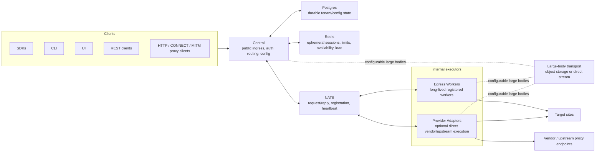

# Straw Proxy Plan

## 1. Purpose

Straw is a distributed HTTP/HTTPS proxy system for high-scale web scraping. It centralizes proxy usage behind a single entrypoint while letting operators combine their own egress endpoints with third-party proxy providers.

Straw solves the operational problem of setting up endpoints, choosing where requests should egress, and managing routing rules across many proxy sources. It provides browser fingerprint simulation, configurable routing, vendor aggregation, and both plain CONNECT tunneling and MITM-based HTTPS handling.

MITM interception is part of the core purpose, but not for surveillance or general man-in-the-middle use. Straw uses it to decode HTTPS requests into a simpler internal request/response message flow between Control and Egress, improving reliability while still allowing raw CONNECT tunnels when needed.

Straw is not an anonymity tool and not a browser automation platform. Its job is to pass requests through the configured route to the desired egress endpoint.

## 2. Goals

Concrete capabilities the system must provide:

- Provide four client entrypoints through Control:
  - REST API for explicit request/response transport operations.
  - HTTP forward proxy for plain HTTP requests.
  - CONNECT tunnel proxy for raw HTTPS TCP tunnels.
  - MITM HTTPS proxy for decoded request/response handling.
- Route traffic through operator-owned Egress workers and operator-configured upstream proxies or vendors.
- Select routes by tags, country, region, IP type, sticky session affinity, fallback rules, and upstream proxy or worker availability.
- Support browser fingerprint simulation for outbound Egress requests, selectable by profile.
- Support configured HTTP header/cookie injection based on tags and target domain.
- Authenticate clients with API keys, authenticate workers, restrict management actions to admins, and preserve tenant isolation.
- Preserve HTTP behavior needed for scraping workloads, including streaming uploads/downloads, client-disconnect cancellation, stable error codes, and clear timeout mapping.
- Allow optional payload capture globally or by tags when explicitly enabled by the operator.
- Store durable configuration and state in Postgres, and use Redis only for ephemeral state such as sessions, rate limits, queues, or short-lived routing data.
- Expose structured logs, metrics, tracing, propagated request IDs, health checks, and readiness checks.
- Include Phase 1 client SDKs, CLI, and UI for operating and using Straw.
- Ship one official Egress implementation written in Go.
- Run locally with docker-compose and support production operation with horizontally scaled Control instances, regional Egress pools, graceful worker draining, and graceful shutdown.
- Enforce abuse and overload controls, including rate limits, quotas, destination deny rules, and payload/header redaction.
- Use stable versioned Control/Egress contracts with protobuf messages, typed errors, request correlation, transport-level retry semantics, timeouts, and backward-compatible rolling deploys, so custom Egress implementations can be built from day one.
- Avoid fixed architectural limits on request concurrency or request rate; practical limits should come from configured capacity, worker pools, queues, quotas, and infrastructure.
- Support unlimited request and response body sizes by design, with configurable deployment limits.
- Make request timeouts configurable, with expected defaults in the 30-60 second range.
- Keep Control-side routing and coordination overhead under 500 ms, excluding actual outbound request execution time on Egress workers.
- Include runnable checks for routing, config, parsing, protobuf compatibility, NATS request/reply, worker registration, REST/proxy/CONNECT/MITM flows, worker loss, NATS outage, timeout paths, backpressure, and load behavior.

## 3. Non-Goals

Things intentionally outside scope so future decisions do not drift.

- Straw is not a scraping orchestrator. It does not provide crawler scheduling, browser orchestration, CAPTCHA solving, content extraction/parsing, scraping retry policies, batch execution, persistent request queues, replay workflows, or "run this later" job APIs. Requests come in, are transported, and finish.
- Phase 1 is limited to HTTP and HTTPS transport. WebSockets, SOCKS5, generic TCP, UDP/QUIC, and non-web protocols are future work.
- Straw does not guarantee anonymity, identity hiding, attribution protection, residential IP procurement, or any privacy-network behavior.
- Phase 1 is not a managed SaaS product. Billing, payments, self-serve signup, customer dashboards, public marketplaces, and hosted multi-customer business workflows are reserved for later monetization work.
- Phase 1 does not include marketplace/vendor integrations, automatic third-party proxy account provisioning, provider billing reconciliation, or marketplace routing economics. It may still chain to operator-configured upstream proxies or vendors.
- Straw does not provide compliance or legal enforcement features such as jurisdiction policy engines, consent management, legal review workflows, or automated `robots.txt` enforcement. Operators are responsible for lawful use.
- Straw does not make content-aware scraping decisions. It does not perform semantic page understanding, response classification, automatic login/session workflows, or smart behavior based on response bodies. Content is processed only as needed to stream, buffer, and transport it.
- Traffic payload capture and storage are not the default behavior. Operators may explicitly enable payload capture globally or by tags for debugging or auditing, subject to their own policy and responsibility.
- Browser fingerprint simulation is best effort. Straw does not guarantee undetectability, CAPTCHA avoidance, WAF bypass, anti-bot bypass, or successful access to any target site.
- Straw is not intended to run as an unauthenticated public open proxy. Clients, workers, and management actions must be authenticated.
- Straw does not provide general traffic tampering, script injection, credential harvesting, surveillance, or content-filtering features. The only planned mutation is configured HTTP header/cookie injection based on tags and target domain.
- Straw exposes health and readiness endpoints, but does not provide built-in global failover, managed disaster recovery, zero-downtime guarantees, or exactly-once request execution. Availability beyond documented deployment patterns is the operator's responsibility.
- Phase 1 includes client SDKs, CLI, and UI, but only one official Egress implementation is planned: the Go worker. Other platforms and languages can implement the Control/Egress protocol, but are not promised as first-party workers.
- Phase 1 does not include a plugin system, embedded scripting, worker marketplace, or runtime module loader inside the official Egress worker.

## 4. System Overview

Straw is control-centered. SDKs, CLI, UI, REST clients, HTTP proxy clients, CONNECT clients, and MITM proxy clients all enter through Control. Control is the only public-facing runtime service: it owns client ingress, admin/config APIs, authentication, authorization, tenant isolation, routing policy, and coordination.

Control is horizontally scalable and mostly stateless. Durable tenant configuration and audit state live in Postgres. Ephemeral state such as sticky sessions, rate limits, queues, worker/adapter availability, and load snapshots lives in Redis. Only Control connects to Postgres and Redis; Egress workers and Provider Adapters communicate through NATS, plus configured large-body transport when needed.

The control/config plane runs through Control. Admins and automation use the UI, CLI, SDKs, or REST APIs to manage tenants, API keys, routing rules, upstream/vendor configuration, fingerprint profiles, injection policies, worker credentials, quotas, and payload capture policy. Control persists durable configuration in Postgres and uses Redis for shared ephemeral coordination.

The request/data plane also starts at Control. REST, plain HTTP proxy, and MITM HTTPS requests are decoded into a shared internal HTTP request/response model. MITM is the default HTTPS proxy behavior. Raw CONNECT remains an explicit separate tunnel path because it forwards bytes rather than decoded HTTP messages. MITM clients must either trust Straw's CA or explicitly disable certificate verification.

Routing uses one unified route model. A route can target an Egress worker pool or a Provider Adapter pool. Egress workers are long-lived registered workers that execute traffic from operator-controlled network locations. Provider Adapters are first-class but optional runtime components used when a route should hit a vendor or upstream provider directly instead of wasting bandwidth through an Egress worker. Control chooses the adapter pool/class; the adapter chooses the exact vendor endpoint, account, or upstream target using its provider-specific logic.

Control dispatches work over NATS using versioned protobuf contracts, request/reply correlation, typed errors, timeouts, registration, heartbeat, and load reporting. Egress workers and Provider Adapters are worker-like NATS participants: they register capabilities, report health/load, receive assigned work, and return responses or typed failures. Downstream executors should verify signed or otherwise authorized dispatch messages when that can be done with minimal overhead; otherwise they trust Control as the authorization boundary for Phase 1.

NATS is the default body path. For bodies that exceed configured message limits or deployment policy, Straw supports configurable large-body handling through object storage references or a direct streaming channel. Egress workers and Provider Adapters may connect to that configured body transport, but they must not connect to Postgres or Redis.

Outbound request mutation is split by responsibility. Control resolves tenant policy, routing metadata, fingerprint profile selection, and header/cookie injection rules. The executing component, either Egress or Provider Adapter, applies transport-level browser fingerprint behavior and final outbound header/cookie changes because it owns the actual outbound connection.

## 5. Components

Responsibilities of each major service.

- Control Server: the single public-facing deployable service. It owns REST, admin/config APIs, HTTP forward proxy, CONNECT tunnel proxy, MITM proxy, client authentication, admin authorization, tenant isolation, routing decisions, request cancellation, and NATS dispatch to executors. Control is the only component that reads and writes Postgres and Redis.
- Egress Worker: the official Go executor for operator-owned egress locations. It registers with Control over NATS, reports capabilities, health, and load, executes assigned outbound HTTP/HTTPS requests, applies browser fingerprint behavior and final header/cookie injection, supports proxy chaining when configured, and streams request/response bodies through NATS or the configured large-body transport.
- Provider Adapter: a Phase 1 executor for routes that should go directly through an upstream proxy or vendor instead of an Egress worker. It participates in NATS like a worker, reports capabilities, health, and load, receives assigned work from Control, and owns provider-specific endpoint, account, and upstream selection.
- NATS: internal message transport between Control, Egress Workers, and Provider Adapters. It owns request/reply correlation, registration, heartbeats, queue groups, transport-level timeouts, typed failures, backpressure signaling, and queue-related behavior. NATS is also the default body path when bodies fit configured message limits.
- Large-Body Transport: configured data path for request or response bodies that should not travel inside NATS messages. Phase 1 supports S3-compatible object storage references and direct streaming channels. Control, Egress Workers, and Provider Adapters may use it; it does not own routing, auth, or durable metadata.
- Redis: shared ephemeral runtime state. It owns sticky session affinity, rate limiting counters, worker and adapter availability snapshots, backpressure/load state, and in-flight request state with TTLs. It does not own durable configuration or queue semantics.
- Postgres: durable system and tenant state. It owns tenants, users, API keys, worker credentials, routing rules, upstream/vendor configuration, fingerprint profiles, header/cookie injection policies, quotas, payload capture policy, audit logs, and request metadata.

Observability is not a separate deployable component. Each service emits its own structured logs, metrics, traces, propagated request IDs, health checks, and readiness checks.

## 6. Client Interfaces

How clients talk to Control.

Control exposes one public interface family with four transport entrypoints:
versioned REST APIs, plain HTTP forward proxying, default MITM HTTPS proxying,
and explicit raw CONNECT tunneling. All interfaces authenticate to the same
tenant/client identity model. REST clients use `Authorization: Bearer ...`;
proxy clients use `Proxy-Authorization`. Admin and configuration operations
require admin-scoped credentials.

The REST API is versioned under `/v1` and is split by purpose:

- Request Transport API: synchronous request/response execution. A submitted
  request blocks or streams until the upstream response, timeout, cancellation,
  or typed failure returns. Phase 1 does not expose async job IDs, polling,
  replay, or persistent request queues.
- Admin and Config APIs: tenant, API key, route, upstream/vendor, fingerprint,
  injection policy, worker credential, quota, and payload-capture management.
  These APIs are separate from request transport paths, such as `/v1/admin/*`
  or `/v1/config/*`, and require admin authorization.

REST request metadata is supplied as structured JSON fields. This includes
routing tags, country, region, IP type, sticky session ID, fingerprint profile,
timeouts, payload capture hints, and any other per-request routing controls.
REST supports arbitrary request and response bodies: small bodies may be inline,
while large uploads and downloads must stream or use configured body references
so REST is not limited to JSON payload sizes.

The HTTP proxy interface follows standard forward proxy semantics for plain
HTTP. Clients send absolute-form requests such as
`GET http://example.com/path HTTP/1.1`, Control authenticates the client,
extracts routing metadata from `X-Straw-*` headers, dispatches the decoded
request, and streams the upstream response back without a Straw response
envelope.

HTTPS proxying defaults to MITM mode. Clients use the MITM proxy listener and
either trust the Straw CA or explicitly disable certificate verification in the
client. Control terminates the client TLS connection, reconstructs the HTTPS
request into the same internal request/response model used by REST and plain
HTTP proxying, applies decoded-request features such as routing metadata and
configured header/cookie injection, and streams the decoded upstream response
back to the client.

Raw CONNECT is an explicit separate listener or mode for clients that need an
opaque tunnel. After Control authenticates the client, reads any routing
metadata present on the CONNECT request, selects a route, and the executor
opens the upstream tunnel, Control returns `200 Connection Established`. The
tunnel is then byte-forwarded without HTTP decoding. Raw CONNECT does not
support decoded-response inspection,
header/cookie injection, payload capture beyond tunnel metadata, or browser
fingerprint behavior that requires access to HTTP messages.

Decoded transport modes return raw upstream responses, not JSON envelopes. When
Control, an executor, or another Straw component rejects or fails a decoded
REST, plain HTTP proxy, or MITM request before an upstream response is visible
to the client, it returns a nonstandard HTTP status code with a JSON envelope
containing the typed error code, retryability, message, and request ID. Raw
CONNECT failures before `200 Connection Established` use CONNECT-compatible
failure behavior; failures after `200` close the tunnel and are recorded in
observability data.

Official SDKs, the CLI, and the UI are thin clients over the REST request,
admin, and config APIs. They do not define separate wire protocols or behavior.

## 7. Request Lifecycle

End-to-end flow from client request to egress response.

Control creates a request ID as soon as a request reaches any ingress path.
That ID is returned on Straw-caused errors and propagated through logs,
metrics, traces, NATS messages, executor work, and persisted request metadata.
Unauthenticated or malformed ingress attempts also get request IDs and are
logged as security/audit events, even when no tenant-bound request record can
be created.

Before any body bytes are forwarded, Control parses ingress-specific request
metadata, authenticates the client, checks quotas and rate limits, applies
destination deny rules, computes the request deadline, resolves routing policy,
and selects an executor. Control persists audit/debug request metadata on a
best-effort basis before dispatch; persistence failures do not fail the
request, but they are logged and counted. Persisted metadata includes request
ID, tenant/client identity, ingress type, target host/path, route hints,
selected route and executor, timing, byte counts, final status/result, typed
error code where applicable, and payload-capture policy decision. Payloads are
not persisted unless capture is explicitly enabled.

REST, plain HTTP proxy, and MITM HTTPS ingress normalize into one decoded
internal request model. REST metadata comes from structured fields, plain HTTP
proxy metadata comes from `X-Straw-*` headers, and MITM metadata comes from the
proxy request before Control terminates client TLS and reconstructs the HTTPS
request. MITM certificate generation and cache behavior are part of the MITM
design section; the lifecycle only depends on MITM producing the same decoded
request shape. Straw routing/control headers are stripped from outbound
requests unless an explicit injection policy re-adds a value.

Decoded requests are asynchronous inside Control even though REST and proxy
clients observe synchronous request/response calls. Control creates an
in-flight request, sends one normalized assignment to the selected executor
with method, URL, headers, routing metadata, fingerprint/injection policy
resolution, deadline, and body stream or body reference, then waits for the
executor to accept or reject the assignment. If the executor rejects before any
body bytes are forwarded and fallback policy allows another eligible route,
Control may try another route. Once body streaming or a client-visible response
has started, executor loss or rejection fails the active request.

Request bodies stream only after route selection and executor assignment
acceptance. Control reads from the client according to downstream backpressure
from NATS, the executor, or the configured large-body transport, using bounded
buffers only. Normal chunks travel through NATS when they fit configured
message limits; bodies that exceed message limits or deployment policy use the
configured large-body transport, such as object storage references or a direct
streaming channel. Payload capture, when enabled, tees the stream and follows
capture truncation or size policy; capture does not force buffering or mutate
the body.

The executor applies final outbound header/cookie injection and transport-level
fingerprint behavior immediately before making the upstream request. Straw does
not follow upstream redirects by default; redirect responses are streamed back
to the client as normal upstream responses. If operator policy allows it, a
request header or REST flag may opt into following redirects because redirect
following can change routing cost and upstream request count.

Executor responses are streamed back as `response_start` with status and
headers, followed by body chunks, optional trailers, and either `response_end`
or a typed error. Control starts the client response as soon as upstream
status/headers arrive and streams body bytes untouched. Trailers are preserved
when the ingress path, internal transport, and executor support them; otherwise
the limitation is documented by that path. Payload capture remains a tee and
does not inspect or transform normal response bodies.

For successful upstream responses, REST transport, plain HTTP proxy, and MITM
proxy return the upstream status, headers, body, and trailers directly rather
than wrapping them in a Straw envelope. Straw-caused Control, executor, routing,
timeout, validation, or transport errors use nonstandard HTTP status codes and
a JSON error envelope for all decoded flows, with exact status values and error
codes defined in the error handling section. If such an error happens after
client-visible response headers or body bytes have already been sent, Control
cannot switch formats; it terminates the stream and records the typed failure
in logs, traces, metrics, and final metadata.

Raw CONNECT is a separate byte-tunnel lifecycle. Control authenticates the
client, reads routing metadata from the CONNECT request, checks quotas and deny
rules, creates and propagates the request ID, persists metadata best-effort,
selects an executor, and asks the executor to open the upstream tunnel. Control
returns `200 Connection Established` only after the executor has opened that
tunnel. After `200`, bytes tunnel through Control and Straw's internal
transport; the client is never handed off directly to an executor. Before
`200`, failures can return a CONNECT-style status and Straw error headers or
envelope as defined by error handling. After `200`, failures close the tunnel
and are recorded in logs, traces, metrics, and final metadata.

Client disconnects and explicit cancellations trigger best-effort cancellation
from Control to the executor, after which Control drops any later response data.
Final metadata is still updated with disconnect/cancellation result, timing,
and known byte counts. If an executor dies mid-request or mid-tunnel, Control
uses the routing fallback safety rules to decide whether best-effort reroute is
allowed; otherwise the active request fails with a typed worker-loss error.
Control may briefly queue a request only within configured backpressure limits
when all matching executors are busy; otherwise it fails before request body
streaming starts. During Control draining or graceful shutdown, Control stops
accepting new requests and lets in-flight lifecycles finish until their
deadlines.

## 8. Routing Model

How Control chooses an executor.

Routing chooses a generic executor: either an Egress worker pool or a Provider
Adapter pool. Clients do not force route IDs. They provide route hints such as
tags, target country, target region, IP type, sticky session ID, ingress type,
and target host. Admin-configured rules decide the selected route.

Rules are tenant-scoped, explicitly prioritized, enabled or disabled, and
evaluated in priority order. Each rule has match conditions and targets one
named executor pool. Lower-priority rules model fallback; rules do not contain
nested pool lists or weighted traffic splitting in Phase 1. Missing request
hints mean no preference, but any hint the client does provide is a hard
constraint. Fallback may relax admin preferences, but it must not relax client
hints.

Rule matching supports:

- Tags: all requested tags must be present.
- Country: strict ISO-3166 alpha-2 country codes.
- Region: optional worker or provider-advertised values scoped to country.
- IP Type: `datacenter`, `residential`, `mobile`, `isp`, or `unknown`.
- Ingress Type: optional match for REST, plain HTTP proxy, MITM, or raw CONNECT.
- Target Host: exact host and suffix domain matches only.

Egress workers and Provider Adapters advertise capabilities through the same
model: executor type, pool membership, tags, countries and regions, IP types,
supported ingress modes, stable egress identities when available, load, health,
and draining state. Provider-specific endpoint or account selection stays
inside the Provider Adapter.

Control evaluates routing from a cached tenant route snapshot, not by querying
Postgres on every request. Admin config writes update Postgres, bump the
routing config version, and publish a Redis invalidation so Control instances
reload the affected tenant snapshot. A short TTL refresh is the fallback if an
invalidation is missed. A request uses the snapshot captured at request start
for all retry and fallback attempts.

After a rule selects a pool, Control chooses the least-loaded healthy eligible
executor in that pool, using round-robin as a tie breaker. Draining executors
are excluded from new assignments but may finish active requests until they
complete or hit their deadline.

Sticky sessions pin to a stable egress identity, such as an upstream endpoint or
IP, rather than a process instance when that identity exists. If no stable
identity is available, Control may pin to the executor instance. Sticky affinity
is stored in Redis with a rule-level TTL and tenant default, refreshed on use.
If the pinned egress identity is unavailable, the request fails by default. A
rule or request may explicitly allow sticky fallback, in which case Control can
choose another eligible executor and update the affinity.

Fallback first tries another eligible executor in the same selected rule, then
lower-priority fallback rules. Fallback is allowed only before request body
streaming starts, or when the request body is replayable and the method is safe
or idempotent. Once body streaming has started for a non-replayable request,
the active request fails instead of being retried through another route.

When no rule matches, Control returns typed `route_no_match`. Decoded modes use
HTTP `421 Misdirected Request`; raw CONNECT uses CONNECT-compatible failure
before tunnel establishment. There is no implicit default route: admins must
create a catch-all rule if they want one.

When a rule matches but all eligible executors are unhealthy, draining,
overloaded, unavailable, or exhausted after fallback, Control returns typed
`route_unavailable`. Decoded modes use HTTP `503 Service Unavailable`; raw
CONNECT uses CONNECT-compatible failure before tunnel establishment.

## 9. Worker Discovery and Health

How workers join, stay alive, and leave.

Egress Workers and Provider Adapters use the same discovery and health protocol
over NATS. The protocol identifies the executor type as `egress_worker` or
`provider_adapter`; exact NATS subject names are defined in the NATS protocol
section. Workers do not call Control directly for discovery or health.

Each worker has a globally unique, operator-assigned `worker_id` configured on
the worker side. If the worker presents valid worker credentials, Control
accepts first registration automatically and records or updates the durable
worker metadata. Credentials define tenant and pool scope: a credential may be
single-tenant or multi-tenant, but the worker cannot register capabilities
outside that scope. Pools must already exist in Control configuration; workers
cannot create pools implicitly during registration.

Registration happens on startup and whenever static capabilities change.
Control rejects missing required fields, out-of-scope capabilities, or
incompatible protocol/software versions with typed registration errors. A valid
registration returns an acknowledgement and a runtime `session_id`; until then,
the worker stays connected but does not join assignment queue groups. Required
registration data includes:

- `worker_id`, `executor_type`, credential scope, and protocol/software version.
- Pool names, tags, countries, regions, IP types, and supported ingress modes.
- Stable egress identity when known, such as an upstream endpoint or source IP.
- Max concurrency and initial draining state.

Static capabilities are trusted in Phase 1 after credential-scope validation.
Control does not actively verify advertised country, region, or IP type before
routing. It relies on health, load, assignment outcomes, logs, and operator
configuration; active egress verification is future work.

Heartbeats update dynamic runtime state only. They include `worker_id`,
`session_id`, worker-reported health, a short reason string, active request
count, max concurrency, available capacity, queue depth if any, and draining
state. Heartbeats may include a worker timestamp for diagnostics, but liveness
uses Control receive time so clock drift cannot mark workers alive or dead.
Workers send heartbeats every `5s` by default.

Worker-reported health is one of `ready`, `degraded`, or `unhealthy`.
`ready` workers are eligible when capacity is available. `degraded` workers can
remain eligible if they still report available capacity. `unhealthy` workers
are not eligible for new assignments. Zero available capacity also excludes a
worker from new assignments, but it does not make the worker unhealthy or dead.
Workers should not maintain a meaningful local assignment queue; Control gates
assignment on reported capacity, and overloaded workers reject with a typed
capacity error.

Control computes final routing availability from worker-reported health,
heartbeat freshness, admin disable state, draining state, capacity, compatible
version, duplicate-session status, and recent assignment failures. The default
freshness thresholds are:

- `15s` without heartbeat: unavailable for new assignments.
- `30s` without heartbeat: dead; live routing/session state is removed.

Durable worker records and audit history remain when a worker is dead. The same
`worker_id` can become routable again by registering a new session. If an
unavailable worker resumes fresh heartbeats before being marked dead, Control
automatically makes it eligible again once it reports `ready` or eligible
`degraded` health with available capacity and is not disabled, draining, or in
cooldown.

Duplicate active sessions for one `worker_id` are not allowed. A newer valid
registration receives a new `session_id` and replaces the old session after a
`10s` grace window. The old session receives no new assignments during grace.
After grace, remaining active requests either finish if already completed or
follow the worker-loss fallback behavior. Heartbeats from stale `session_id`
values are ignored.

Draining is runtime state. A worker can start draining by reporting
`draining=true`, and an admin can also mark a worker draining through Control.
In both cases, Control stops assigning new work while allowing in-flight work
to finish until each request deadline. Draining clears on new registration
unless the worker reports `draining=true` again. A separate admin disable flag
is durable, survives worker restart, and excludes the worker from routing while
still allowing it to register and report health for observability.

Graceful shutdown sends a best-effort final stopping or draining update so
Control can mark the worker unavailable immediately. Crashes are detected by
heartbeat timeout. When a worker is unavailable, dead, replaced, or lost during
an assignment, Control attempts best-effort reroute only where the routing
fallback rules allow it: before request body streaming starts, or when the body
is replayable and the method is safe or idempotent. Otherwise the request fails
with a typed worker-lost or route-unavailable error.

Control applies a short cooldown for repeated assignment/start failures. The
default trigger is `3` failures within `60s`; the worker is excluded from new
assignments for `30s` or until a healthy heartbeat reports available capacity,
whichever comes first.

Postgres stores durable worker identity, credential, admin disable, and audit
metadata. Redis stores ephemeral current registration, `session_id`, heartbeat,
load, availability, draining, cooldown, and routing snapshots. Registration and
admin state changes are durable audit events; high-frequency heartbeat and
health transitions stay in Redis, logs, metrics, and traces. Local worker
liveness/readiness HTTP endpoints may exist for deployment probes, but Control
discovery and routing health depend on NATS registration and heartbeats.

## 10. NATS Protocol

Messaging shape between Control, Egress Workers, and Provider Adapters.

Phase 1 uses Core NATS only. NATS is an internal service transport, not a
durable job queue, replay log, tenant authorization system, or hidden backlog.
All NATS payloads are protobuf binary messages wrapped in a small common
envelope containing `request_id`, `tenant_id`, `trace_id`, `deadline`,
`protocol_version`, and `attempt`. Message-specific fields stay in the concrete
protobuf body. JSON is used only at public REST/admin boundaries.

Subjects use a stable major-version prefix. Minor protobuf schema evolution
uses backward-compatible fields rather than new subject names. Participants
reject incompatible major protocol versions during registration or assignment
and tolerate unknown backward-compatible protobuf fields. Field-level schema
rules are defined in the protobuf contracts section.

Phase 1 uses this subject table:

- `straw.v1.control.register`: worker or adapter registration request/reply.
- `straw.v1.control.heartbeat`: worker or adapter heartbeat request/reply.
- `straw.v1.executor.<worker_id>.<session_id>.assign`: assignment request/reply
  for one registered executor session.
- `straw.v1.req.<request_id>.<worker_id>.<session_id>.c2e`: request-scoped
  Control-to-executor frames.
- `straw.v1.req.<request_id>.<worker_id>.<session_id>.e2c`: request-scoped
  executor-to-Control frames.

`request_id`, `worker_id`, and `session_id` values used in subjects must be
dot-free safe tokens. Registration rejects invalid `worker_id` values instead
of escaping subject tokens dynamically. Tenant, pool, route, capability, and
executor-type data stay in protobuf fields, not subject names. Provider
Adapters use the same executor protocol and subjects as Egress Workers, with
`executor_type` distinguishing behavior.

Registration is request/reply on `straw.v1.control.register`, handled by any
Control instance in the `control` queue group. A valid registration returns
typed status and a runtime `session_id`. A worker or adapter subscribes to its
assignment subject only after registration returns `ok`, and it re-registers
after any NATS reconnect before accepting new assignments. Draining, stopping,
stale, or replaced sessions unsubscribe from assignment immediately but may
remain connected for heartbeats and active request-scoped streams.

Heartbeats are request/reply on `straw.v1.control.heartbeat`, also handled by
the `control` queue group. The heartbeat ack can return `ok`,
`stale_session`, `re_register`, `disabled`, or `drain` so basic runtime control
does not need a separate channel.

Control owns routing and executor choice. It sends each assignment to the exact
executor session subject, not to a pool queue group, because Control already
tracks sticky sessions, capacity, health, draining, cooldowns, and fallback.
Control sends one active assignment attempt at a time; Phase 1 does not use
parallel speculative dispatch. NATS queue groups are used for shared Control
service handling, not executor load balancing.

Assignment is a two-step flow. Control sends an assignment request and waits
for an immediate accept/reject reply. The default assignment ack timeout is
`2s`, configurable, and capped by the request deadline. If assignment publish
or request/reply fails, Control marks that executor attempt failed and lets the
routing fallback rules decide whether another executor can be tried safely.
There are no generic NATS transport retries because duplicate assignment is
worse than a clean failed attempt.

After assignment accept, request and response data move over deterministic
request-scoped subjects derived from `request_id`, `worker_id`, and
`session_id`. Decoded HTTP bodies and raw CONNECT tunnel bytes use the same
frame protocol, with an explicit mode distinguishing decoded HTTP from opaque
tunnel behavior. Frames include monotonically increasing sequence numbers.
Receivers fail the active request on gaps, duplicates, or out-of-order frames.
Ordering is guaranteed only within a single request stream; there is no
cross-request ordering contract.

Request-scoped protobuf message types include stream frames, credit updates,
cancel, error, end, and cancelled. Credit messages travel on the opposite
direction subject: `c2e` carries request body or tunnel upload frames plus
credit for executor-to-Control response/tunnel bytes, while `e2c` carries
response or tunnel download frames plus credit for Control-to-executor upload
bytes. Senders stop when credit is exhausted, keeping buffers bounded instead
of relying on NATS buffering for backpressure.

Every accepted assignment ends with exactly one terminal message: `end`,
`error`, or `cancelled`. After a terminal message or deadline, Control and the
executor close request-scoped subscriptions and ignore late frames. Late frames
do not change the client-visible result; they are counted as protocol errors
and can contribute to worker cooldown if repeated.

Control sends a best-effort request-scoped `cancel` message when the client
disconnects, an admin action or shutdown abandons the request, a timeout fires,
or fallback makes an accepted attempt obsolete. Deadlines remain the hard stop:
executors must stop work when the assignment deadline expires even if a cancel
message is missed.

Timeout handling has three layers: assignment ack timeout, per-frame idle
timeout, and total request deadline. The assignment ack timeout decides whether
the selected executor accepted work. The idle timeout detects stream silence
after accept. The request deadline is the absolute cap for all NATS and
executor work for that request.

NATS is the default body path only while messages stay under deployment limits.
The default maximum application payload per protobuf message is `1 MiB`,
configurable. Larger request or response bodies use the configured large-body
transport instead of tuning Straw around oversized broker messages.

NATS authentication is service-level in Phase 1. Control, workers, and adapters
receive credentials scoped to their allowed subject prefixes. Tenant
authorization remains in Control and worker credential scope validation during
registration. NATS publish/request/reply failures are exposed externally as
typed `transport_unavailable`; executor reject, timeout, loss, capacity, and
upstream failures keep their more specific typed error codes.

## 11. Protobuf Contracts

Schemas shared by Control and Egress.

Phase 1 uses one shared protobuf package for Control, Egress Workers, and
Provider Adapters:

- Protobuf package: `straw.v1`.
- Go package name: `strawpb`.
- Source file: `proto/straw/v1/straw.proto`.
- Tooling files: `buf.yaml` and `buf.gen.yaml`.
- Optional helper script: `scripts/proto-generate`.

All NATS payloads are one binary protobuf `Envelope`. The envelope contains the
common transport fields and a `oneof payload` so every participant has one
decode path:

- `request_id`, `tenant_id`, `trace_id`.
- `deadline_unix_ms` for the absolute request deadline.
- `protocol_major` and `protocol_minor`.
- `attempt`, starting at `1` and incrementing for fallback attempts.
- `oneof payload`: `RegisterRequest`, `RegisterAck`, `HeartbeatRequest`,
  `HeartbeatAck`, `AssignRequest`, `AssignAck`, and `StreamFrame`.

IDs are plain strings, not binary UUIDs. This keeps REST, logs, NATS subjects,
and generated clients simple across languages. Validation rules are documented
in the schema comments: IDs must be non-empty where business logic requires
them; IDs used in NATS subjects, such as `request_id`, `worker_id`, and
`session_id`, must be dot-free safe tokens. `tenant_id` stays in protobuf
fields and is never included in NATS subjects. Workers include tenant IDs for
correlation only; authorization still comes from validated worker credentials
and registration scope.

Time values use simple integers instead of protobuf timestamp wrapper types:

- Absolute times use `int64 *_unix_ms`.
- Durations and timeouts use `uint32 *_ms`.

The schema uses proto3 and no `required` fields. Receivers validate mandatory
business fields after decoding and return typed `validation_error` failures for
missing, zero, oversized, or inconsistent values. Unknown fields are ignored for
rolling deploy compatibility. Unknown enum values and unsupported `oneof`
payloads are rejected as unsupported or incompatible protocol input.

Fixed-value fields are protobuf enums with explicit `*_UNSPECIFIED = 0`
values. Enums include `IpType`, `IngressType`, `ExecutorType`, worker health,
assignment mode, payload capture decision, registration status, heartbeat ack
status, assignment ack status, fingerprint preset, and shared error codes.
Custom implementations must treat unknown enum values as unsupported rather
than silently defaulting.

HTTP headers use ordered repeated pairs, not maps:

- `Header { string name; bytes value; }`.
- Ordering and duplicates are preserved, including repeated `Set-Cookie`
  headers.

Routing metadata mirrors the routing model. Request metadata carries tags,
country, region, IP type, sticky session ID, ingress type, and target host.
Control-selected fields, such as route ID, pool ID, executor ID, and stable
egress identity, are optional presence-sensitive scalar fields.

`RegisterRequest` advertises static identity and capabilities:

- `worker_id`, `executor_type`, credential identifier, and opaque
  `signed_token`.
- Supported protocol major/minor and software version.
- Pool names, tags, countries, regions, IP types, supported ingress modes, and
  stable egress identity when known.
- Max concurrency and initial draining state.

`RegisterAck` uses a status enum with `OK`, `REJECTED_AUTH`,
`REJECTED_SCOPE`, `REJECTED_VERSION`, and `REJECTED_VALIDATION`. It includes
`session_id` only when status is `OK`; rejected responses include a shared
`Error` and operator-facing message.

`HeartbeatRequest` carries dynamic runtime state only:

- `worker_id`, `session_id`, health, reason, active request count, max
  concurrency, available capacity, optional queue depth, draining state, and
  optional `worker_unix_ms` for diagnostics.

`HeartbeatAck` uses `OK`, `STALE_SESSION`, `RE_REGISTER`, `DISABLED`, and
`DRAIN`.

Assignment reserves capacity before request details are streamed. `AssignRequest`
does not carry the full HTTP request. It carries only reservation data:

- Mode: decoded HTTP or raw tunnel.
- Deadline.
- Expected upload size when known.
- Selected route, pool, executor, and stable egress metadata.

`AssignAck` uses enum values for `ACCEPTED`, `REJECTED_CAPACITY`,
`REJECTED_DRAINING`, `REJECTED_UNSUPPORTED`, and `REJECTED_ERROR`. Rejections
include messages; `REJECTED_ERROR` includes the shared `Error`.

After an accepted assignment, request-scoped traffic uses one `StreamFrame`
message with a `oneof` payload:

- `request_start`
- `response_start`
- `data`
- `credit`
- `cancel`
- `error`
- `trailers`
- `end`
- `cancelled`

Frame direction is implied by the NATS subject: `c2e` carries client-to-executor
upload or tunnel bytes, and `e2c` carries executor-to-Control response or
tunnel bytes. Sequence numbers apply only to data-bearing `DataFrame` messages.
Receivers fail the request on data sequence gaps, duplicates, or out-of-order
frames. Control frames such as credit, cancel, error, trailers, end, and
cancelled are not part of the data sequence.

`CreditFrame` uses byte credit only. Combined with the per-frame data limit,
this bounds memory without frame-count bookkeeping.

Request and response bodies use the same body model:

- Normal bodies stream as repeated `DataFrame { uint64 sequence; bytes data; }`
  messages.
- Large bodies use `BodyRef`.
- `BodyRef` supports S3-compatible object storage references and generic direct
  streaming references from day one.
- Direct stream references are transport-neutral:
  `DirectStreamRef { string stream_id; map<string,string> params; }`.

`RequestStart` carries the executor-ready request:

- Mode: decoded HTTP or raw tunnel.
- HTTP method and full absolute URL as one string.
- Stripped outbound headers only; Straw routing/control headers are never sent
  to executors.
- Routing metadata and selected route/executor metadata.
- Computed deadline and `replayable_body`.
- Payload capture decision and size limits.
- Executor-ready resolved fingerprint and header/cookie injection instructions.

Executors never query config and never interpret raw admin policy objects.
Control sends the resolved instructions needed for this request plus
policy/version IDs for audit correlation. Header and cookie injection
instructions are ordered operations, such as add, set, or remove header and
add or set cookie, so execution order is deterministic.

Fingerprint instructions are a fixed protobuf message, not an opaque JSON blob.
The official worker uses `tls-client`; the protobuf enum mirrors the
`tls-client` preset set in the current Straw contract. When `tls-client` adds
presets, Straw adds enum values in a contract update. Executors reject unknown
or unsupported presets with `unsupported_fingerprint`.

Payload capture is not a boolean. It is an enum decision with size limits:
`NONE`, `METADATA_ONLY`, `HEADERS`, `BODY_TRUNCATED`, and `BODY_FULL`.

`ResponseStart` is upstream-only. It carries the upstream status, ordered
upstream headers, and optional timing fields such as DNS, connect, TLS, and
TTFB durations when available. Straw-generated JSON error envelopes are not
represented as `ResponseStart`; they are Control's client-facing behavior only
when a decoded request fails before upstream response headers are visible.

Trailers are represented by a separate `TrailersFrame` before `EndFrame`.
`EndFrame` marks successful completion and carries final byte counts and timing
summary when known. `CancelFrame` includes a shared error code and reason so
client disconnects, deadlines, admin cancels, and superseded fallback attempts
are distinguishable. `CancelledFrame` acknowledges cancellation and carries
final byte counts and timing when known.

`Error` is shared across registration, assignment, and streams. It includes:

- Shared typed error code.
- Retryability.
- Operator-facing message.
- HTTP status for decoded client-facing failures.
- Details map.
- Optional upstream status.

The shared error code enum covers auth, validation, routing, transport
unavailable, timeout, capacity, worker loss, unsupported fingerprint, upstream
failure, protocol error, cancellation, and unknown internal error. An `Error`
frame after `ResponseStart` means the stream failed after upstream headers or
body began; Control closes the client stream and records the typed failure
instead of trying to switch to a JSON error envelope.

Validation and protocol failures close the active stream. Peers reject invalid
frames, sequence gaps, duplicate or out-of-order data frames, oversized fields,
unsupported enum values, unsupported payload types, and missing mandatory
business fields.

Default limits are explicit in schema comments and config defaults:

- `DataFrame.data`: `1 MiB`.
- Total headers per message: `128 KiB`.
- Metadata/details map entries: `64`.
- Error message length: `4 KiB`.

Optional presence-sensitive scalar values use proto3 `optional`, including
`upstream_status`, `queue_depth`, `worker_unix_ms`, expected upload size, and
selected route/executor fields.

Compatibility is enforced with Buf from day one:

- `buf lint` runs in CI.
- `buf breaking` compares against the last released protobuf contract.
- Removed fields reserve both field numbers and names.
- Changes must not alter field meaning, field type, enum numeric values,
  requiredness expectations, or `oneof` membership incompatibly.
- Minor evolution uses additive optional fields and new enum values.
- Major protocol breaks require a new major protocol version and NATS subject
  prefix.

Generated code targets Go, TypeScript, JavaScript, Python, C#, Java, Kotlin,
and Rust. Generated output is not committed. The repo keeps generation config
and scripts for every target, and CI verifies generation succeeds. Releases
publish language-native generated packages: Go module, npm package, PyPI
package, NuGet package, Maven/Gradle artifacts for Java and Kotlin, and Cargo
crate. The protobuf contract version is canonical; generated packages use that
same version and do not have independent language-specific patch versions.

Phase 1 relies on NATS subject credentials for dispatch authorization and does
not include dispatch signature fields. Deterministic protobuf serialization for
signing or hashing is a Phase 2 concern only; Phase 1 does not depend on
byte-stable serialization.

## 12. HTTP Semantics

Which HTTP behavior is preserved.

- Methods: supported methods.
- Headers: pass-through, stripped, rewritten, generated.
- Cookies: pass-through and session behavior.
- Redirects: follow or return upstream redirects.
- Compression: preserve, decode, or recompress.
- Trailers: support or explicitly reject.
- Connection Reuse: pooling and keep-alive behavior.
- WebSockets: supported modes or not.
- HTTP/2: inbound and outbound support.
- TLS Behavior: SNI, ALPN, verification, client certs.

## 13. MITM Design

HTTPS interception details.

- CA Generation: how root/intermediate CA is created.
- Certificate Storage: where generated certs live.
- Per-Host Certificates: cache and generation rules.
- Client Trust Setup: how clients trust the CA.
- TLS Termination: inbound TLS handling.
- Upstream TLS: outbound TLS handling.
- Security Boundaries: what data is exposed and to whom.

## 14. Egress Execution

How workers perform outbound requests.

- `tls-client` Integration: exact library and call boundary.
- Browser Fingerprints: available profiles and selection.
- Proxy Chaining: whether egress can use another upstream proxy.
- DNS Resolution: local, remote, custom resolver behavior.
- Source IP Selection: how worker IP is chosen.
- Timeout Handling: dial, TLS, header, body, total timeout.
- Error Mapping: translating execution failures to Control errors.

## 15. State and Storage

What is persisted or cached.

- Postgres Data Model: durable tables and ownership.
- Redis Usage: ephemeral keys and TTLs.
- Session State: sticky sessions and routing affinity.
- Worker State: registration snapshots and health.
- Request Logs: metadata, payload policy, retention.
- Retention: cleanup rules.

## 16. Authentication and Authorization

Who can access what.

- Client Authentication: API/client identity.
- API Keys or Tokens: issuance, hashing, revocation.
- Worker Authentication: worker identity and trust.
- NATS Authentication: service credentials.
- Admin Access: privileged operations.
- Tenant Isolation: cross-tenant safety rules.

## 17. Rate Limits and Quotas

How abuse and overload are controlled.

- Per-Client Limits: client request caps.
- Per-Worker Limits: worker capacity caps.
- Global Limits: system-wide protection.
- Burst Handling: short spikes.
- Limit Error Responses: status codes and error payloads.

## 18. Error Handling

Canonical failure behavior.

- Client Errors: bad input and auth failures.
- Routing Errors: no worker or invalid route hints.
- Worker Errors: crashes, rejection, capacity.
- Upstream Errors: DNS, TLS, timeout, refused connection.
- NATS Errors: publish/request/reply failures.
- Timeout Errors: which timeout fired.
- Error Codes: stable internal and external codes.

## 19. Observability

How the system is operated.

- Logs: structure, fields, redaction.
- Metrics: latency, volume, errors, worker health.
- Tracing: request spans across Control/NATS/Egress.
- Request IDs: propagation rules.
- Health Endpoints: liveness/readiness.
- Debug Endpoints: restricted diagnostics.

## 20. Configuration

Runtime configuration surface.

- Control Config: ports, NATS, auth, limits.
- Egress Config: worker ID, capabilities, fingerprints.
- NATS Config: URLs and credentials.
- Redis Config: URL and key namespace.
- Postgres Config: DSN and migrations.
- Secrets: source and rotation.
- Environment Variables: supported env names.

## 21. Deployment

How it runs outside code.

- Local Development: docker-compose and dev commands.
- Docker Compose: local dependency topology.
- Production Topology: service layout.
- Scaling Control: horizontal behavior.
- Scaling Egress: pool growth and regional workers.
- Rolling Deploys: compatibility during deploy.
- Draining and Shutdown: graceful stop behavior.

## 22. Security

Threat model and protections.

- Trust Boundaries: client/control/worker/NATS/storage boundaries.
- Secret Handling: storage and logging rules.
- Certificate Handling: MITM CA protection.
- Request Data Handling: sensitive payload policy.
- Abuse Prevention: SSRF, spam, forbidden destinations.
- Audit Logging: security-relevant events.

## 23. Testing

Checks needed to trust the system.

- Unit Tests: routing, config, parsing, error mapping.
- Protobuf Contract Tests: compatibility and required fields.
- NATS Integration Tests: request/reply and worker registration.
- Proxy Integration Tests: REST, HTTP proxy, CONNECT.
- MITM Tests: cert generation and intercepted HTTPS.
- Load Tests: capacity and backpressure.
- Failure Tests: worker loss, NATS outage, timeout paths.

## 24. Operational Behavior

Expected behavior during incidents.

- Startup: dependency checks and readiness.
- Graceful Shutdown: stop accepting, finish active work.
- Worker Loss: reroute or fail active requests.
- NATS Outage: degradation and recovery.
- Redis Outage: features affected.
- Postgres Outage: features affected.
- Partial Degradation: what still works.

## 25. Open Decisions

Unresolved choices that block implementation or affect architecture.

## 26. Implementation Order

Build sequence and dependencies between parts.

## 27. Risks

Known technical, security, operational, and legal risks.

## 28. Future Work

Useful ideas that are not required for the current planned scope.
