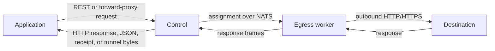

# Straw

[](https://github.com/beremaran/straw-oss/actions/workflows/ci.yml)
[](https://github.com/beremaran/straw-oss/actions/workflows/security.yml)
[](LICENSE)

Straw is a small, self-hosted HTTP/HTTPS egress proxy. Your application sends a request to Control, Control assigns
it over NATS to an Egress worker, and the worker makes the outbound request.



One deployment is one trust boundary. Straw has no tenants, accounts, RBAC, billing, quotas, or analytics database.
NATS is the only required backing service; optional JetStream, Redis, and object-storage profiles provide durable
runtime configuration, multi-Control coordination, and large-body receipts respectively.

## Quickstart

Requirements: Git, Docker with Compose v2, `make`, Bash, and `curl`.

```sh
git clone https://github.com/beremaran/straw-oss.git
cd straw-oss
make dev
```

Then send a request:

```sh
curl -sS \
  -H 'Content-Type: application/json' \
  -d '{"method":"GET","url":"https://example.com"}' \
  http://localhost:8080/api/v1/requests
```

Or use Control as an HTTP/HTTPS forward proxy:

```sh
curl --proxy http://localhost:8080 https://example.com
```

The CLI and tagged SDKs expose the same per-request routing hints. For example:

```sh
straw request --url https://example.com --route-country AU --route-tag residential --sticky-session-id checkout-42
```

The local stack contains exactly NATS, Control, and one Egress worker. It needs no credentials or provisioning.

## Why Straw

- separate the application-facing API from the network that performs egress;
- scale outbound workers independently;
- preserve ordered and duplicate headers;
- bound request bodies, response bodies, and deadlines;
- apply the same routing rules, pool constraints, sticky-session behavior, and destination policy from REST, forward-proxy, and CONNECT ingress;
- optionally move large request and response bodies through verified expiring receipts;
- select any of 79 pinned `tls-client` v1.15.1 TLS/HTTP/2 fingerprint profiles without a runtime dependency on
  `tls-client` or `fhttp`;
- operate with Prometheus metrics, health endpoints, and JSON logs;
- deploy without an application database.

## Documentation

- [Full documentation](https://beremaran.github.io/straw-oss/docs)
- [Quickstart](docs/public/quickstart.md)
- [Install a release](docs/public/installation.md)
- [Architecture](docs/public/architecture.md)
- [Request API](docs/public/api/requests.md)
- [HTTP and HTTPS proxy ingress](docs/public/proxy-ingress.md)
- [Configuration](docs/public/configuration.md)
- [Deployment patterns](docs/public/deployment.md)
- [Runtime administration](docs/public/runtime-administration.md)
- [Highly available Control](docs/public/highly-available-control.md)
- [Object storage and receipts](docs/public/object-storage-receipts.md)
- [Security](docs/public/security.md)
- [Compatibility and supported versions](docs/public/compatibility.md)
- [Public components and provenance](docs/public/components.md)
- [Support](SUPPORT.md)
- [Governance](GOVERNANCE.md)
- [Contributing](CONTRIBUTING.md)

## Development

```sh
make check
make production-deploy-check
make docs-website
```

See [CONTRIBUTING.md](CONTRIBUTING.md) for setup and contribution conventions. The supported development stack is in
`deploy/local`; `deploy/production` is a security-conscious example to adapt to your environment.

## Project status

Straw is pre-1.0. The REST request API and HTTP/HTTPS proxy ingress are the primary supported surfaces; custom-worker
protocol packages are more likely to change between minor releases. See [ROADMAP.md](ROADMAP.md) and
[CHANGELOG.md](CHANGELOG.md).

## License

[MIT](LICENSE) © 2026 Berke Arslan. Adapted third-party profile data is covered by
[THIRD_PARTY_NOTICES.md](THIRD_PARTY_NOTICES.md).
