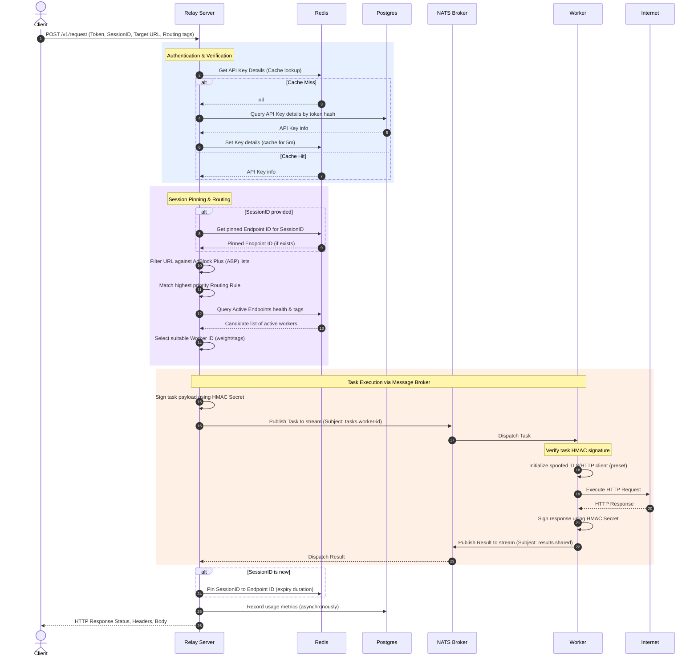

# Architecture Overview

This section describes the internal architecture of Straw Proxy, covering its component layout, request processing pipeline, state caching, message broker communication, and database design.

---

## 🏗️ System Components

Straw Proxy is organized into two main logical zones: the **Control Plane** (Relay Server) and the **Data/Execution Plane** (Distributed Endpoint Workers).

```mermaid
graph TB
    subgraph Clients
        App1[Scraping Engine] -->|HTTP POST| RelayPort[Relay Port :8080]
        MgmtApp[Management CLI / Web] -->|HTTP API| MgmtPort[Management Port :8081]
    end

    subgraph Control Plane (Relay Server)
        RelayPort --> Handler[Relay Handler]
        Handler --> AuthServ[Auth Service]
        Handler --> SessServ[Session Service]
        Handler --> Matcher[Routing Matcher]
        Handler --> FilterServ[ABP Filter Service]
        Handler --> RetryExec[Orchestrator Executor]

        MgmtPort --> MgmtSrv[Management Server]
        MgmtSrv --> DbMigrate[Database Migrations]
    end

    subgraph Data Stores
        AuthServ & Matcher & SessServ -->|Read/Write Cache| Redis[(Redis Cache)]
        AuthServ & Matcher & MgmtSrv -->|Persistent State| Postgres[(Postgres DB)]
    end

    subgraph Message Broker
        RetryExec -->|Queue Job| NatsBroker((NATS Message Bus))
        NatsBroker -->|Heartbeats| HealthServ[Endpoint Health Monitor]
        HealthServ -->|Active Status| Redis
    end

    subgraph Execution Plane (Workers)
        NatsBroker -->|Tasks Stream| WorkerA[Worker Node A]
        NatsBroker -->|Tasks Stream| WorkerB[Worker Node B]
        WorkerA -->|HTTP Egress| Web1[Target Website 1]
        WorkerB -->|HTTP Egress| Web2[Target Website 2]
    end
```

### 1. Control Plane (Relay Server)
* **API Handler**: Exposes `POST /v1/request` and `POST /v2/request` for regular proxy clients.
* **Management Server**: Exposes endpoints to control rules, keys, endpoints, and monitor usage.
* **Services**:
  * **Auth Service**: Evaluates and validates client Bearer tokens.
  * **Session Service**: Pinpoints requests belonging to the same session to the same egress worker (sticky sessions).
  * **Routing Matcher**: Selects rule priorities and matches request parameters against required/excluded tags.
  * **ABP Filter Service**: Matches request URLs against AdBlock Plus rules to block traffic to trackers and advertisements before dispatching them.
  * **Orchestrator Executor**: Handles publishing tasks, listening for results, handling worker retries, and timing out requests.
  * **Endpoint Health Monitor**: Tracks heartbeats from worker nodes.

### 2. Execution Plane (Workers)
* **Endpoint Worker**: A stateless process that connects to the NATS broker, receives task jobs, executes HTTP requests utilizing customized/spoofed TLS parameters and user agents, and returns the response metadata and bodies.
* **Custom Egress Workers**: Built via the exported `pkg/endpoint` Go SDK. Developers can create proprietary workers running custom networking configurations.

---

## 🔄 Request Lifecycle

The diagram below details the end-to-end journey of a proxy request:



---

## 🗄️ Database Schema Design

The system relies on PostgreSQL for persistent config storage and audits, organized as follows:

* **`api_keys`**: Manages customer authorization. Token hashes are stored as SHA256 signatures of Bearer tokens. Includes rate limiting overrides and scope constraints (e.g., `["target:google.com", "type:residential"]`).
* **`routing_rules`**: Stores prioritized routing rules. Priority rules allow requests matching specific criteria to map onto target workers.
* **`cost_multipliers`**: Defines billing costs based on worker tags (e.g. `type:residential` has a `10.0` multiplier, whereas `type:datacenter` has a `1.0` multiplier).
* **`fingerprint_presets`**: Pre-configured JA3, HTTP/2 connection flows, and User-Agent presets used by workers to simulate real browsers.
* **`usage_records` & `usage_daily_summary`**: Records hourly usage metrics (transferred bytes, request counts, weighted cost units) categorized by API keys for billing reports.
* **`audit_log` & `admin_audit_log`**: Tracks administrative adjustments (keys created, rules updated, worker drains) for system accounting.

---

## ⚡ Resilience & Protection Systems

### 1. Circuit Breakers
The Relay Server implements the **Circuit Breaker** pattern (located in `internal/infra/circuitbreaker`) for dependencies:
* **Postgres**: Opens after 5 consecutive failures, resetting after 30 seconds. Protects against database exhaustion.
* **Redis**: Opens after 10 consecutive failures, resetting after 10 seconds. Falls back to direct database queries for API keys and routes.
* **Message Broker (NATS)**: Opens after 5 failures, resetting after 20 seconds. Prevents stalling HTTP requests when NATS streams are overloaded or down.

### 2. SSRF Protection (Private IP Blocking)
To prevent Server-Side Request Forgery (SSRF) attacks, the Relay Server validates target URLs before routing them to endpoints.
By default, requests targeting private IP spaces (e.g. `127.0.0.1`, `10.0.0.0/8`, `192.168.0.0/16`, local DNS names) are blocked.
> [!WARNING]
> This can be bypassed for testing purposes by setting `ALLOW_PRIVATE_IPS=true` in the environment.

### 3. Session Stickiness
When a client requests a proxy task with a `SessionID`, the Session Service pins that session to the chosen Endpoint ID for future requests (storing the association in Redis). Subsequent requests with the same `SessionID` bypass rule evaluation and route directly to the same node, supporting multi-step session logging or cookies.
