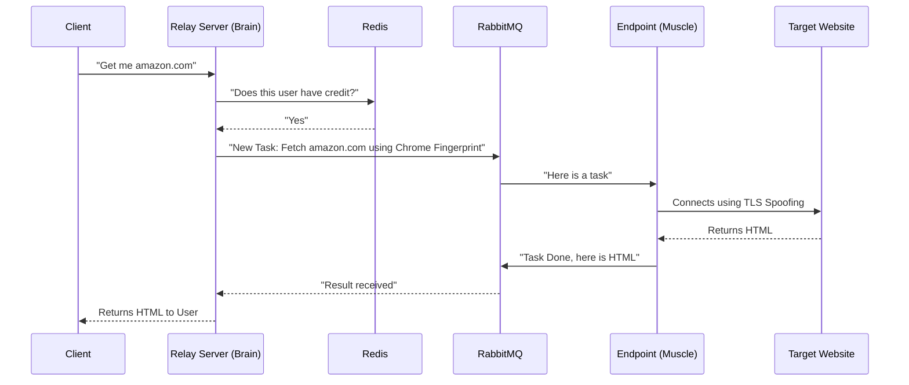

# 🏗️ Architecture Overview

Paperboy (Straw Proxy) is an **Event-Driven, Passive Consumer** proxy system. That sounds fancy, but it simpy means:

1. **Event-Driven**: Components talk to each other by sending messages (like email), not by direct phone calls. This allows them to work at their own speed.
2. **Passive Consumer**: The worker nodes (Endpoints) dial *out* to pick up work. They don't wait for incoming connections. This is the "magic" that lets them run anywhere.

## The Big Picture



## Core Components

### 1. The Relay Server ("The Brain") 🧠

Think of the Relay Server as the **Traffic Controller**. It doesn't fetch any websites itself. Its job is to:

* **Authenticate Users**: "Are you allowed to be here?"
* **Manage Quotas**: "Do you have enough credits?"
* **Route Traffic**: "You asked for Amazon, so I'll send this to the 'Premium Residential' pool."
* **Handle Sessions**: "You want to keep the same IP for 10 minutes? Okay, I'll tag your requests."

It talks to the Client via standard HTTP (`http://proxy:8080`) and talks to the workers via RabbitMQ.

### 2. The Endpoint ("The Muscle") 💪

The Endpoint is the **Worker Bee**. It is a small, lightweight program that runs on the proxy node (e.g., a server, a 4G dongle, a home computer).

* **It is "Dumb"**: It knows nothing about users, billing, or quotas. It just sees "Fetch URL X".
* **It mimics Browsers**: It uses a library called `utls` to handshake with websites exactly like Chrome, Firefox, or Safari would. This makes it very hard to detect.
* **It connects OUT**: It connects to RabbitMQ to ask for work. Because it creates the connection, it **doesn't need port forwarding**.

### 3. The Message Broker (RabbitMQ) 📬

The Broker is the **Post Office**.

* The Relay puts a "Task" in the mailbox.
* The Endpoint picks up the "Task".
* The Relay doesn't need to know *which* endpoint picked it up, just that *someone* did.

## Scaling & Fault Tolerance

### What happens if an Endpoint crashes?

Since the Relay and Endpoint are decoupled, if an endpoint crashes while processing a request, the request will time out (or be nack'd if implemented) and can be retired. If an endpoint goes offline, it simply stops asking for work. The Relay doesn't care; it just waits for another endpoint to pick up the task.

### Automatic Failover

If an endpoint gets blocked (e.g., receives a 403 or Captcha), it reports this back. The Relay allows for **Pool Escalation**:

1. Try "Standard Pool".
2. If blocked (403), retry instantly in "Premium Pool".
3. If still blocked, return error.

This happens transparently to the user.

```mermaid
graph TD
    Client[Client] -->|HTTP Request| Relay[Relay Server]
    Relay -->|Publish| MQ[RabbitMQ]
    MQ -->|Consume| ThisEP[Endpoint A (Blocked 🚫)]
    ThisEP -->|Report 403| MQ
    MQ -->|Retry / Elevate| OtherEP[Endpoint B (Fresh IP ✅)]
    OtherEP -->|Success| Relay
    Relay -->|Response| Client
```
