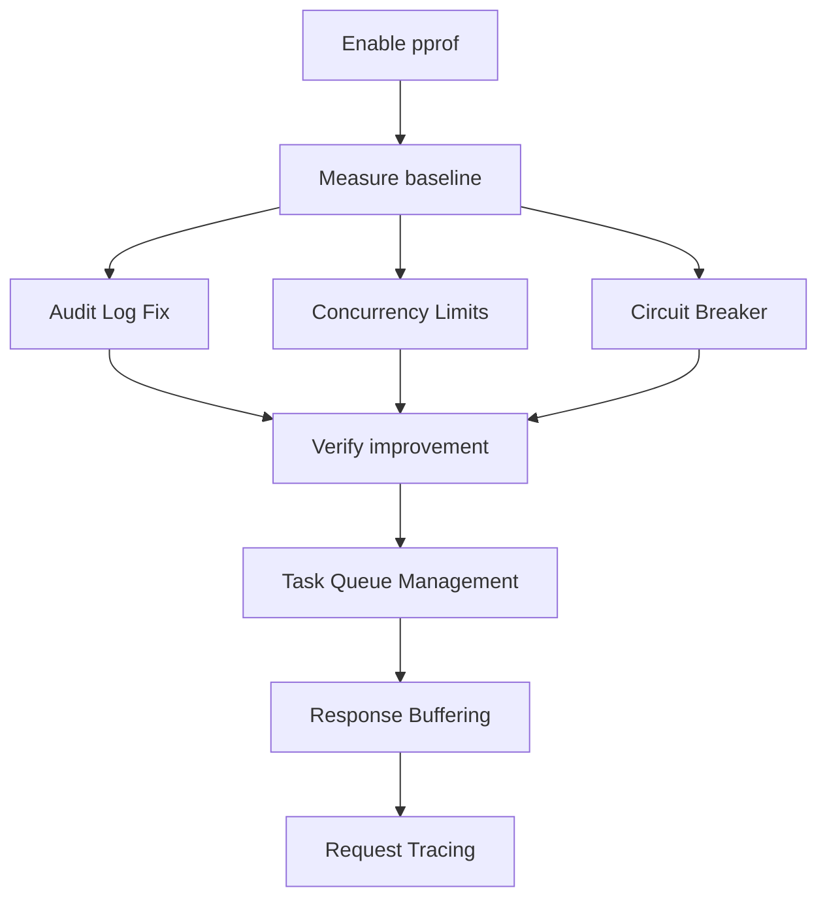

# Implementation Context & Prerequisites

This document summarizes additional context needed to implement the performance optimization plans.

## Key Findings from Investigation

### 1. NATS Broker Configuration

**File:** `internal/broker/nats.go`

The current JetStream consumer configuration (lines 144-151) does **not** set `MaxAckPending`:

```go
consumerConfig := jetstream.ConsumerConfig{
    Durable:       strings.ReplaceAll(queue, ".", "_"),
    FilterSubject: subject,
    DeliverPolicy: jetstream.DeliverNewPolicy,
    AckPolicy:     jetstream.AckExplicitPolicy,
    // MaxAckPending is NOT set - defaults to unlimited
}
```

**Impact on Task Queue Management Plan:**

- Need to add `MaxAckPending` to limit in-flight messages at broker level
- This is the recommended approach for backpressure

---

### 2. Protocol Types Missing Streaming Support

**File:** `pkg/protocol/types.go`

The `Response` struct does **not** have an `IsStreaming` field. The Response Buffering plan proposes adding:

- `StreamResponse` to `Request`
- `IsStreaming` to `Response`

**New fields needed:**

```go
// In Request
StreamResponse  bool  `json:"stream_response,omitempty"`
MaxResponseSize int64 `json:"max_response_size,omitempty"`

// In Response
IsStreaming bool `json:"is_streaming,omitempty"`
```

---

### 3. No Existing Benchmarks

Only test files reference "benchmark" (in `codec_test.go`, `signature_test.go`).

**Recommendation:** Before implementing optimizations, establish baselines:

```bash
go test -bench=. ./pkg/protocol/... ./internal/infra/circuitbreaker/...
```

---

### 4. Audit Log Table Schema

The `admin_audit_log` table needs to exist. Verify in migrations:

```sql
CREATE TABLE IF NOT EXISTS admin_audit_log (
    id SERIAL PRIMARY KEY,
    timestamp TIMESTAMPTZ NOT NULL,
    method VARCHAR(10),
    path TEXT,
    query TEXT,
    body TEXT,          -- Currently unbounded, consider TEXT with application limit
    ip VARCHAR(45),
    user_agent TEXT,
    status INT,
    error TEXT
);
```

---

## Suggested Implementation Order

1. **[plan-enable-pprof.md](file:///home/beremaran/projects/straw-proxy/docs/high-resource-usage/plan-enable-pprof.md)** - Enables profiling first to measure impact of other changes
2. **[plan-audit-log-fix.md](file:///home/beremaran/projects/straw-proxy/docs/high-resource-usage/plan-audit-log-fix.md)** - Highest impact, critical memory/goroutine leak
3. **[plan-concurrency-limits.md](file:///home/beremaran/projects/straw-proxy/docs/high-resource-usage/plan-concurrency-limits.md)** - Simple config change, immediate effect
4. **[plan-circuit-breaker-optimization.md](file:///home/beremaran/projects/straw-proxy/docs/high-resource-usage/plan-circuit-breaker-optimization.md)** - Low complexity, good RWMutex improvement
5. **[plan-task-queue-management.md](file:///home/beremaran/projects/straw-proxy/docs/high-resource-usage/plan-task-queue-management.md)** - Requires NATS config changes
6. **[plan-response-buffering.md](file:///home/beremaran/projects/straw-proxy/docs/high-resource-usage/plan-response-buffering.md)** - Larger scope, needs protocol changes
7. **[plan-request-tracing.md](file:///home/beremaran/projects/straw-proxy/docs/high-resource-usage/plan-request-tracing.md)** - Enhancement, not critical path

---

## Dependencies Between Plans



---

## Questions Before Proceeding

1. **Audit Log:** Should we keep audit logging synchronous with a timeout, or is async with worker pool acceptable?
2. **Concurrency:** What's the expected load? This affects the optimal concurrency limit.
3. **Compression:** The current LZMA compression is very CPU-intensive. Should we switch to `zstd` (faster) and accept slightly larger payloads?
