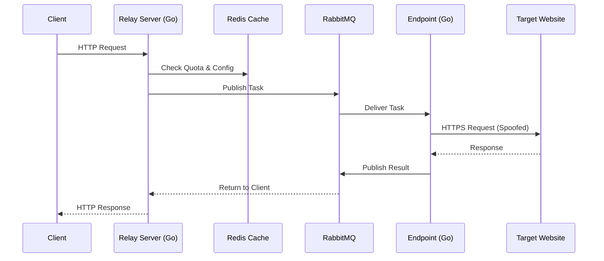

# Welcome to Straw Proxy Server 🥤

**High-Performance Distributed Web Scraping Infrastructure**

Straw Proxy Server is a scalable, open-source solution for managing high-volume web scraping operations. It decouples request logic from network execution, allowing you to run thousands of endpoint workers behind consumer-grade networks (like residential IPs or 4G modems) without complex networking setups.

## 🌟 Why Use Straw?

* **Residential & 4G Proxy Support**: Endpoints connect *outbound*, so you can run them on ANY device with internet access (Raspberry Pi, old Android phones, desktop PCs) without port forwarding.
* **Bypass Anti-Bot Systems**: Built-in [TLS fingerprinting](architecture/security.md) mimics real Chrome, Firefox, and Safari browsers to pass Ja3/Ja4 checks.
* **Centralized Control**: Manages quotas, user access, and routing rules from a single "Brain" (Relay Server).
* **High Throughput**: Event-driven architecture utilizing RabbitMQ and Redis allows for thousands of concurrent requests with low latency.

## 🧠 High-Level Architecture

The system splits responsibilities into two roles: **Relay** (Management) and **Endpoint** (Execution).

## 🚀 Getting Started

Ready to dive in?

* **[Quick Start Guide](getting-started/quickstart.md)**: Spin up the full stack locally in 5 minutes.
* **[Architecture Overview](architecture/overview.md)**: Learn how the components talk to each other.
* **[Development Guide](guides/development.md)**: Setup your environment for contributing.

## 🤝 Community & Support

* **Issues**: Found a bug? [Open an issue](https://github.com/kwilabs/straw-proxy-server/issues).
* **License**: MIT License.
