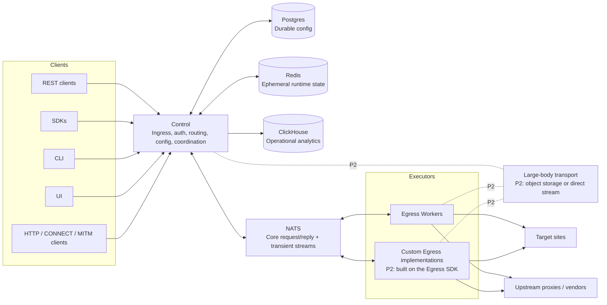

## 4. Canonical Architecture

Control is the only public-facing runtime service. All clients enter through Control. Control owns:

- ingress protocols,
- authentication,
- authorization,
- tenant resolution,
- routing decisions,
- quota/rate-limit admission,
- destination policy checks,
- worker selection,
- request IDs and trace propagation,
- NATS dispatch,
- config APIs,
- durable config access,
- observability aggregation.

Executors own outbound execution. Executors are not allowed to query Postgres, Redis, or ClickHouse. They receive
resolved per-request instructions from Control and report constrained results/failures back to Control.

