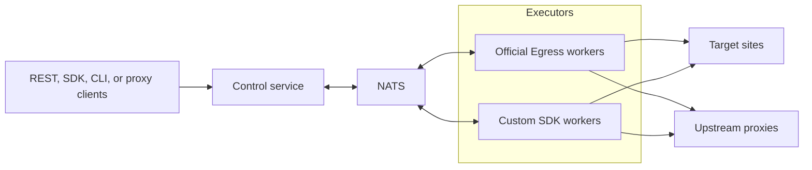

## 4. Canonical Architecture

Control is the only public-facing runtime service. All clients enter through Control. Control owns:

- ingress protocols,
- optional deployment-scoped client authentication,
- routing decisions,
- destination policy checks,
- worker selection,
- request IDs and trace propagation,
- NATS dispatch,
- static configuration loading,
- Prometheus metrics and structured logs.

Executors own outbound execution. They receive resolved per-request instructions from Control and report constrained
results or failures to Control.

NATS is the only required backing service. Operators may collect `/metrics` and structured logs using their existing
observability stack; Straw does not require a database or bundled analytics platform.
