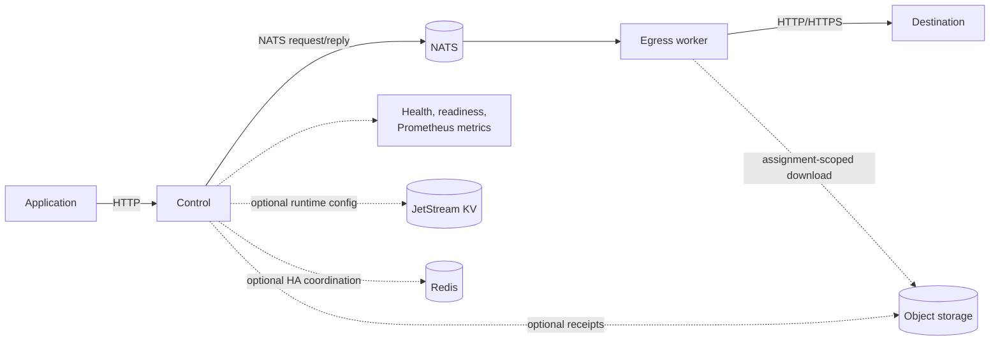
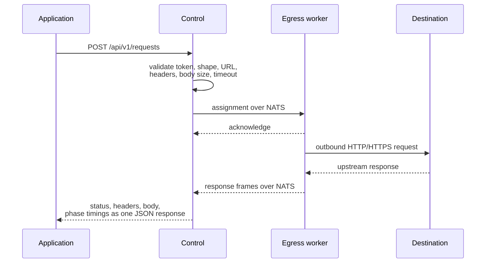

# Architecture

Straw has three runtime components:

**Control** exposes the REST request API and HTTP/HTTPS proxy ingress, validates authentication and input, applies the
deployment policy, selects a healthy worker, and relays request, response, or tunnel frames. The optional runtime
profile also exposes the Admin/Config API and dashboard. Controls are interchangeable when the Redis runtime-state
profile is enabled.

**Egress** registers with Control, advertises capacity, executes outbound requests, and streams responses back. Add
workers when you need more concurrency or network locations.

**NATS** provides discovery, assignment, request/response transport, and runtime snapshot distribution. The default
profile uses Core NATS only. The optional runtime-administration profile enables file-backed JetStream KV for current
configuration and audit history.

**Redis** is optional and stores only expiring coordination state for highly available Control: worker sessions and
heartbeats, capacity, cooldowns, sticky pins, request ownership, cancellation routing, Control instance leases, and
the active configuration version. Redis never stores request or response bodies and is not the durable configuration
authority.

**Object storage** is optional. It stores durable receipt records, resumable upload parts, and verified request or
response bodies. Control streams verification and composition; NATS carries only a short-lived body reference for a
receipt request. Egress downloads through the assignment URL and verifies size and SHA-256 before use.

## Request lifecycle

1. A client posts a request to Control.
2. Control validates the bearer token, JSON shape, URL, headers, body size, and timeout.
3. Control selects an available worker from the rule's enabled pool, requiring claimed membership, exact executor
   type, required tags, allowed capabilities, health/degraded policy, and available capacity.
4. The worker acknowledges the assignment and performs the outbound request.
5. Control returns the upstream status, headers, body, and phase timings in one JSON response.

With receipt transport, an application first uploads and verifies a request receipt. Control claims it for one
request and sends a `BodyRef` instead of body frames. For a stored response, Control writes response frames directly
to bounded object parts and returns an authorized receipt after the terminal frame.

In HA mode, NATS queue subscriptions may deliver a worker registration or heartbeat to any Control. The receiving
instance updates Redis with a session fence and TTL, so every Control routes against the same fleet. A request remains
owned by the Control holding its client connection; the shared owner record lets another instance forward an
administrative cancellation to it over NATS.

GET, HEAD, and OPTIONS requests are replayable by default in the tagged clients. Other methods are not retried unless
the caller explicitly marks them replayable. REST, absolute-form proxy, and CONNECT share the same route evaluation;
the ingress mode is an additional match/capability constraint when configured.

## Forward-proxy lifecycle

Absolute-form HTTP proxy requests use the decoded request pipeline, but Control streams the upstream response
directly instead of wrapping it in JSON. CONNECT assignments use the protocol's raw-tunnel mode. Egress applies the
destination policy and opens the TCP socket before its success frame causes Control to return `200 Connection
Established`; after that point NATS data and credit frames provide bounded bidirectional flow control. Tunnel bytes
remain opaque to Straw. Authenticated proxy routing hints are normalized into the same `RoutingHints` input as REST,
and the reserved `X-Straw-*` namespace is stripped before decoded forwarding or tunnel establishment. Assignment
rejection can exclude a worker and retry before the first client-visible response bytes; the first raw response header
or `200 Connection Established` is a no-replay and no-reroute boundary.

## Trust boundary

One Straw deployment is one trust and configuration boundary. Run separate deployments when workloads need isolated
credentials, policy, networks, or operators. The runtime deliberately serves a deployment rather than acting as a
hosted multi-tenant platform.

## Source map

- `cmd/control`, `internal/control`: public API, proxy ingress, and dispatch pipeline
- `cmd/egress`, `internal/egress`: official worker and HTTP executor
- `internal/natsx`: NATS connection and subjects
- [`straw-protos`](https://github.com/beremaran/straw-protos): canonical language-neutral worker protocol
- [`straw-protos-go`](https://github.com/beremaran/straw-protos-go): exact-tag Go bindings consumed by this runtime
- [`straw-protos-python`](https://github.com/beremaran/straw-protos-python): exact-tag Python bindings consumed by the
  Python SDK
- [`straw-sdk-go`](https://github.com/beremaran/straw-sdk-go): Go client and common worker SDK machinery
- [`straw-sdk-python`](https://github.com/beremaran/straw-sdk-python): Python client and common worker SDK machinery
- `deploy/local`: supported development stack
- `deploy/production`: production-pattern example
