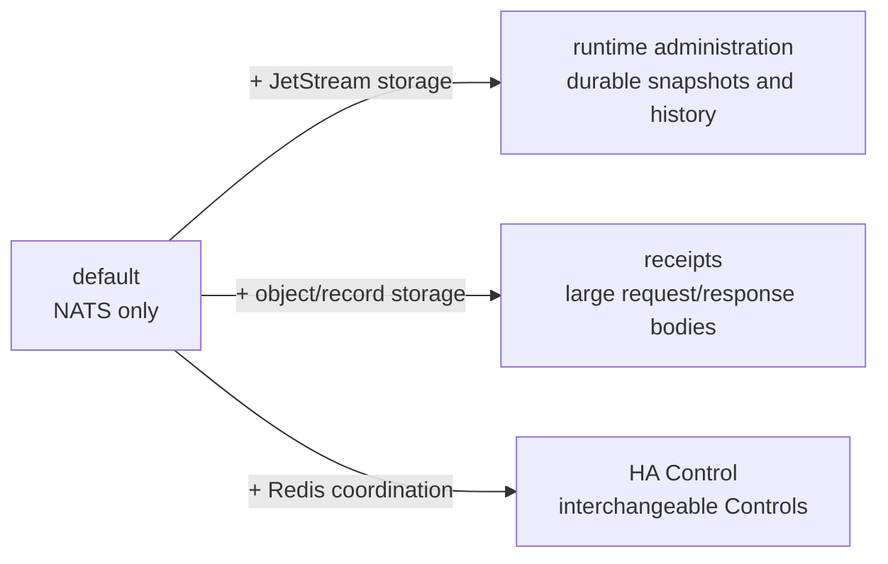

# Deployment

## Choose a profile

| Profile | Required services/state | Choose when |
| --- | --- | --- |
| default | NATS only; no durable application state | one Control is sufficient and bodies fit inline limits |
| runtime administration | NATS + JetStream storage | runtime snapshots/history must survive Control restarts |
| receipts | NATS + shared object/record storage | request or response bodies exceed inline transport limits |
| HA Control | NATS + Redis coordination | multiple interchangeable Controls and failure fencing are required |



Profiles are additive only where the supplied overlays explicitly compose. Back up JetStream before admin-profile
changes and receipt records/objects before receipt-profile changes. Redis coordination is expiring state and is not a
backup authority.

## Local development

`make dev` is the supported starting point. It uses `deploy/local/docker-compose.yml` and starts exactly NATS,
Control, and one Egress worker.

Override occupied host ports without editing files:

```sh
STRAW_NATS_PORT=14222 \
STRAW_NATS_MONITOR_PORT=18222 \
STRAW_CONTROL_API_PORT=18080 \
STRAW_CONTROL_METRICS_PORT=19090 \
make dev
```

These variables affect host mappings only.

## Production pattern

`deploy/production` is an example to adapt, not a turnkey platform. It demonstrates authenticated NATS, a required
Control token, internal backend networking, loopback-bound public ports, health checks, read-only containers, and
independently scalable workers.

Combine it with `deploy/production/compose.runtime-admin.yml` to opt into durable runtime administration. The overlay
enables file-backed JetStream, mounts persistent storage, selects `control.runtime-admin.json`, and requires
`STRAW_ADMIN_TOKEN`. Adapt NATS replication, snapshots, storage, and secret delivery before production use.

Combine the base file with `compose.object-storage.yml` after adapting `control.object-storage.json` to opt into
receipt transport. This profile requires a shared S3-compatible store and receipt signing key. The local
`make dev-receipts` profile uses a private persistent filesystem volume instead.

### Compose overlay commands

Run `config` before `up` so missing environment values and the final merged mounts are visible. Choose the runtime
administration or receipt overlay when it replaces the base Control configuration; the checked-in examples are not a
single arbitrary collection of mix-and-match overlays.

```sh
cp deploy/production/.env.example deploy/production/.env
$EDITOR deploy/production/.env
docker compose --env-file deploy/production/.env \
  -f deploy/production/compose.yml config
docker compose --env-file deploy/production/.env \
  -f deploy/production/compose.yml up -d --build
```

Runtime administration:

```sh
docker compose --env-file deploy/production/.env \
  -f deploy/production/compose.yml \
  -f deploy/production/compose.runtime-admin.yml config
docker compose --env-file deploy/production/.env \
  -f deploy/production/compose.yml \
  -f deploy/production/compose.runtime-admin.yml up -d --build
```

Receipts:

```sh
docker compose --env-file deploy/production/.env \
  -f deploy/production/compose.yml \
  -f deploy/production/compose.object-storage.yml config
docker compose --env-file deploy/production/.env \
  -f deploy/production/compose.yml \
  -f deploy/production/compose.object-storage.yml up -d --build
```

The standalone HA example has its own NATS, Redis, two Controls, load balancer, and Egress service; run it as a
separate Compose project rather than layering it over `compose.yml`:

```sh
docker compose --env-file deploy/production/.env \
  -f deploy/production/compose.ha.yml config
docker compose --env-file deploy/production/.env \
  -f deploy/production/compose.ha.yml up -d --build
```

Before real use:

- terminate TLS in a reverse proxy or load balancer in front of Control;
- move secrets into your secret manager;
- pin reviewed images by immutable tag or digest;
- choose a NATS availability model appropriate to your environment;
- restrict NATS, metrics, and worker health ports to trusted networks;
- set resource, file-descriptor, and log-retention limits;
- run separate Straw deployments for separate trust or policy boundaries.

### Adaptable TLS reverse proxy

`compose.tls.yml` adds HAProxy in front of Control. Its listener defaults to `0.0.0.0:8443`; set
`STRAW_TLS_BIND` and `STRAW_TLS_PORT` to change the host bind and port. Place the managed certificate followed by its
private key in `deploy/production/secrets/straw.pem` with owner-only permissions, then combine the base and TLS files.
The secret path is deliberately untracked; never use the ephemeral QA certificate in production.

```sh
install -m 600 /path/to/managed-certificate-and-key.pem deploy/production/secrets/straw.pem
docker compose --env-file deploy/production/.env \
  -f deploy/production/compose.yml -f deploy/production/compose.tls.yml config
docker compose --env-file deploy/production/.env \
  -f deploy/production/compose.yml -f deploy/production/compose.tls.yml up -d --build
make tls-proxy-check
```

`make tls-proxy-check` validates the checked-in HAProxy configuration and an ephemeral owned QA request path; it does
not install or validate a production certificate. The example requires TLS 1.2+, forwards `X-Forwarded-Proto: https`,
checks Control readiness, and leaves metrics/NATS off the public listener. Adapt hostname, managed certificate
delivery, client/body/time limits, access logging, and network firewall before use.

After any profile starts, verify the merged configuration, service health, and request path from the same network as
your client:

```sh
docker compose --env-file deploy/production/.env \
  -f deploy/production/compose.yml ps
curl -fsS http://127.0.0.1:8080/readyz
```

For the TLS overlay, use `https://127.0.0.1:${STRAW_TLS_PORT:-8443}/readyz` with the managed CA or certificate. Do not
disable certificate verification merely to make a smoke request pass.

## Capacity and host requirements

Start from measured peak concurrency and response sizes. Worker count is at least peak concurrent outbound requests
divided by each worker's `max_concurrency`, plus failure headroom. Size Control for active request state and streaming
buffers; size NATS bandwidth for request/response frames and keep its `max_payload` above Straw's frame envelope but
below an intentionally reviewed bound. Size Redis for worker/request keys and operation latency rather than durable
data. Size receipt storage for ingress plus response volume multiplied by retention and retry headroom.

Containers run as non-root and support read-only root filesystems. Mount configuration read-only and grant writable
access only to JetStream or local receipt volumes used by the selected profile. Set CPU/memory, process/file-descriptor
limits, log retention, and graceful-stop time greater than the maximum request deadline plus the documented drain
margin. Control uses API `8080` and metrics `9090`; Egress health and metrics both use `8090`; NATS uses `4222` and monitoring `8222`
in examples. Restrict all but the TLS reverse-proxy listener. Outbound DNS, IPv4/IPv6, proxy, CA, and network policy
must work from Egress—not merely from Control.

## Upgrade order

Pull and verify immutable digests and take profile backups. Protocol-minor-2 upstream-proxy deployments are a
Control-first exception to the ordinary component rollout: upgrade every Control while pools remain direct, remove old
Control instances and shared worker rows, then deploy minor-2 Egress workers before enabling fresh proxy pool IDs.
Watch readiness, rollout acknowledgement, error ratio, and latency between stages. Roll back using
the prior digest; restore durable state only when release notes identify a format change.

The default profile has no application database to migrate or back up. Back up the JetStream bucket and storage when
the runtime-administration profile is enabled, and back up or lifecycle-manage the object bucket when receipts are
enabled.

Validate the example with `make production-deploy-check`.

For multiple interchangeable Controls, use the standalone `deploy/production/compose.ha.yml` example and read
[Highly available Control](highly-available-control.md). It adds Redis and HAProxy while preserving the ordinary
NATS-only local path.
