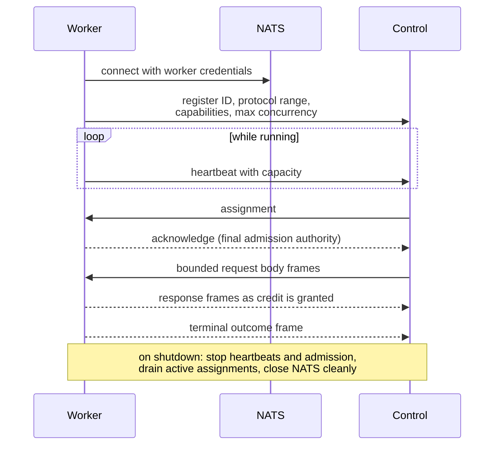

# Egress workers

The official Go worker is the normal choice. It registers with Control over NATS, advertises its concurrency, and
executes outbound HTTP/HTTPS requests.

## Run another official worker

Use the same NATS settings as Control and choose a unique `worker_id`:

```sh
go run ./cmd/egress -config /path/to/egress.json
```

In Compose, scale the service instead:

```sh
docker compose -f deploy/production/compose.yml up -d --scale egress=3
```

Each worker exposes `/healthz`, `/readyz` and `/metrics` on its configured health port. Readiness becomes successful
after the worker has connected and registered.

## Place workers near destinations

Workers only need outbound access to NATS and destination hosts. They do not expose the public Control API. You can
place workers in different networks or regions, provided they can reach the deployment's secured NATS service.

## Claim executor pools

The official worker claims `default/default` when `capabilities.allowed_pools` is omitted. To populate another
configured pool, list it in the Egress JSON:

```json
{
  "config_version": "v1",
  "egress": {
    "capabilities": {
      "allowed_pools": [
        {"pool_id": "default"},
        {"pool_id": "residential-au"}
      ],
      "tags": ["residential"],
      "countries": ["AU"],
      "regions": ["ap-southeast-2"],
      "ip_types": ["residential"]
    }
  }
}
```

Each referenced pool must already exist in the deployment snapshot. Pool references are unique, default to the
single `default` deployment when `deployment_id` is omitted, and cannot name another deployment. Control rejects
invalid or duplicate claims at registration. Membership alone is not enough for assignment: the worker's executor
type must exactly match the pool, it must advertise every required pool tag, and its claimed capability values must
remain within the pool's allowed country, region, and IP-type lists. Disabled pools never receive new assignments;
degraded workers are admitted only when the pool allows them.

## Custom workers

[`straw-sdk-go/egress`](https://github.com/beremaran/straw-sdk-go) and the tagged Python SDK expose worker machinery
for specialized executors. The canonical Egress implementation in this repository exercises the Go SDK base. Custom
workers must keep protocol versions, heartbeats, assignment acknowledgements, capacity, deadlines, and stream framing
correct. Treat this as an advanced integration surface and pin exact SDK and binding tags.

### Protocol and admission checklist

Start with the exact compatibility set: worker protocol/binding `v0.3.0` and the public Go/Python SDK tag listed in
[Compatibility and versioning](compatibility.md). Before a custom worker is admitted, verify all of the following:

- use a unique worker ID and session ID made only from letters, digits, `-`, and `_`; these values become NATS subject
  tokens;
- publish a signed registration with protocol range, executor type, pool claims, tags/locations/IP modes, supported
  ingress modes, fingerprint names, and maximum concurrency;
- continue authenticated heartbeats with current health, active requests, available capacity, and drain state;
- reject assignments while draining, at capacity, or unable to execute the request mode/profile, before request bytes
  are accepted;
- validate the full runtime snapshot before acknowledging its version; keep active requests on their starting snapshot;
- enforce ordered stream sequence numbers, upload/download credit, deadlines, cancellation, and one terminal outcome;
- re-verify receipt assignment scope, declared size, and SHA-256 before using a request body; and
- run `make conformance` plus the tagged producer/consumer compatibility workflow before production admission.

The current subject families are:

| Direction | Subject family | Purpose |
| --- | --- | --- |
| worker → Control | `straw.v1.control.register` | Registration request/reply |
| worker → Control | `straw.v1.control.heartbeat` | Heartbeat request/reply |
| Control → worker | `straw.v1.executor.<worker_id>.<session_id>.assign` | Assignment request/reply |
| Control → worker | `straw.v1.req.<request_id>.<worker_id>.<session_id>.c2e` | Request start/body/credit/cancel frames |
| worker → Control | `straw.v1.req.<request_id>.<worker_id>.<session_id>.e2c` | Response/progress/terminal frames |
| Control → worker | `straw.v1.config.snapshot` | Runtime snapshot publication when enabled |
| worker → Control | `straw.v1.config.ack` | Runtime snapshot acknowledgement when enabled |

The SDK exposes `_INBOX.ctl` for Control request/reply traffic and `_INBOX.wrk.<worker_id>` for worker-scoped
request/reply traffic. Treat these as logical prefixes for an ACL design, and keep generated reply subjects scoped to
the deployment and worker/session. A minimal NATS policy gives Control publish access to assignments, request `c2e`,
and snapshots and subscribe access to registration, heartbeat, request `e2c`, and snapshot acknowledgements. A worker
gets the inverse for its own worker/session plus its reply inbox. This table is an integration guide, not a copy-paste
NATS account policy; verify the exact client reply subject and credentials in your deployment.

The lifecycle every worker must implement:



A worker registers a stable ID, protocol range, executor type, claimed pool memberships, tags/locations/IP modes, ingress modes, fingerprint
profiles, and maximum concurrency. It becomes assignable only after authenticated registration and heartbeats.
Admission must reject unsupported request modes/profiles before request start. Stream request bodies only as Control
grants bounded frames; return download credit as response bytes are consumed. Preserve ordered duplicate headers,
deadlines, attempt numbers, sequence validation, cancellation, and terminal error mapping.

Runtime-admin workers validate snapshots before acknowledging the version and continue active requests on their
original immutable snapshot. Receipt-capable workers treat assignment URLs as short-lived credentials, re-check size
and SHA-256, and never expose storage credentials. On shutdown, stop heartbeats/admission, drain active assignments
within their deadlines, publish terminal outcomes where possible, and close NATS cleanly.

Run `make conformance` and the tagged producer/consumer compatibility workflow before admission. Custom workers own
destination resolution/enforcement, TLS/proxy behavior, credential redaction, resource bounds, and upstream security
equivalent to the official Egress implementation. Protocol framing and runtime-snapshot acknowledgement remain the
least stable pre-1.0 surfaces; do not infer compatibility beyond the published matrix.

The official worker advertises all names in the [built-in fingerprint catalogue](compatibility.md#fingerprint-profile-catalogue).
Custom workers may advertise a subset, but protocol minor 1 registration rejects unknown or duplicate names. An
advertised name promises the pinned TLS/HTTP/2 behavior for that exact profile; HTTP/3 is outside the contract.
