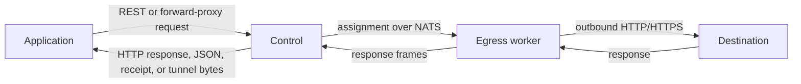

# Straw documentation

Straw is a self-hosted HTTP/HTTPS egress proxy. Applications send an HTTP request to Control, Control assigns it to
an Egress worker over NATS, and that worker makes the outbound request. Clients can use the REST request API or
Control's standard HTTP/HTTPS forward-proxy ingress.

Straw is designed for one trusted deployment boundary. It does not include tenants, accounts, billing, quotas, or an
analytics database. NATS is the only required backing service. Optional JetStream, Redis, and object-storage profiles
add durable runtime policy, shared Control coordination, and large-body receipts.

## Start here

1. Follow the [quickstart](quickstart.md) to run Straw locally and send a request.
2. Read the [architecture](architecture.md) to understand the three services.
3. Use the [request API](api/requests.md), [proxy ingress](proxy-ingress.md), [CLI](cli.md), or [SDKs](sdk.md) from your
   application.
4. Review [configuration](configuration.md), [deployment](deployment.md), and [security](security.md) before exposing
   Control outside a development machine. Use [runtime administration](runtime-administration.md) when policy must
   change without restarts.

## What Straw does

- forwards HTTP and HTTPS requests through independently scalable workers;
- accepts standard absolute-form HTTP proxy requests and HTTP/1.1 CONNECT tunnels;
- keeps workers off the public API network;
- preserves duplicate and ordered request/response headers;
- enforces request size and timeout limits;
- supports an optional deployment-wide bearer token;
- exposes Prometheus metrics, health endpoints, and structured JSON logs;
- supports selectable outbound TLS fingerprint profiles;
- optionally provides a durable Config/Admin API and API-parity dashboard;
- optionally stores verified request and response bodies as expiring receipts in local or S3-compatible object
  storage.

## What Straw does not do

Straw is not a browser automation system, hosted proxy network, tenant management platform, SOCKS proxy, TLS
interception service, or indefinite traffic archive. Its request interfaces are `POST /api/v1/requests` and the
forward-proxy behavior on Control's API listener; optional administration remains deployment-scoped and belongs to
the operator.

The source is available under the [MIT License](https://github.com/beremaran/straw-oss/blob/main/LICENSE).
