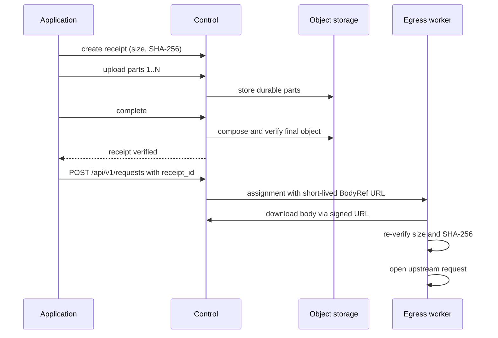
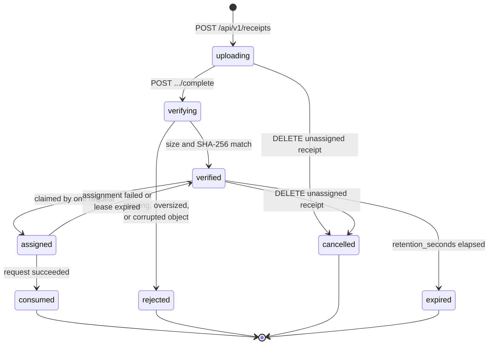

# Object storage and receipts

Receipt transport is an optional profile for request or response bodies that exceed the inline base64 limit. The
default `make dev` path still uses only NATS and inline bodies. Enable receipts locally with:

```sh
make dev-receipts
```

That overlay stores objects in a private persistent volume. Production deployments should adapt the S3-compatible
example in `deploy/production/control.object-storage.json` and supply storage credentials through environment
variables.

The full round trip for a receipt-backed request body:



## Upload a request body

Calculate the final byte length and SHA-256 digest before creating the receipt:

```bash
body=large-request.bin
size=$(wc -c < "$body" | tr -d ' ')
sha256=$(shasum -a 256 "$body" | cut -d' ' -f1)

auth_args=()
if [ -n "${STRAW_AUTH_TOKEN:-}" ]; then
  auth_args=(-H "Authorization: Bearer $STRAW_AUTH_TOKEN")
fi

curl -sS -X POST "${auth_args[@]}" http://localhost:8080/api/v1/receipts \
  -H 'Content-Type: application/json' \
  -d "{\"direction\":\"request\",\"size_bytes\":$size,\"sha256_hex\":\"$sha256\",\"idempotency_key\":\"upload-42\"}"
```

In local development, the token is usually unset and `auth_args` stays empty. In a protected deployment, set
`STRAW_AUTH_TOKEN`; the same bearer header is required for every client receipt lifecycle request. The response
contains `receipt_id`, `status_url`, `part_upload_template`, and `complete_url`. Use positive part numbers; uploads
may arrive out of order and a part can be safely replaced with the same number after an interruption:

```bash
curl -sS -X PUT "${auth_args[@]}" \
  -H "Content-Length: $size" \
  --data-binary @large-request.bin \
  http://localhost:8080/api/v1/receipts/RECEIPT_ID/parts/1
curl -sS -X POST "${auth_args[@]}" \
  http://localhost:8080/api/v1/receipts/RECEIPT_ID/complete
```

`Content-Length` is required on each part, including a zero-byte part. `X-Straw-Part-SHA256` may declare a part
checksum. Completion requires the uploaded set to be exactly parts `1..N`, streams them into the final object, and
compares the final size and SHA-256 with the original declaration. Missing, oversized, or corrupted objects never
become `verified`.

Use the verified receipt in a normal request:

```json
{
  "method": "POST",
  "url": "https://example.com/upload",
  "body": {"mode": "receipt", "receipt_id": "RECEIPT_ID"}
}
```

Control changes the receipt from `verified` to `assigned`, issues a short-lived URL scoped to that Straw request ID,
and sends only the reference, size, and checksum over NATS. Egress rejects the wrong deployment/request scope,
limits the download to the declared size, and verifies size and SHA-256 before opening the upstream request. A URL
stops working when the assignment finishes, even if its timestamp has not elapsed.

## Store a response body

Set `response_body_mode` to `receipt`:

```json
{"method":"GET","url":"https://example.com/large-file","response_body_mode":"receipt"}
```

Control writes response frames as bounded durable parts rather than retaining the body in memory. After a successful
terminal frame, the success envelope contains a body like:

```json
{"mode":"receipt","receipt_id":"rcpt_...","size_bytes":7340032,"sha256_hex":"..."}
```

Inspect or download it with the same deployment authorization used for requests:

```bash
curl -sS "${auth_args[@]}" http://localhost:8080/api/v1/receipts/RECEIPT_ID
curl -sS "${auth_args[@]}" -o response.bin \
  http://localhost:8080/api/v1/receipts/RECEIPT_ID/content
```

The download includes `Content-Length` and `X-Straw-SHA256`.

## Lifecycle and recovery

Receipt states are `uploading`, `verifying`, `verified`, `assigned`, `consumed`, `rejected`, `cancelled`, and
`expired`.



The diagram shows the normal upload and assignment path. The current cancellation endpoint also accepts records in
`rejected` or `expired` state, except for `assigned` and `consumed`, and records the result as `cancelled`.

- `GET /api/v1/receipts/{id}` is the durable status/check API.
- `DELETE /api/v1/receipts/{id}` marks any record other than `assigned` or `consumed` as cancelled and removes its
  body and parts; repeating it for a cancelled record is safe.
- `POST /api/v1/receipts/{id}/complete` is idempotent after verification. An interrupted verification can be retried;
  uploaded parts remain durable.
- `idempotency_key` returns the original receipt only when direction, size, and checksum match.
- Failed assignments return a request receipt to `verified`; successful requests move it to `consumed`.
- Cleanup removes payloads and incomplete parts after `retention_seconds`. Expired assignment leases return to
  `verified` until the receipt itself expires.

Metrics cover receipts created, parts uploaded, verification/rejection, assignments, consumption, and expiry under
the `straw_receipt*` names documented in [Operations](operations.md).

## Storage and security boundaries

The `local` backend uses private directory/file permissions and is intended for development or an operator-managed
shared filesystem. The `s3` backend uses AWS Signature Version 4 against a path-style S3-compatible endpoint and
supports temporary session tokens plus `AES256` or `aws:kms` server-side encryption.

Storage credentials exist only in Control environment variables. Egress receives an assignment-scoped signed Control
URL, never the S3 access key. Put TLS in front of Control, protect `STRAW_RECEIPT_SIGNING_KEY` like a credential,
restrict bucket access, and apply storage lifecycle/backups appropriate to receipt retention.
