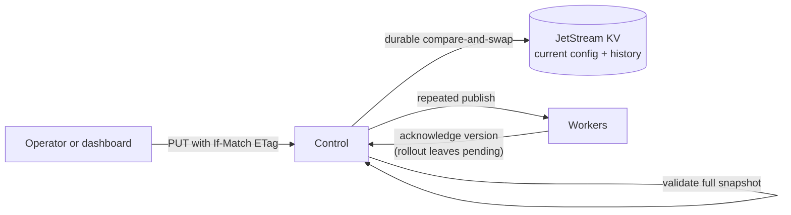

# Runtime administration

The optional runtime-administration profile lets an operator inspect and change deployment policy without editing a
file or restarting Control or Egress. It uses a file-backed NATS JetStream KV bucket for current configuration and
history. The default profile remains unchanged: static JSON configuration and Core NATS are enough unless you enable
this feature.

One deployment is still one trust boundary. There are no accounts, tenants, billing controls, or per-user roles.

## Start the local example

```sh
make dev-admin
```

This combines `deploy/local/docker-compose.yml` with `deploy/local/docker-compose.runtime-admin.yml`, enables
JetStream persistence, and uses `local-admin` as the development-only admin token. Open
`http://localhost:8080/admin/`, enter `local-admin`, and choose **Connect**. Set `STRAW_ADMIN_TOKEN` before the command
to use a different token.

To prove worker behavior changes while requests continue, start a slow request in one terminal, then drain the worker
in another:

```sh
curl -sS -H 'Content-Type: application/json' \
  -d '{"method":"GET","url":"https://httpbin.org/delay/5"}' \
  http://localhost:8080/api/v1/requests &

revision="$(curl -sS -D - -o /dev/null \
  -H 'Authorization: Bearer local-admin' \
  http://localhost:8080/api/v1/admin/config |
  awk -F '"' 'tolower($1) == "etag: " {print $2}')"

curl -sS -X POST \
  -H 'Authorization: Bearer local-admin' \
  -H "If-Match: $revision" \
  http://localhost:8080/api/v1/admin/workers/egress-1/drain
```

The running request finishes. New requests receive `route_unavailable` until the worker is undrained. Repeat the
configuration read to obtain the new ETag, then call the `undrain` action.

## Authenticate administrative actions

When `runtime_admin.enabled` is true, Control refuses to start unless the environment variable named by
`runtime_admin.token_env` contains a non-empty token. Every `/api/v1/admin/*` request requires
`Authorization: Bearer <admin-token>`. The request token in `STRAW_AUTH_TOKEN` does not grant administration access.

The dashboard is a static shell and does not contain the token. It sends the token entered in its password field to
the same documented REST endpoints. Put both the dashboard and API behind TLS and network access controls.

## Use the Config and Admin API

All successful JSON responses use `Content-Type: application/json`. Mutations require `If-Match` with the numeric
ETag revision returned by `GET /api/v1/admin/config`. A stale revision returns `409`; omitting it returns `428`. This
prevents two operators from silently overwriting one another.

| Capability | REST endpoint | Dashboard |
| --- | --- | --- |
| Inspect and replace the full deployment snapshot | `GET`, `PUT /api/v1/admin/config` | JSON editor |
| Inspect audit history | `GET /api/v1/admin/config/history` | Audit cards |
| Roll back by configuration version | `POST /api/v1/admin/config/rollback` | Rollback button |
| Inspect rollout | `GET /api/v1/admin/rollouts` | Rollout panel |
| Inspect workers | `GET /api/v1/admin/workers` | Worker cards |
| Drain, undrain, disable, or enable | `POST /api/v1/admin/workers/{worker_id}/{action}` | Worker buttons |
| Inspect active request IDs | `GET /api/v1/admin/requests` | Request cards |
| Safely cancel a request | `DELETE /api/v1/admin/requests/{request_id}` | Cancel button |

Set `X-Straw-Actor` to a stable operator or automation identity. It is recorded in history for attribution; bearer
authentication remains the authorization decision.

How an accepted change reaches the fleet:



### Replace configuration

Read the record and ETag, edit its `snapshot`, and send that snapshot as the PUT body:

```sh
curl -sS -D headers.txt -o record.json \
  -H 'Authorization: Bearer local-admin' \
  http://localhost:8080/api/v1/admin/config

revision="$(awk -F '"' 'tolower($1) == "etag: " {print $2}' headers.txt)"
jq '.snapshot.max_timeout_ms = 90000 | .snapshot' record.json > snapshot.json

curl -sS -X PUT \
  -H 'Authorization: Bearer local-admin' \
  -H 'X-Straw-Actor: local-example' \
  -H "If-Match: $revision" \
  -H 'Content-Type: application/json' \
  --data-binary @snapshot.json \
  http://localhost:8080/api/v1/admin/config
```

Control validates and prepares the complete snapshot before the durable compare-and-swap. Validation covers routing
conditions and sticky TTL/fallback coherence, executor-pool eligibility semantics, destination-policy rules, header
injection operations, fingerprint-profile metadata, and worker settings—not just IDs and references. Invalid input
returns `422`; nothing is persisted, activated, or published. Accepted changes receive the next `config_version`, are
atomically applied to new requests, and are repeatedly published to workers. Requests already running keep the
immutable snapshot with which they started.

Destination rules accept `raw_pattern` as their authoritative input. Control deterministically writes the corresponding
`normalized_host`, `normalized_cidr`, `normalized_ip`, or `normalized_name` and clears the other derived fields. Host
and CNAME patterns are lowercased and IDNA-normalized; CIDRs are masked to their canonical network; IPs are canonicalized.
The rule type must match the representation: `host`, `host_suffix` (optionally `*.example.com`), `cidr`, `ip`,
`cname_suffix`, `private_range`, or a recognized `metadata_ip`. Malformed hosts, suffixes, CIDRs, IPs, private ranges,
metadata addresses, actions, injection operations, or non-executable fingerprint records are rejected before persistence.
An empty `raw_pattern` is accepted only for legacy snapshots that already contain exactly one valid normalized field;
when a raw pattern is supplied, stale normalized values are never retained.

### Roll back

Rollback copies a retained snapshot into a new current version; history is never rewritten:

```sh
curl -sS -X POST \
  -H 'Authorization: Bearer local-admin' \
  -H "If-Match: $revision" \
  -H 'Content-Type: application/json' \
  -d '{"config_version":1}' \
  http://localhost:8080/api/v1/admin/config/rollback
```

Rollback goes through the same complete preparation and validation boundary. It creates a new version only when the
retained snapshot is still executable, while preserving compare-and-swap and the original history record.

## Understand lifecycle behavior

- **Drain** and **disable** stop new assignments. Existing requests continue.
- **Undrain** and **enable** make an otherwise healthy worker eligible again.
- Lifecycle choices are stored in the deployment snapshot, so they survive Control and worker restarts.
- Safe cancellation cancels the Control request context and uses the existing ordered cancel frame to stop Egress.
- Rollout status is `pending` until an official worker acknowledges the current version. Custom workers that do not
  implement runtime snapshot acknowledgement remain pending, while Control still enforces routing policy.

## Back up and recover

The default runtime-admin bucket is `STRAW_RUNTIME_CONFIG`; it stores the current record at the `deployment` key and
the bounded history in the same file-backed JetStream KV bucket. The checked-in Compose overlays use the
`straw-runtime-data` volume. Back up the NATS account or JetStream topology that owns this bucket—not just the
application container filesystem.

For an owned local verification, use the disposable backup drill:

```sh
make state-backup-smoke PROFILE=admin
```

For an operator-managed NATS account, the NATS CLI account backup includes all streams in that account. Use a
dedicated account or an operator-approved backup scope, keep the output encrypted and access-controlled, and adapt
the credentials to your deployment:

```sh
export NATS_URL=nats://nats.example.internal:4222
export NATS_USER=straw-backup
export NATS_PASSWORD=replace-me
backup_dir="/secure/backups/straw-runtime-$(date -u +%Y%m%dT%H%M%SZ)"
mkdir -p "$backup_dir"

nats --server "$NATS_URL" --user "$NATS_USER" --password "$NATS_PASSWORD" \
  account backup "$backup_dir"
```

Restore into a replacement or clean JetStream topology according to the [NATS JetStream disaster recovery
procedure](https://docs.nats.io/running-a-nats-service/nats_admin/jetstream_admin/disaster_recovery); do not overwrite a
live data directory while NATS is running:

```sh
nats --server "$NATS_URL" --user "$NATS_USER" --password "$NATS_PASSWORD" \
  account restore "$backup_dir"
```

The exact NATS account, operator policy, storage class, and restore target are deployment decisions. Do not copy live
storage files directly; use the NATS-supported account/stream procedure or stop the server cleanly first.

If the bucket is unavailable or its current record is invalid, Control fails startup instead of silently falling back
to file defaults. Restore the NATS data or start the static profile with a reviewed JSON configuration. If the bucket
is intentionally deleted, the next runtime-profile start initializes version 1 from the built-in deployment policy.
Retained history is bounded by `history_limit` (maximum 64), so external backups are required for longer retention.
