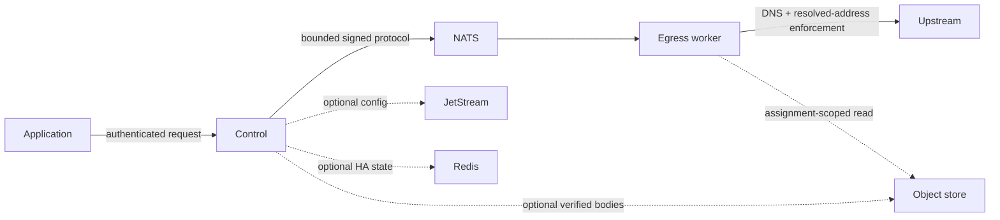

# Threat model and hardening invariants

Straw assumes every caller, Control, Egress worker, NATS account, Redis instance, JetStream bucket, and receipt store
inside one deployment belongs to one trust boundary. It does not isolate mutually hostile tenants.

| Threat | Enforced invariant | Operator verification |
| --- | --- | --- |
| SSRF, metadata ranges, DNS rebinding/CNAME changes | Direct-local Egress resolves and validates every dial address. Trusted upstream-proxy pools validate literal targets but delegate hostname DNS to the provider, so local CIDR/CNAME enforcement is unavailable for hostnames. | Run destination-policy and Egress tests; configure provider destination ACLs against private, metadata, loopback, and special-use ranges. |
| Redirect/proxy bypass | Redirects remain disabled; proxy pools bind a Control pool claim to one worker profile and always use bounded CONNECT without direct fallback. | Use fresh proxy pool IDs, keep `trusted_remote_resolution` explicit, and deny private/metadata networks at the provider. |
| Header/request smuggling | Names, values, ordered duplicates, lengths, hop-by-hop behavior, frames, and total bodies are validated | Keep reverse proxy parsing strict and do not rewrite signed protocol frames |
| Credential/log disclosure | Separate request/admin bearer tokens; signed receipt URLs are short-lived; structured logs must omit tokens, headers, URLs, bodies, and object credentials | Search logs and diagnostic bundles with synthetic canary secrets |
| NATS subject impersonation | Subjects are bounded and protocol messages signed/validated | Give components only required publish/subscribe permissions and TLS credentials |
| Admin compromise | Admin authentication is separate from request authentication and should be network-isolated | Do not expose `/admin/` or `/api/v1/admin/*` publicly |
| Redis loss or stale owner | TTLs, fencing, instance leases, and explicit degraded readiness prevent silent ownership reuse | Exercise the owned HA failure drill before release |
| Receipt corruption/replay | Declared size/SHA-256 is checked at completion and consumption; assignment references bind identity and expiry | Use least-privilege bucket policy, encryption, lifecycle retention, and clock synchronization |
| Malicious custom worker | A worker is inside the trust boundary but remains bounded by capabilities, flow control, deadlines, and protocol validation | Issue distinct NATS credentials; run conformance before admission |
| Resource exhaustion | Request/response/frame/time/concurrency/object limits are explicit and validated | Set proxy/body limits, container resources, NATS payload limits, and alerts |

Security findings are triaged by the security contact in `SECURITY.md`. Critical/high reachable issues block release;
exceptions require a private owner, rationale, compensating control, and expiry. Dependency, CodeQL, secret, image,
and vulnerability scans run in CI. See [Security](security.md) for per-profile deployment controls.
