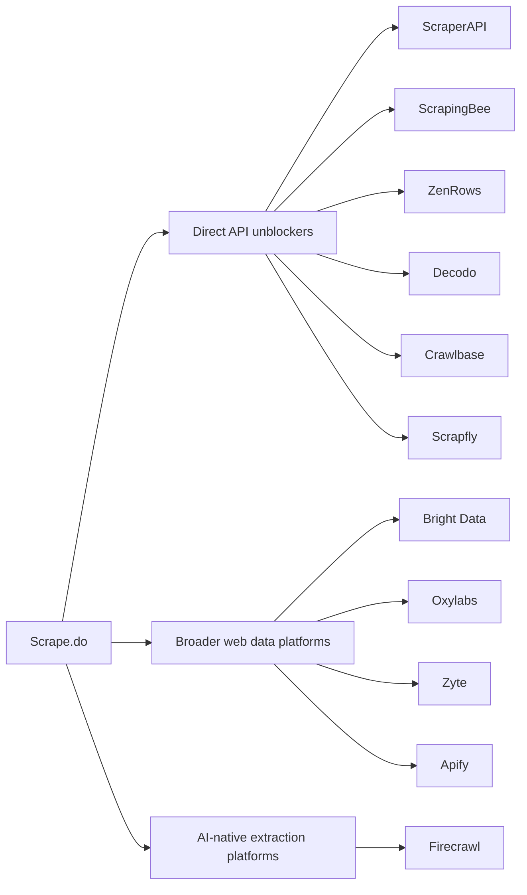
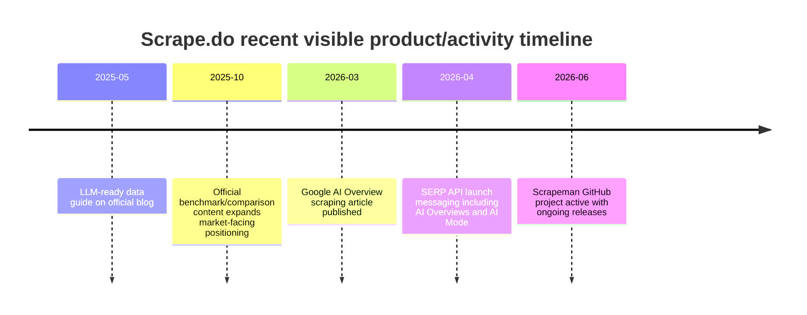

# Scrape.do Competitor Analysis

## Executive summary

Scrape.do is a developer-first web scraping and unblocking platform operated by PACKEND, LLC. Public company data are somewhat inconsistent on geography: Scrape.do’s legal pages identify PACKEND, LLC as the operator, Trustpilot lists a Sheridan, Wyoming contact address, while Dealroom lists the company’s HQ in Çankaya, Türkiye and a May 2020 launch date. Dealroom also reports no known external funding, which is consistent with Scrape.do’s positioning as a bootstrapped, engineer-led product rather than a venture-scaled platform.

The product’s core value proposition is unusually clear: one endpoint for public-web extraction with proxy rotation, CAPTCHA handling, WAF bypass, JavaScript rendering, sticky sessions, geo-targeting, and proxy-mode compatibility, with charges applied only to successful responses. Scrape.do has also moved beyond a generic unlocker into more structured products, including ready-made APIs for Amazon, Google, YouTube, Google Flights, Google Trends, Google News, Google Play, and ChatGPT, plus an asynchronous jobs API and official no-code integrations for n8n and Zapier.

Pricing is one of Scrape.do’s strongest competitive levers. All features are available even on the free plan, and paid tiers are priced from $29 per month for 250,000 successful API credits to $699 per month for 10 million credits, with custom enterprise pricing above that. The company repeatedly emphasizes “pay only for successful results,” which directly attacks a common buyer pain point in this market. Against enterprise-heavy players like Bright Data and Oxylabs, and against more credit-multiplier-heavy tools like ScrapingBee and ZenRows, Scrape.do stands out as a value-oriented alternative for teams that want unblocker capability without paying for a broader data platform.

The most important strategic conclusion is that Scrape.do appears strongest in the “mid-market infrastructure” niche: stronger anti-bot capabilities than lightweight API wrappers, materially cheaper than top enterprise platforms, and simpler than marketplace-style platforms such as Apify. Its risks are also clear. Compared with Bright Data, Oxylabs, Zyte, and Apify, Scrape.do has a thinner public proof layer: fewer verified reviews, limited public Q&A footprint on Stack Overflow, no strong evidence of a large official SDK ecosystem, and fewer obvious first-party workflow assets such as persistent storage, visual builders, native scheduling, or major warehouse connectors. Those gaps do not invalidate the product; they do, however, constrain upmarket motion.

From a competitive perspective, the direct rivals are Bright Data, Oxylabs, Zyte, ScraperAPI, ScrapingBee, ZenRows, Decodo, Apify, Crawlbase, and Scrapfly. The most important indirect rival is Firecrawl, which is not trying to be a proxy-first unblocker but is winning mindshare in AI-native workflows by returning clean Markdown / structured outputs, crawl primitives, and developer-friendly SDKs. If Scrape.do wants to expand beyond price-performance leadership, the highest-return moves are likely to be official SDKs, first-party scheduling and storage, stronger AI-ready outputs, and more visible compliance tooling around robots.txt, terms, and privacy-sensitive data handling.

## Scrape.do company overview and product profile

### Company snapshot

Scrape.do’s own legal pages identify the service operator as PACKEND, LLC. Dealroom lists the company as launched in May 2020, based in Çankaya, Türkiye, with 11–50 employees and no known external funding. Trustpilot, meanwhile, shows a Sheridan, Wyoming mailing address, and public LinkedIn snippets place the company in Sheridan as well. The cleanest interpretation is that Scrape.do uses a U.S. LLC as the billing/legal shell while operating with a Turkey-based core team. That interpretation is an inference from the available public records, not an official company statement.

| Item                 | Finding                                                                                                                                        |
| -------------------- | ---------------------------------------------------------------------------------------------------------------------------------------------- |
| Legal operator       | PACKEND, LLC                                                                                                    |
| Public launch date   | May 2020 according to Dealroom                                                                                            |
| HQ / legal geography | Çankaya, Türkiye on Dealroom; Sheridan, Wyoming appears on Trustpilot and LinkedIn snippets     |
| Funding              | No known external funding on Dealroom; no public funding round was surfaced in the higher-confidence source set used here |
| Employee scale       | Dealroom: 11–50 people; LinkedIn snippet shows 16 employees visible on profile at one point                 |

### Product architecture and technical capabilities

Scrape.do’s core product consists of two access models: a standard API endpoint and a proxy mode. Proxy mode is notable because it lowers switching friction for teams already wired around proxy-compatible scraping stacks; Scrape.do states there is “no difference” between proxy mode and API mode other than access method. That design choice is strategically useful because it lets the product appeal both to API-first builders and to teams migrating from proxy vendors.

The basic infrastructure claims are strong for the price tier. Scrape.do says it rotates 110M+ datacenter, residential, and mobile proxies across 150 countries, renders content in a managed Chromium headless browser, and handles anti-bot, WAF, and CAPTCHA bypass with custom solutions. On the marketing site it claims a 99.98% success rate and on documentation/FAQ it says users should generally expect success rates above 85% unless the target is unusually problematic. Those numbers should be treated as vendor-reported rather than independently audited.

Headless-browser support is more than simple render-on/off. The docs support browser interactions through a `playWithBrowser` instruction payload, screenshots, `returnJSON=true`, and iframe capture through `showFrames=true`. Sticky sessions are available via `sessionId`, transparent target status-code passthrough is supported, and the platform exposes headers/cookies controls, post/put handling, retries, timeouts, device selection, and redirection control in the docs navigation.

The asynchronous API is a meaningful differentiator at this price point. Scrape.do documents a separate async thread pool that is independent of main API concurrency and sized at 30% of plan concurrency, with job creation, polling, task retrieval, cancellation, and user-info endpoints. The docs explicitly recommend `WebhookURL` for production use and note that results expire after temporary storage, which implies partial storage capability but not a durable data warehouse or long-term object store.

Structured-data products increasingly matter in this category, and Scrape.do has clearly invested there. Public docs expose dedicated APIs for Amazon, YouTube, Google Shopping, Google News, Google Trends, Google Flights, Google Play, and a Google Search scraper that includes AI Overviews and AI Mode. This broadens Scrape.do from “generic unblocker” into “selective structured-data platform,” especially for SEO and commerce.

SDK support is the main technical gap. The official documentation provides language examples for curl, Python, Node, Go, Ruby, Java, C#, and PHP, and the GitHub organization hosts samples and tools. But Scrape.do’s own 2026 comparison article explicitly lists “no official SDKs” as a weakness. In practice, that means the platform is easy to call, but enterprise buyers who prefer fully supported client libraries may see a maturity gap relative to rivals with official SDKs.

### Scrape.do capability matrix

| Dimension            | What Scrape.do publicly documents                                                                                                                                                                |
| -------------------- | ------------------------------------------------------------------------------------------------------------------------------------------------------------------------------------------------ |
| Access model         | API endpoint plus proxy mode                                                                                                                                                   |
| Proxies              | 110M+ datacenter, residential, and mobile proxies in 150 countries                                                                                                             |
| Anti-bot             | WAF, CAPTCHA, and anti-bot bypass; dynamic TLS fingerprinting on pricing/features pages                                                                             |
| Headless browser     | Managed Chromium via `render=true`                                                                                                                              |
| Browser actions      | `playWithBrowser` instructions, screenshots, iframe extraction                                                                                         |
| Sessioning           | Sticky sessions via `sessionId`                                                                                                                                             |
| Output formats       | Raw HTML, transparent responses, JSON/ReturnJSON, structured JSON for ready-made APIs                                                    |
| Async jobs           | Separate async concurrency pool plus webhooks and temporary task storage                                                                                            |
| Integrations         | Official n8n and Zapier docs; examples pushing to Google Sheets, databases, and CRMs through workflow tools                                                       |
| Scheduling / storage | No first-party scheduler was clearly surfaced; scheduling is pushed through automation tools, and async results are temporary rather than durable long-term storage |
| Language support     | Docs provide examples for curl, Python, Node, Go, Ruby, Java, C#, PHP; no official SDKs clearly surfaced                                                         |
| Rate limits / quotas | Plan-based concurrency; `/info` endpoint capped at 10 requests per minute; API returns 429 on concurrency overrun                                                   |

## Pricing, customers, positioning, and go-to-market

### Pricing and plan design

Scrape.do’s self-serve pricing is unusually aggressive. The free tier includes 1,000 successful API credits, 5 concurrent requests, and explicitly says it includes every Scrape.do feature, including residential/mobile proxies, JS rendering, geo-targeting, sticky sessions, and unlimited bandwidth. Paid plans then scale primarily on included successful credits and concurrency rather than by locking major features behind higher tiers.

| Plan                | Monthly price | Included successful credits | Concurrency | Notes                                                                     |
| ------------------- | ------------: | --------------------------: | ----------: | ------------------------------------------------------------------------- |
| Free                |            $0 |                       1,000 |           5 | All features unlocked for testing                       |
| Hobby               |           $29 |                     250,000 |          10 | $0.11 / 1K credits                                      |
| Pro                 |           $99 |                   1,250,000 |          50 | $0.08 / 1K credits                                      |
| Business            |          $249 |                   3,500,000 |         100 | Premium resi/mobile proxies; dedicated support          |
| Advanced            |          $699 |                  10,000,000 |         200 | Custom WAF bypass; custom SLA; Slack support |
| Custom / Enterprise |        Custom |                   Unlimited |   Unlimited | Custom firewall bypass based on target-site dynamics    |

This packaging produces three clear commercial advantages. First, the all-features-on-free model lowers trial friction. Second, success-based charging is easy for buyers to understand. Third, the marginal price curve falls meaningfully as volume increases, giving the product a strong “scale with me” message. The tradeoff is that some enterprise buyers may read the low entry price as a signal of lower governance, integrations, or support sophistication compared with Bright Data, Oxylabs, and Zyte.

### Target customers and use cases

Scrape.do’s site and documentation consistently market to e-commerce, AI and LLM pipelines, travel, real estate, marketing, social media, finance, cryptocurrency, and job boards. The company also emphasizes SEO and SERP-monitoring workflows, including rank tracking, ad visibility checks, and geo-specific search observation.

The ideal buyer appears to be a technical SMB or mid-market team that wants to outsource difficult web-access infrastructure rather than build it. The G2 page describes use cases such as competitor tracking, market analysis, multi-site extraction, and engineering workload reduction, while Trustpilot reviews repeatedly mention support responsiveness and reliable scraping at scale. This is a pattern more typical of operational data teams and growth/SEO automation teams than of large enterprises seeking compliance-heavy managed data delivery.

### Market positioning and unique value proposition

Scrape.do is most credibly positioned as a price-performance specialist. Its differentiation is not that it has the broadest product catalog. Bright Data and Oxylabs clearly operate broader platforms; Apify has a much larger ecosystem and marketplace; Zyte has a long heritage and stronger formal extraction stack. Scrape.do instead competes on a smaller set of sharper claims: all features available from day one, pay only for successful requests, high anti-bot efficacy, real-browser interactions, and responsive human support.

In effect, Scrape.do occupies the middle between “simple unlocker API” and “full web data platform.” This is attractive for customers who do not want the complexity or cost of broader platforms, but do need stronger anti-bot capability than entry-level scraping APIs often provide. That positioning is also reinforced by Similarweb’s peer set, which places Scrape.do closest to ScrapingBee, ScraperAPI, Zyte, Bright Data, Apify, Crawlbase, ZenRows, and Scrapfly.

## Competitive landscape and comparison with direct and indirect rivals

### Competitive landscape

The most relevant **direct competitors** are Bright Data, Oxylabs, Zyte, ScraperAPI, ScrapingBee, ZenRows, Decodo, Crawlbase, and Scrapfly. The most relevant **indirect competitor** is Firecrawl, because it addresses a growing adjacent demand: turning websites into clean AI-ready content and crawl outputs rather than acting primarily as an unblocking layer.

### Concise comparison against Scrape.do

The table below is intentionally decision-oriented rather than exhaustive.

| Competitor      | Type vs Scrape.do  | Key feature delta vs Scrape.do                                                                       | Entry pricing                                                                                                                                                                        | Ease of use vs Scrape.do                                                 | Reliability signal                                                                             | Best-fit use case                                                           |
| --------------- | ------------------ | ---------------------------------------------------------------------------------------------------- | ------------------------------------------------------------------------------------------------------------------------------------------------------------------------------------ | ------------------------------------------------------------------------ | ---------------------------------------------------------------------------------------------- | --------------------------------------------------------------------------- |
| **Bright Data** | Direct             | Broader platform: unlocker, scraping browser, datasets, IDE, huge proxy network                      | Web Scraper API free tier 5K records; PAYG from $1.5/1K records                                                                                   | More powerful, but heavier and more enterprise-oriented                  | Large platform footprint; broader compliance/abuse-prevention positioning | Enterprises needing datasets, compliance posture, and multi-product stack   |
| **Oxylabs**     | Direct             | Stronger enterprise packaging; scraper API, unblocker, headless browser, AI Studio, web index data   | Free trial 2K results; paid from $49/month; Web Unblocker free trial then $75 list / $45 promo micro tier                                        | More complex than Scrape.do, especially across products                  | Established high-scale vendor positioning                                 | Large-scale web data and AI workflows with enterprise procurement           |
| **Zyte**        | Direct             | Mature extraction stack, browser automation, automatic extraction, long crawling heritage            | $5 free credit on signup; usage-based after that                                                                                                  | Powerful but less immediately simple than Scrape.do                      | Longstanding company and strong docs footprint              | Teams that want flexible extraction modes and enterprise-style data ops     |
| **ScraperAPI**  | Direct             | Similar one-endpoint value prop; simpler than large platforms                                        | Official pricing page accessible; public source set here confirms plans and 5,000 free API calls via Similarweb snippet                             | Very easy, close substitute                                              | Strong mindshare as a simple proxy API                                                         | Teams wanting a well-known simple unblocker with minimal setup              |
| **ScrapingBee** | Direct             | Similar unlocker API with screenshot / extraction rules / Google Search API                          | From $49/month for 250,000 credits; free trial available                                                                                          | Very easy; closest UX-style peer                                         | Similarweb top peer to Scrape.do by affinity                                | SMB developers needing straightforward API access                           |
| **ZenRows**     | Direct             | Universal Scraper API, scraping browser, residential proxies on shared-balance pricing               | Paid from $69/month; free trial, no permanent free version surfaced in high-confidence source set                                  | Easy for API users, but credit multipliers can complicate buying         | Strong anti-bot messaging                                                                      | Sites with tougher anti-bot where buyers accept feature-based credit costs  |
| **Decodo**      | Direct             | Strong proxy heritage; web scraping API plus 125M+ IPs, 99.99% uptime claim, LangChain/MCP messaging | Free starter; paid plans from $19/month, popular from $49 and $99 tiers                                                             | Easier for users already buying proxies                                  | Trustpilot volume much larger than Scrape.do’s                           | Cost-sensitive teams wanting either proxies or ready-made scraping API      |
| **Apify**       | Direct but broader | Marketplace of 26,000+ Actors, browser automation, data for AI, actor ecosystem                      | Permanent free plan with $5 monthly platform credit; paid plans visible on official pages and creator plan from $29 for all Actors | More complex, because it is a platform not just an API                   | Much larger ecosystem and traffic footprint                                 | Teams wanting reusable scrapers, workflows, and marketplace leverage        |
| **Crawlbase**   | Direct             | Crawler + scraping + AI proxy + managed scrapers + cloud storage + MCP                               | Pricing not fully surfaced in the high-confidence source set used here; positioned as accessible and affordable by company copy                  | Moderate; broader than Scrape.do                                         | Claims 70,000+ developers in MCP repo copy                               | Teams wanting crawl infrastructure and AI-agent hooks on one platform       |
| **Scrapfly**    | Direct             | Strong anti-bot + cloud browser + screenshot + compliance positioning                                | Free and paid plans from $30/month; enterprise from $500/month and custom above $1.2k+                                             | Technical but well-documented                                            | Strong anti-bot/compliance branding                                                            | High-friction targets, structured extraction, and more advanced browser use |
| **Firecrawl**   | Indirect           | AI-native outputs: clean Markdown, crawl/search/extract, open-source hosted hybrid                   | Free 1,000 pages/month; paid plans from $83/month for 100k credits                                                                 | Easier for AI/RAG use cases, less ideal as generic unblocker replacement | Strong open-source and AI-agent momentum                                 | LLM pipelines, RAG, agent workflows, clean content extraction               |

### What the field looks like from Similarweb

Similarweb’s public competitor page for Scrape.do places **ScrapingBee** as the closest website competitor by similarity, followed by **ScraperAPI**, **Zyte**, **Bright Data**, **ScrapeOps**, **Apify**, **Crawlbase**, **WebScraper.io**, **ZenRows**, and **Scrapfly**. Public Similarweb engagement metrics for May 2026 show Scrape.do at global rank **#172,794**, U.S. country rank **#192,325**, category rank **#3,343** in U.S. programming/developer software, bounce rate **38.17%**, pages per visit **5.60**, and average visit duration **00:07:07**. Those engagement metrics are strong relative to traffic scale and suggest a technically engaged audience rather than casual top-of-funnel browsing.

A useful competitive read-through is that Scrape.do is not winning on raw audience size. Similarweb places Apify at **#8,861** globally and Bright Data at **#53,144**, both much larger top-of-funnel properties. But Scrape.do’s session depth and duration are notably healthy, which is consistent with a product serving developers who spend time in docs, guides, and integration flows.

## Customer feedback, market signals, traffic, and recent updates

### Review sentiment and public proof

Scrape.do’s review profile is positive but still thin by enterprise-software standards. On G2, Scrape.do has a **5.0/5** score from **4 reviews**, all five-star. The recurring themes are easy setup, customer support, flexibility, and reliability on difficult sites. G2 itself notes there are not enough reviews to generate deeper buying insight. That means the sentiment is encouraging, but the sample is too small to treat as a strong market-validation moat.

Trustpilot is a stronger signal in terms of volume: Scrape.do has a **4.8/5** rating from **68 reviews**, with **39 reviews in the last 12 months**. The most repeated themes in Trustpilot summaries and recent reviews are fast support response times, reliability, ease of use, and fair pricing. However, Trustpilot also marks that the company invites customers to review, which is standard but worth noting when interpreting the distribution.

Reddit and Stack Overflow are notably weaker channels for Scrape.do. The most visible Reddit content in the source set was either a question asking people to compare Scrape.do with other tools, or posts/comments from Scrape.do’s own official account. One notable official self-description on Reddit explicitly says the product’s pros are speed, success rate, and stack compatibility, while the cons are “no pre-made datasets or community parsers like Bright Data and Apify.” Stack Overflow exposure is minimal and largely incidental, such as a third-party answer referencing the `api.scrape.do` endpoint. In practical terms, that means Scrape.do has good review-site sentiment but a relatively shallow organic developer-community footprint.

### Market and traffic indicators

The most defensible public traffic numbers in the source set come from Similarweb’s public pages. Scrape.do’s accessible Similarweb page exposes rank and engagement data, not a straightforward monthly-visits figure in the lines captured here. Separately, public third-party pages that cite Similarweb estimate Scrape.do monthly visits in the roughly **187K** range; because that number was not directly surfaced from Similarweb’s own accessible page in this research session, it should be treated as an unverified secondary estimate rather than a primary metric. The higher-confidence Similarweb takeaways are rank and engagement, listed below.

| Signal                        |                                                        Scrape.do | Interpretation                                     |
| ----------------------------- | ---------------------------------------------------------------: | -------------------------------------------------- |
| Similarweb global rank        |                          #172,794 in May 2026 | Niche but established                              |
| Similarweb U.S. category rank | #3,343 in U.S. programming/developer software | Small-to-mid vendor, not a mass-market platform    |
| Bounce rate                   |                                        38.17% | Healthy engagement for a technical site            |
| Pages / visit                 |                                          5.60 | Suggests docs and multi-page research behavior     |
| Avg visit duration            |                                      00:07:07 | Strong technical-session depth                     |
| Trustpilot rating             |                         4.8/5 from 68 reviews | Positive customer sentiment, especially on support |
| G2 rating                     |                          5.0/5 from 4 reviews | Positive but low sample size                       |

Ahrefs-style backlink metrics were not directly retrievable at high confidence from public Ahrefs pages for `scrape.do` in this session. The most reliable statement that can be made is that Ahrefs publicly documents Domain Rating, linking websites, backlinks, and Ahrefs Rank as the key measurements in its free backlink tools, but an accessible public `scrape.do` profile page did not surface in the captured results. For this reason, the report does **not** present a numeric Ahrefs DR or referring-domain count for Scrape.do.

### Recent news and product updates

The most important recent product update is Scrape.do’s 2026 push into structured SERP products. A March 2026 official article and product page show active support for scraping Google AI Overviews and AI Mode via the Google Search Scraper API. An April 2026 press-release style article also quotes the company on launching a new SERP API covering AI Overviews and AI Mode, with average response time and pricing claims for SERP workflows.

A second recent signal is the company’s open-source **Scrapeman** project. GitHub describes it as an open-source desktop API client built by Scrape.do to give developers “Postman-grade” features locally, and its releases were active in 2026. This is strategically interesting because it suggests Scrape.do is investing in developer tooling and brand reach outside the narrow core API.

## Legal, compliance, partnerships, SWOT, and recommendations

### Legal and compliance considerations

Scrape.do’s public legal posture is more explicit than many competitors’ marketing pages. Its documentation and blog repeatedly discuss robots.txt, terms review, and ethical/legal scraping, including a guide on how to check whether a website allows scraping and a dedicated robots.txt explainer. That does not make downstream customer activity compliant by default, but it is a positive signal that the company acknowledges legal and operational boundaries rather than claiming unrestricted access.

The Terms of Use prohibit use of the service in ways that violate applicable law or regulation and provide DMCA procedures for infringement complaints. This matters because many scraping disputes arise from copyright, contract, and access-control issues rather than from the scraping act alone. Scrape.do’s terms do not grant customers a blanket right to extract or reuse target-site content; they simply govern the platform relationship.

On privacy, Scrape.do’s Privacy Policy explicitly describes GDPR rights for EU/EEA residents and CCPA rights for California residents, including access, deletion, restriction, portability, objection, opt-out of “sale/share,” and complaint rights. The policy also says Scrape.do does not sell or rent personal information for monetary consideration, though it acknowledges some transfers may be considered a “sale” under California law. For customers using Scrape.do to process personal data from third-party websites, these disclosures are relevant but insufficient on their own; the customer still needs a lawful basis and a purpose-limited data-handling model under GDPR and CCPA/CPRA.

The biggest compliance risk for buyers is not Scrape.do’s own privacy notice. It is operational misuse: scraping personal data without lawful basis, ignoring website contractual restrictions, or extracting copyrighted materials for prohibited reuse. Buyers should treat robots.txt as a risk signal, review target-site terms, minimize personal-data collection, honor deletion/access rights where relevant, and document purpose limitation and retention policies. Those are general compliance implications inferred from the company’s legal materials plus GDPR/CCPA source texts.

### Partnerships and integrations

The clearest official integrations are **n8n** and **Zapier**. Scrape.do’s docs describe those integrations as ways to automate web scraping workflows, parse data with AI or Python code, and export results to tools such as Google Sheets, databases, or CRMs. These are integrations rather than formal strategic alliances, but they matter commercially because they widen adoption beyond pure-code buyers.

Separately, the website displays customer logos including Revolut, Expedia, TripAdvisor, Shopee, Zeo, Otelz, and Revenue Grid on pricing and documentation pages. Those should be treated as customer/social-proof signals, not automatically as formal partnerships.

### SWOT for Scrape.do

| Strengths                                                                                                                                                                                                                                                                             | Weaknesses                                                                                                                                                                                                                                                                                                                |
| ------------------------------------------------------------------------------------------------------------------------------------------------------------------------------------------------------------------------------------------------------------------------------------- | ------------------------------------------------------------------------------------------------------------------------------------------------------------------------------------------------------------------------------------------------------------------------------------------------------------------------- |
| Aggressive price-performance; all features available from free tier; pay-for-success model; proxy + rendering + anti-bot + async in one service; strong support sentiment on G2/Trustpilot                                     | Thinner public proof than larger rivals; limited public review volume on G2; weak Stack Overflow / organic community footprint; no clearly surfaced official SDKs; no clear first-party scheduler or durable storage layer                                      |
| Opportunities                                                                                                                                                                                                                                                                         | Threats                                                                                                                                                                                                                                                                                                                   |
| Expand AI-ready outputs, official SDKs, warehouse/no-code integrations, and compliance tooling; leverage SERP/AI Overview products into SEO and AI budgets; acquire or partner for visual/no-code extraction and scheduling | Larger rivals can compress price or bundle broader capability; AI-native tools like Firecrawl can abstract away raw HTML workflows; tougher anti-bot systems may increase infrastructure costs and reduce value gap vs enterprise providers |

### Strategic recommendations

#### Short-term actions

The highest-confidence short-term move is to close the **developer-productization gap**. Scrape.do should ship official SDKs in Python and JavaScript first, because the current docs are good but the absence of official libraries is a visible weakness even in Scrape.do’s own comparison content. This is a relatively small execution cost with outsized trust benefits in enterprise evaluation.

The second short-term move is to add a **first-party scheduling, webhook, and storage layer**. The docs already show async jobs, webhook guidance, and automation-tool integrations, but there is no clear first-party “schedule this target daily and keep the last N results” product surface. That gap is where no-code and AI-native competitors create stickiness. Even lightweight native job scheduling plus S3/GCS/webhook sinks would materially improve practical adoption.

The third short-term move is to make **proof and governance** more visible. Scrape.do should publish customer case studies, third-party benchmark methodology, uptime/SLA transparency, and clearer compliance guidance for robots.txt, terms, personal data, and deletion policies. The product already has positive review-site sentiment; it now needs stronger enterprise-grade evidence packaging.

#### Long-term actions

Longer term, Scrape.do should decide whether it wants to remain primarily a cost-efficient unblocker or become a broader **web data platform for AI and search intelligence**. The SERP API expansion and AI Overview support suggest the latter. If that is the chosen direction, the roadmap should prioritize AI-ready normalized outputs, crawl orchestration, and warehouse-ready connectors rather than only adding more endpoint-specific APIs.

A second long-term move is verticalization. Scrape.do already markets to e-commerce, travel, real estate, and marketing. The strongest path to durable differentiation is not “support every website”; it is “own several high-value workflows” such as e-commerce price intelligence, SEO/SERP monitoring, travel fare capture, and LLM/RAG ingestion. Those verticalized packages should include parsers, templates, QA checks, and legal guidance, not just access infrastructure.

#### Pricing, product, marketing, and partnership recommendations

A pragmatic pricing move would be to keep the current core structure but add a **usage-based overage / PAYG bridge** below enterprise. The current plans are strong, but mid-volume teams often dislike forced tier jumps. Bright Data, Zyte, and AI-native platforms increasingly train buyers to expect pay-as-you-go or top-up flexibility.

On product marketing, Scrape.do should lean hard into the position it already owns: **“all features unlocked, high anti-bot power, excellent support, and better economics.”** That message is much more credible than claiming the broadest platform. The SERP/AI Mode story is particularly promising because Google’s AI-generated results are creating new budget lines in SEO and AI observability.

On partnerships, the lowest-risk candidates are those that amplify workflow and AI adoption. The obvious near-term candidates are deeper official relationships in the automation ecosystem around **n8n** and **Zapier**, because Scrape.do already has integration docs there. Beyond that, fit-based partnership targets would include additional ETL / reverse-ETL and AI orchestration ecosystems, but those were not deeply researched here and are therefore best considered directional rather than recommendation-grade.

On acquisition, the most logical fit-based targets are **small no-code extraction products** that could fill Scrape.do’s visual-builder and scheduler gap. Two examples from the source set are **WebScraper.io**, which emphasizes cloud scraping and export to CSV/Excel/JSON, and **Simplescraper**, which emphasizes turning websites into APIs quickly. This is a strategic fit inference, not deal intelligence or a claim of any active conversation.

## Open questions and limitations

Some high-value items were not fully verifiable from the accessible public pages captured in this research session. In particular, a directly sourced **Ahrefs numeric profile** for Scrape.do was not retrievable at high confidence, and a directly sourced **Similarweb monthly visits** figure for Scrape.do did not appear on the accessible public page lines used here. Where lower-confidence secondary estimates existed, they were either omitted or labeled as such.

Public company metadata also conflict on geography. Dealroom points to Çankaya, Türkiye and May 2020 launch, while Trustpilot and LinkedIn snippets point to Sheridan, Wyoming. The report therefore treats legal domicile and operating HQ as **publicly inconsistent** rather than forcing a single unsupported answer.

Finally, the review picture is positive but still developing. G2 volume is too low to support strong quantitative conclusions, Reddit and Stack Overflow footprints are thin, and many vendor benchmark claims in this category are self-authored. The findings are therefore strongest on product architecture, pricing, positioning, and publicly visible competitive gaps, and somewhat weaker on independently audited reliability or market-share claims.
