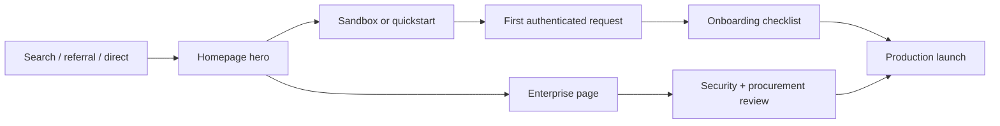
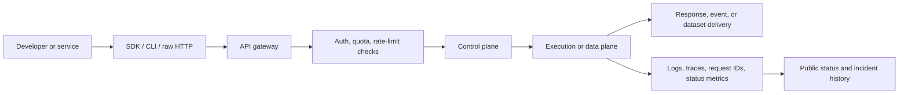

# Minimum Viable Website Blueprint for Technical SaaS Products

## Executive summary

Official websites for technically heavy SaaS platforms tend to converge on the same structural pattern: a homepage that
explains the category and outcome in one sentence, a self-serve path for engineers, a parallel enterprise path for
buyers, deep documentation with quickstarts and API references, public operational transparency, and a trust/legal layer
that can survive security review. Bright Data, Cloudflare, Stripe, Datadog, and LaunchDarkly all expose some variation
of this pattern, even though they sell different products. Their homepages also consistently pair a self-serve CTA with
a higher-touch CTA such as pricing, contact sales, demo, or free trial.

For an MVP, the website should behave like three things at once: a product catalog, a developer portal, and an
enterprise diligence package. That means the minimum viable scope is not just home plus docs. It is home, product
overview, docs hub, quickstart, API reference, SDKs, CLI, sandbox or explorer, integrations, onboarding, pricing,
enterprise, case studies, blog or resources, status, incident history, a trust center, and a legal cluster that includes
privacy, DPA, terms, and acceptable-use or equivalent policy pages. This structure is directly supported by patterns
visible on Bright Data, Stripe, Cloudflare, Datadog, LaunchDarkly, GitHub Enterprise, and Okta official properties.

The strongest homepage pattern is: category statement first, time-to-value proof second, developer activation third,
enterprise controls next, customer proof after that, and pricing or contact conversion near the end. Leading sites
repeatedly combine technical specifics with risk-reducing proof such as uptime targets, SOC 2 or ISO references, support
terms, or incident history. That is the right north star for a minimum-viable site in this category.

## Market signals from leading platforms

The first repeated pattern is **dual-track conversion**. Bright Data offers “Get started for free” alongside “Talk to a
data expert,” Cloudflare pairs “Start for free” with “See pricing,” Stripe pairs “Get started” with “Contact sales,”
Datadog pushes “Free trial,” and LaunchDarkly combines “Free trial” with “Book a demo.” This is not just marketing
convention; it reflects the fact that technical SaaS products usually have two buyer motions at the same time: a fast
individual engineering motion and a slower enterprise buying motion. Your MVP should support both from day one.

The second pattern is **docs as product surface**. Bright Data’s docs front-load quickstarts, auth choices, SDKs, CLI,
and language examples; Stripe’s docs expose sandboxes, SDKs, CLI, developer resources, and product-specific guides;
Cloudflare provides SDK references and a full CLI guide; Datadog’s API docs include “Run in Postman” and official client
libraries; LaunchDarkly exposes SDK catalogs plus a downloadable OpenAPI specification and client libraries; Okta
centers step-by-step quickstarts by app type. The implication is simple: for a technical SaaS site, documentation is not
a support artifact; it is part of the acquisition funnel.

The third pattern is **public trust and operational transparency**. Bright Data publishes a Trust Center plus a public
network status page and SLA; Cloudflare publishes trust and compliance resources, a DPA, a SOC 2 page, and a public
status page; LaunchDarkly publishes pricing-linked governance features, support terms, a public status page, and SLA
terms; Stripe publishes security, DPA, service agreement, and a public status property; GitHub Enterprise documents SCIM
and audit log behavior in detail. Enterprise buyers do not want to “contact sales to learn whether you support SAML,
audit logs, or a DPA.” They expect to verify this on the website before serious procurement starts.

The fourth pattern is **proof over promise**. Stripe’s customer pages foreground measurable outcomes, Cloudflare has a
dedicated case study hub, and Datadog’s case studies tie technical adoption to uptime, service count, and
troubleshooting speed. Technical buyers respond to architecture and examples; enterprise buyers respond to quantified
outcomes, governance controls, and implementation evidence. A credible MVP website needs both.

## Audience model and narrative

The audience model should be explicit because these websites serve different evaluators in sequence. Datadog describes
itself as serving software development across the stack, LaunchDarkly explicitly lists developers and DevOps and SRE
teams, Bright Data emphasizes developers plus enterprise-grade security and expert support, Cloudflare splits platform,
developer, and enterprise motions, and GitHub Enterprise documentation shows how identity and audit requirements become
central for admins and security teams.

| Audience segment                  | Core question on first visit                       | What convinces them                                                                                   | Best primary CTA     |
|-----------------------------------|----------------------------------------------------|-------------------------------------------------------------------------------------------------------|----------------------|
| Developers and integrators        | “Can I make a working request quickly?”            | Quickstart, auth example, SDK install, API explorer, sandbox key, copy-paste code                     | Start in sandbox     |
| SREs and platform teams           | “Will this behave predictably in production?”      | Architecture diagrams, rate limits, retries, status page, incident history, SLAs, metrics             | Review architecture  |
| Security and compliance teams     | “Does this fit our controls and data obligations?” | SSO/SAML, SCIM, RBAC, audit logs, DPA, SOC/ISO attestations, acceptable use, privacy posture          | Open trust center    |
| Procurement and enterprise buyers | “Can we buy this safely and predictably?”          | Pricing model, contracts, support tiers, dedicated infrastructure options, buyer guides, case studies | Talk to sales        |
| Product and data leaders          | “What business outcome do we get?”                 | Use cases, ROI proof, customer stories, deployment patterns, benchmark data                           | See customer results |

A good homepage should therefore speak in layers rather than in one generic headline. The opening message should satisfy
the developer and the business sponsor at once: category plus measurable operational outcome. Mid-page content should
satisfy SRE, security, and procurement concerns without forcing them into docs or a sales call too early. That is the
pattern visible across the official sites reviewed here.

## Recommended sitemap

The sitemap below is a synthesis of repeated patterns found on official sites and docs from Bright Data, Stripe,
Cloudflare, Datadog, LaunchDarkly, Okta, and GitHub Enterprise. The goal is not to reproduce any one vendor’s IA
exactly, but to identify the minimum structure that reliably supports self-serve adoption and enterprise diligence at
the same time.

```mermaid
flowchart TD
    home["/"]
    product["/product"]
    products["/products/<capability>"]
    docs["/docs"]
    quickstart["/docs/quickstart"]
    api["/docs/api"]
    sdks["/docs/sdks"]
    cli["/docs/cli"]
    sandbox["/docs/sandbox"]
    onboarding["/docs/onboarding"]
    integrations["/integrations"]
    pricing["/pricing"]
    enterprise["/enterprise"]
    customers["/customers"]
    blog["/blog"]
    changelog["/changelog"]
    status["/status"]
    history["/status/history"]
    trust["/trust"]
    privacy["/legal/privacy"]
    dpa["/legal/dpa"]
    terms["/legal/terms"]
    aup["/legal/acceptable-use"]

    home --> product
    home --> docs
    home --> integrations
    home --> pricing
    home --> enterprise
    home --> customers
    home --> blog
    home --> status
    home --> trust
    home --> changelog

    product --> products
    docs --> quickstart
    docs --> api
    docs --> sdks
    docs --> cli
    docs --> sandbox
    docs --> onboarding
    status --> history
    trust --> privacy
    trust --> dpa
    trust --> terms
    trust --> aup
```

| Page                        | Purpose                                                             | Key content blocks                                                                                                    | Technical assets                                                                 | Priority | Suggested path                                                       |
|-----------------------------|---------------------------------------------------------------------|-----------------------------------------------------------------------------------------------------------------------|----------------------------------------------------------------------------------|----------|----------------------------------------------------------------------|
| Homepage                    | Explain category, outcome, proof, and next step in under one minute | Hero, proof bar, product summary, quickstart teaser, enterprise controls, customer proof, pricing snapshot, final CTA | Product screenshot, architecture thumbnail, KPI strip, logos                     | MVP      | `/`                                                                  |
| Platform overview           | Show the product as a coherent system, not a bag of features        | Problem framing, core capabilities, control plane vs data plane, supported workflows, deployment model                | High-level architecture diagram, comparison matrix, supported environments table | MVP      | `/product`                                                           |
| Capability pages            | Expand each major module without bloating the homepage              | Per-capability value prop, workflow, input/output, limits, integrations, use cases                                    | Sequence diagram, example payloads, feature tables                               | Phase 2  | `/products/<capability>`                                             |
| Docs hub                    | Give technical users one canonical starting point                   | Docs nav, auth models, first paths, language picker, release links                                                    | Docs taxonomy, search, version switcher                                          | MVP      | `/docs`                                                              |
| Quickstart                  | Deliver first success fast                                          | Prerequisites, auth, install, first request, expected response, troubleshooting                                       | Copyable cURL, Node, Python, Go; sample responses; “time to first success” box   | MVP      | `/docs/quickstart`                                                   |
| API reference               | Make every endpoint navigable and testable                          | Endpoint docs, auth, params, errors, headers, pagination, webhooks                                                    | Interactive explorer, OpenAPI download, example requests, schema tables          | MVP      | `/docs/api`                                                          |
| SDKs                        | Reduce boilerplate and prove ecosystem maturity                     | SDK catalog, install instructions, feature parity notes, deprecation policy                                           | Package manager commands, GitHub links, version table, minimal examples          | MVP      | `/docs/sdks`                                                         |
| CLI                         | Support local development and ops workflows                         | Install, auth, command groups, examples, CI usage, automation patterns                                                | Command reference, sample scripts, downloadable binaries if relevant             | MVP      | `/docs/cli`                                                          |
| Sandbox and explorer        | Let engineers test safely without production risk                   | Test credentials, mock data, quotas, sample collections, cleanup guidance                                             | Interactive playground, Postman collection, environment presets                  | MVP      | `/docs/sandbox`                                                      |
| Onboarding                  | Bridge from first request to production rollout                     | Account setup, key rotation, role setup, webhooks, retries, launch checklist                                          | Production-readiness checklist, environment matrix, rollout plan template        | MVP      | `/docs/onboarding`                                                   |
| Integrations                | Show ecosystem fit and reduce technical risk                        | Native integrations, IaC, CI/CD, identity, observability, data sinks                                                  | Integration cards, setup snippets, marketplace links, architecture examples      | MVP      | `/integrations`                                                      |
| Pricing                     | Make self-serve buying legible and enterprise escalation easy       | Tier cards, usage units, included limits, overages, FAQ, contact options                                              | Pricing calculator, unit economics examples, plan comparison table               | MVP      | `/pricing`                                                           |
| Enterprise                  | Package buyer concerns in one place                                 | SSO, SCIM, RBAC, audit logs, support tiers, deployment options, legal readiness                                       | Enterprise feature matrix, security diagram, buyer checklist                     | MVP      | `/enterprise`                                                        |
| Customers and case studies  | Provide quantitative proof and implementation credibility           | Stories by use case, company size, industry, outcomes, stack                                                          | Quote cards, metrics callouts, downloadable PDFs                                 | MVP      | `/customers`                                                         |
| Blog and resources          | Capture search demand and nurture technical evaluation              | Engineering posts, comparisons, guides, webinars, benchmark pieces                                                    | Articles, diagrams, video embeds, downloadable guides                            | MVP      | `/blog`                                                              |
| Changelog and release notes | Prove the product evolves and document breaking changes             | Release feed, known issues, deprecations, migration notes                                                             | Release tables, RSS, diff summaries                                              | Phase 2  | `/changelog`                                                         |
| Status                      | Expose current health and reduce uncertainty                        | Current component status, uptime, maintenance notices, subscription options                                           | Component table, uptime chart, status badges, webhook or email signup            | MVP      | `/status`                                                            |
| Incident history            | Preserve trust after failures                                       | Historical incidents, timelines, RCAs, maintenance archive                                                            | Incident timelines, RCA templates, CSV export or RSS                             | MVP      | `/status/history`                                                    |
| Trust center                | Centralize security, privacy, and compliance posture                | Certifications, security overview, privacy posture, subprocessor links, data handling                                 | Attestation request flow, scope tables, control summaries                        | MVP      | `/trust`                                                             |
| Legal cluster               | Remove procurement blockers                                         | Privacy, DPA, terms, SLA, acceptable use, support policy                                                              | Legal index page, version dates, downloadable PDFs                               | MVP      | `/legal/privacy` `/legal/dpa` `/legal/terms` `/legal/acceptable-use` |

A practical rule of thumb is this: if a page helps a user answer “Can I use it?”, “Can I trust it?”, or “Can I buy it?”,
it belongs in the MVP. Pages that mostly expand breadth, such as deep solution clusters or comparator landing pages, can
wait for phase two. That prioritization is consistent with how self-serve and enterprise motions are supported on the
official sites reviewed.

## Recommended homepage wireframe

The wireframe below follows the sequence seen most often on leading technical SaaS sites: clear category statement,
activation path, operational proof, product explanation, developer path, enterprise controls, customer outcomes, and
only then the final conversion close. That sequencing mirrors how Cloudflare, Stripe, Datadog, LaunchDarkly, and Bright
Data structure their highest-visibility content.

| Order | Section                          | Why it exists                                          | Key content blocks                                                                 | Primary asset or CTA                                    |
|-------|----------------------------------|--------------------------------------------------------|------------------------------------------------------------------------------------|---------------------------------------------------------|
| 1     | Hero                             | State category and outcome immediately                 | One-sentence value prop, short subhead, two CTAs, optional work-email field        | Primary: “Start in sandbox”; Secondary: “Talk to sales” |
| 2     | Trust and proof bar              | Reduce bounce from technical and enterprise users      | Customer logos, supported regions, uptime or reliability signal, compliance badges | Logo strip and KPI chips                                |
| 3     | What the platform does           | Make orchestration legible in plain English            | Inputs, processing layer, outputs, deployment modes                                | Animated product diagram                                |
| 4     | Developer quickstart preview     | Show that first success is close                       | Install snippet, auth example, first request, expected JSON                        | Copyable code tabs                                      |
| 5     | Core capabilities                | Teach the product surface without jargon overload      | Three to five capability cards with problem and output                             | Capability cards linked to product pages                |
| 6     | Architecture and reliability     | Reassure SRE and platform teams                        | Control plane, data plane, rate limits, retries, regional footprint, status links  | Architecture diagram + “View status”                    |
| 7     | Security and enterprise controls | Reassure security, procurement, and admins             | SSO, RBAC, audit logs, DPA, attestations, support tiers, dedicated infrastructure  | Enterprise matrix + “Open trust center”                 |
| 8     | Customer results                 | Convert evaluators who need outcome proof              | Case study metrics, quotes, industries, stack context                              | Case study cards                                        |
| 9     | Pricing snapshot                 | Support self-serve without forcing a full pricing read | Starting price, usage unit, free trial or sandbox note, calculator teaser          | “See full pricing”                                      |
| 10    | Resource shelf                   | Let users self-segment                                 | Docs, integrations, tutorials, API reference, blog, release notes                  | Resource cards                                          |
| 11    | Final CTA band                   | Capture users after trust is built                     | Repeated dual CTA, short reassurance line, support note                            | “Start building” and “Contact sales”                    |

The homepage should not try to replace the docs. Its job is to create confidence, route users to the right next step,
and make the product feel operable before login. The fastest way to fail in this category is to make the homepage
visually polished but technically evasive.

## Technical and enterprise content system

Required technical content is remarkably consistent across the platforms reviewed. API-driven products publish
authentication models, install instructions, quickstarts, endpoint references, language examples, code snippets, SDK
matrices, webhooks or event guidance, rate limits, and release information. Bright Data documents both API-key and
native authentication, quickstarts, SDKs, and CLI usage; Stripe documents sandboxes, SDKs, CLI, webhook builders, and
the changelog; Cloudflare publishes SDK references plus Wrangler CLI guides and API limits; Datadog documents API keys,
rate limits, Postman usage, and client libraries; LaunchDarkly separates API use from SDK use and exposes client
libraries plus OpenAPI. An MVP site should therefore assume that at least four technical artifacts must exist on day
one: quickstart snippets, an authoritative API reference, an SDK catalog, and a production-readiness guide.

Developer experience elements should be treated as conversion features, not documentation extras. The highest-value
stack is: interactive API explorer, quickstart with real sample responses, sandbox or free credits, official SDKs, CLI,
Postman collection or OpenAPI import path, and copyable code in at least cURL, JavaScript, and Python. Stripe’s sandbox
split and interactive webhook builder are particularly strong examples; Datadog’s API reference and Postman collection
show how to make evaluation hands-on; LaunchDarkly’s OpenAPI export supports Postman or Insomnia; Cloudflare’s CLI guide
shows how much activation power a proper command-line path adds; Bright Data’s quickstarts and SDK docs show how fast
copy-paste examples reduce friction; Okta’s platform-specific quickstarts show the value of routing users by app type.

Enterprise features should have a visible home on the public site, not just in a sales deck. LaunchDarkly’s pricing page
explicitly calls out SSO or SAML, SCIM, audit logging, advanced RBAC, approvals, and security and compliance coverage on
higher plans. GitHub Enterprise documents how SCIM and SAML SSO change provisioning and deprovisioning behavior, and how
audit logs can be searched, exported, streamed, and queried by API. Bright Data’s trust and legal pages surface
certifications, privacy, SLA, acceptable use, and governance. Cloudflare’s trust hub exposes compliance resources, SOC 2
scope, and DPA language. Stripe exposes DPA, service agreement, and security documentation. For an MVP website, the
enterprise page should make these controls easy to locate in one place even if deeper artifacts live in trust or legal
subpages.

Status and reliability content should also be public and structured. Bright Data’s network status exposes product and
datacenter status; Cloudflare and LaunchDarkly both expose current incidents and history; Stripe’s status property
exists specifically for real-time and historical service performance; LaunchDarkly and Bright Data publish explicit
uptime commitments in their SLA terms. A strong minimum implementation is a public status page with component health,
maintenance notices, subscription, and a linked history page with incident timelines and postmortems. If your product
has regional or component-level variation, status should reflect that explicitly rather than collapsing everything into
one green badge.

A useful generic architecture diagram for this class of product looks like this:

That same diagram family can be reused in four places: the product overview page, the enterprise page, the onboarding
page, and selective docs pages. The key is consistency: the site should teach the same mental model everywhere. That is
something the most mature technical SaaS sites do very well.

## SEO, conversion, and positioning notes

For SEO, the safest strategy is to combine product-category keywords with workflow and buyer-intent keywords. Title and
description tags should describe the concrete job-to-be-done, not the company slogan alone. Technical docs should have
indexable canonical URLs, strong meta descriptions, and structured data where appropriate. On the markup side, the most
relevant schema types are `Organization` for company identity pages, `SoftwareApplication` for product pages, and
`Article` for blog posts and resource content. Google’s own documentation also recommends thoughtful use of canonical
URLs, robots meta controls, and high-quality meta descriptions, while noting that `robots.txt` is for crawl management
rather than indexing exclusion.

The high-value keyword families for this category are usually: **category terms** such as “API platform,” “developer
platform,” “proxy API,” “browser automation API,” or “feature management platform”; **workflow terms** such as
“quickstart,” “SDK,” “CLI,” “API reference,” “rate limits,” “webhooks,” “sandbox,” and “integrations”; **buyer-intent
terms** such as “pricing,” “enterprise,” “SOC 2,” “ISO 27001,” “DPA,” “SAML SSO,” and “audit logs”; and **competitive
terms** such as “[competitor] alternative” or “[category] comparison.” Official product sites repeatedly reinforce this
taxonomy through docs, pricing, industry pages, and compliance pages, which is why your information architecture should
encode it from the start.

Conversion patterns should follow pricing reality. If the product is usage-based, include a calculator early, because
Bright Data, Datadog, LaunchDarkly, and Stripe all expose usage-driven pricing concepts in different ways: per request,
per GB, per monthly metrics or entitlements, or custom enterprise pricing. If a true sandbox is possible, say so
prominently and separate it from live mode the way Stripe does. If a free trial is easier than a sandbox, say that. If
enterprise controls are gated to higher tiers, mirror LaunchDarkly’s clarity and make that obvious rather than burying
it in fine print. The ideal CTA stack is usually three-way: **trial or sandbox**, **see pricing**, and **contact sales
**.

On positioning, the most important choice is what you want to be “best at” in the buyer’s mind. Bright Data leans into
scale, compliance, and web-data access; Cloudflare pairs security and performance with a developer platform; Datadog
sells unified observability; LaunchDarkly sells runtime control and safe release behavior; Stripe sells programmable
financial infrastructure. The lesson is not to copy these exact categories. It is to pick one sharp sentence that
combines **technical surface area** with **operational outcome**. For a heavy technical SaaS product, the strongest
homepage formula is often: **[product category] for [technical team] that delivers [operational outcome]
with [enterprise proof].**

The microcopy below is suitable for a minimum-viable site and is intentionally short, operational, and buyer-aware.

| Surface               | Suggested microcopy                          |
|-----------------------|----------------------------------------------|
| Hero primary CTA      | Start in sandbox                             |
| Hero secondary CTA    | Talk to an enterprise architect              |
| Hero reassurance line | Working request in under 10 minutes          |
| Product page CTA      | See the request flow                         |
| Docs banner           | Make your first authenticated call           |
| API explorer prompt   | Paste a test key and send a live request     |
| SDK section prompt    | Pick a language and copy the install command |
| CLI section prompt    | Run the setup command from your terminal     |
| Pricing CTA           | Estimate monthly usage                       |
| Enterprise CTA        | Need SSO, audit logs, or custom terms?       |
| Status CTA            | View current service health                  |
| Trust center CTA      | Review certifications and data agreements    |
| Onboarding CTA        | Take the production readiness checklist      |
| Case studies CTA      | See how teams shipped faster                 |
| Final page CTA        | Start building now or contact sales          |

If you want one sentence to guide the entire build, it is this: **make the website capable of producing a first
successful request and a first successful security review without requiring a sales call.** The official sites reviewed
here differ in tone and product category, but that underlying design principle is what the best of them share.
